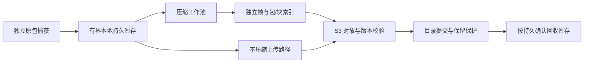

# 星烽 StarBeacon PCAP 压缩与存储布局设计

核对日期：2026-09-30。PCAP 采用无损压缩可以降低空间和上传字节，但收益取决于实际流量、块尺寸及硬件。**推荐评测低级别 Zstandard 独立帧与包/块索引，ZIP 用于下载打包。** 压缩不改变默认 180 天留存、原始包字节、时间戳、完整会话要求和权限。本文定义可选配置及生产准入，尚未取得 StarBeacon 实测压缩率或性能结果；通过验收前容量基线仍按压缩比 1 计算。

## 1. 压缩收益与格式选择

加密载荷、视频、图片和已压缩文件通常缺少可继续压缩的冗余；PCAP 记录头和重复网络头仍可能有收益。明文文本与重复业务内容可能更容易压缩，但不能用文本日志压缩率推算整个出口流量，也不能为了节省空间删除载荷、修改记录头或缩短 snaplen。

| 方式 | 适用场景 | 随机取证与资源边界 |
| --- | --- | --- |
| 原始 PCAP/PCAPNG | 收益很低、CPU 紧张或尚未取得压缩资格 | 依原始偏移直接读取；空间和上传带宽较大 |
| ZIP，常见 Deflate 成员 | 多份导出文件、完整性说明及 manifest 的下载包 | 可定位 ZIP 成员，不等于能随机读取一个巨大压缩成员里的任意包；解包后交给抓包工具 |
| gzip | 兼容导出、已有工具链归档 | 普通单流没有本平台所需的任意包定位能力；分段 gzip 仍需专用偏移索引 |
| Zstandard 独立帧＋sidecar | 平台压缩归档与按范围读取的首选评测方案 | 只解压相关帧；由平台维护逻辑偏移、压缩偏移、包位置和版本映射 |
| Zstandard seekable 格式 | 需要标准 seek table 的互操作方案 | 以独立帧加尾部可跳过的寻址表实现；是否高效读取取决于读取器，普通 `.zst` 不自动具备这项能力 |

Zstandard 的独立解码单位是 **frame**；同一 frame 内部的算法 block 可能依赖前面的 block。文中“压缩块”指平台的独立 frame，不能只按算法内部 block 切出字节就声称可独立解压。[官方压缩格式](https://github.com/facebook/zstd/blob/v1.5.7/doc/zstd_compression_format.md)、[seekable 格式](https://github.com/facebook/zstd/blob/v1.5.7/contrib/seekable_format/zstd_seekable_compression_format.md)

Arkime 已提供可寻址 gzip/zstd 压缩，并分别暴露压缩级别、块大小和队列限制；可借鉴其存储与读取配合的思路，不能把其参数当作本平台性能证明。Zstandard 官方基准用于说明级别和速度/压缩率取舍，基准语料、C 实现与 Go 实现均不能替代本项目 PCAP 测试。[Arkime 设置](https://arkime.com/settings#simpleCompression)、[Zstandard 官方说明](https://github.com/facebook/zstd/blob/v1.5.7/README.md)

## 2. 捕获、压缩和持久化

采集循环不等待整片压缩、远程上传或数据库调用；工作池有独立 CPU、内存、磁盘和并发预算。压缩在探针持久暂存之后、上传之前执行，可同时减少上传带宽；也可在存储侧异步转码，但后一种不会减少探针上传原始字节的带宽，而且需要计算额外读写和转换期间双份空间。高流量档仍需验证本地持久暂存是否能够承受完整输入，不能用异步二字掩盖瓶颈。

配置分别记录 `compression_mode=none/zstd`、codec/版本、实现级别、目标 frame 大小、worker 并发、队列上限、最小节省比例、原包暂存预算和压力降级策略。评测起点采用独立帧 **64 KiB、256 KiB、1 MiB** 三档及 zstd **1/3 等价级别**；Go 选项和参考 CLI 等级的映射必须记录，不假定不同实现同名级别的速度/结果相同。帧大小与封装对象大小独立，不能把每个 64 KiB frame 变成一个 S3 对象。

可以对封存片段做有界抽样，再按实际压缩结果决定该片段是否采用压缩。最小节省比例从 5% 作为试验值；该值只是避免收益过低的策略，不是实际节省承诺。未达到条件或 CPU/队列超过预算时，允许把尚未提交的片段以 `codec=none` 持久保存并记录原因；压缩和原始对象并存由目录逐对象说明。不能在缺少额外磁盘/上传容量时把“回退不压缩”当作可靠保护，原始速率的容量与带宽仍需预留。

若原始和压缩路径都无法持久跟上输入，进入明确的采集容量故障，记录受影响窗口、丢失与告警；不静默截断、降低采样率或把 180 天改短。压缩失败、进程重启或索引未提交时，暂存只有在仍存在可恢复的持久副本后才能回收。实时 Suricata 告警、通知和封禁不等待归档压缩完成，PCAP 状态可暂为“归档中”。

## 3. 对象布局、随机读取与证据完整性

对象封装沿用 PCAP/PCAPNG 的逻辑字节流，通过维护中的 codec 生成独立 zstd frames；平台实现权限、目录和偏移映射，不重写压缩算法。sidecar 至少保存：

| 范围 | 字段与要求 |
| --- | --- |
| 对象 | `object_id/version`、`format_version`、codec/实现版本/级别、压缩/原始长度、时间范围、保留策略 |
| 帧 | `frame_id`、压缩 offset/length、逻辑原始 offset/length、原始及压缩 SHA-256、字典引用（如有） |
| 包 | 稳定原包 ID、所属接口/section、逻辑 offset/length、时间、会话代次和依赖范围 |
| 完整性 | 原始流 SHA-256、存储制品 SHA-256、源 manifest 版本、捕获缺口、截断和转换验证结果 |

尽可能沿包记录或 PCAPNG block 边界切帧；超过目标尺寸的单条记录可扩大到受控上限，确需跨帧时保存全部片段映射。PCAPNG 的 Section/Interface 描述和时间精度作为解码依赖保存，不能取到若干数据帧就遗漏其接口上下文。默认不使用外部压缩字典。确需启用时，字典以不可变版本、SHA-256 和租户授权单独持久保存，保留与备份至少覆盖最后一个依赖对象及保全期限；恢复必须先验证字典，丢失时返回不可解码，不能假称可从 sidecar 重建。通用 `.zst` 导出采用无外部字典编码或先还原普通 PCAP。不同租户不共用封装对象和敏感压缩字典；同租户不同权限包仍须由网关提取后提供。

读取流程为：授权会话/包集合 → 查询 sidecar → 取得涉及的完整压缩帧 Range → 校验并限额解压 → 按原包集合过滤 → 重建合法 PCAP/PCAPNG。原始 offset 不能直接作为压缩对象的 Range。跨帧合并、相邻 Range 合并和缓存必须绑定对象版本；缓存键包括租户与权限范围，不能将原始混合权限帧直接返回用户。

压缩 checksum 用于发现意外损坏，不能替代可信 manifest 中的 SHA-256 及签名。重新压缩会改变存储制品 hash/对象版本，原始字节 hash 与原包身份保持不变。转换使用新对象、验证往返字节一致、取得同等保留/保全保护、原子切换目录，再等待读取租约结束后回收旧副本；受存储锁保护的旧版本按实际期限保留，容量计入转换重叠。sidecar 丢失时应能从受控解码过程重建必要目录，恢复期间禁止错误地把未知偏移当空结果。

## 4. Go 复用与存储兼容

Go codec 选用维护中的 `github.com/klauspost/compress/zstd` **v1.20.1**，2026-09-25 发布，模块 Go 下限 1.25，适配项目 1.26.x 工具链的声明要求；具体构建、并发和性能仍需验收。该库提供纯 Go 编解码，不代表内建 StarBeacon 的包授权、S3 Range 或 seek table 目录服务。主许可 BSD-3-Clause，制品按实际使用内容纳入 SBOM。参考 `libzstd/zstd` **1.5.7** 仅作为可选互操作验证工具，不要求生产 Go 服务加载 C 库。[Go 库发布](https://github.com/klauspost/compress/releases/tag/v1.20.1)、[Go codec 文档](https://github.com/klauspost/compress/blob/v1.20.1/zstd/README.md)、[模块声明](https://github.com/klauspost/compress/blob/v1.20.1/go.mod)

Wireshark/TShark 4.6.9 文档列出 gzip、Zstandard、LZ4 输入支持，取决于构建时相应库。交付时实测顺序读、拼接 frame、截断和损坏场景；这项兼容不代表它能利用 S3 Range 或 seek table 高效远程读取。原生取证 Worker 先获得授权包制品，再运行 TShark。[锁版 TShark 文档](https://github.com/wireshark/wireshark/blob/v4.6.9/doc/man_pages/tshark.adoc)

MinIO AIStor 的服务端透明压缩发生在 PUT 后、GET 时透明解压，属于存储实现特性，不能假定任意 S3 实现等价，也不能抵扣客户端上传带宽。其与加密组合有独立配置和限制，需按目标发行版验收；平台自行压缩的 `.zst` 对象不再期待服务端二次压缩收益。对象 SDK 不得按 HTTP `Content-Encoding` 自动解压后再套用压缩偏移；读到的字节必须与 manifest 描述的存储制品一致。[MinIO 压缩说明](https://docs.min.io/aistor/administration/objects-and-versioning/data-compression/)

优先以存储端加密保护已压缩对象，配置压缩先于静态加密；不自行设计加密格式。客户端整对象加密会改变可读取偏移及认证范围，必须另验收随机读取，不能假定 Range 仍能独立解密。解压入口限制声明长度、窗口、内存、实际输出、CPU 时间和 frame 数量；上传的外部压缩证据按不可信输入处理，不信任文件扩展名或声明压缩率。

## 5. 容量收益与性能准入

定义 `C = 原始字节 / 压缩后字节`，节省比例为 `1−1/C`。多类流量的整体比率按字节加权计算：`C_total = 1 / Σ(f_i/C_i)`，其中 `f_i` 为原始字节占比；不能直接平均各类压缩比。尚未实测时采用 C=1，配置页面显示实际 24 小时/7 天滚动字节比与样本构成，不能用几段高重复演示包估算 180 天。

以持续 1 Gbit/s、180 天、冗余系数 1.5、最高磁盘利用率 70% 为例，未计记录头、目录、备份和转换重叠：

| 假设实测 C | 空间节省 | 物理规划容量 |
| --- | ---: | ---: |
| 1.00 | 0% | 4.166 PB |
| 1.10 | 9.09% | 3.787 PB |
| 1.50 | 33.33% | 2.777 PB |
| 2.00 | 50% | 2.083 PB |
| 3.00 | 66.67% | 1.389 PB |

上表是敏感性计算，**不是 PCAP 可达到的压缩率承诺**。例如 80% 原始字节只能达到 C=1、其余 20% 达到 C=4，整体仅 C≈1.176，节省 15%；加密流量占比高时，压缩不能把 PB 需求自然变成 TB 需求。所有原始包仍保留，冷热成本见[PCAP 留存与会话完整性设计](PCAP留存与会话完整性设计.md)。

压缩 CPU 起点可按 `核数 ≥ 原始输入 MB/s ÷ 实测每核 MB/s ÷ 目标利用率` 估算，再加入编码、复制、GC、哈希、磁盘和网络成本并验证扩展性。100 Gbit/s 帧字节已约 12.5 GB/s，不能笼统承诺单个 worker 轻松处理。实际瓶颈可能从磁盘转移到 CPU，也可能因减少 IO 而改善整体延迟，两者均需测量。

验收应在同一硬件、同一规则/协议/文件功能、同一数据集上比较 none、zstd 低级别及 gzip 兼容方案；可加入 LZ4 候选，但未通过评估不增加生产依赖。至少记录以下结果：

1. **真实性**：逐字节往返相等、原包时间/顺序/长度、TCP 握手与导出完整性；损坏、截断、超限有明确错误。
2. **持续能力**：原始输入 bps/PPS、压缩吞吐/比例、CPU/RSS、读写字节、队列最老年龄、磁盘和对象数；混合小包/大包/明文/TLS/媒体/文件，覆盖高峰与故障恢复。
3. **业务影响**：全路径开启下的捕获丢包率、检查覆盖、告警产生/推送 P95/P99；优先级隔离有效，不只报告压缩函数 benchmark。
4. **取证速度**：单告警首包展示、跨片完整会话导出、冷对象恢复、并发 Range、解压读取放大；测试64 KiB/256 KiB/1 MiB帧与不同封装对象组合。
5. **恢复与留存**：压缩时断电、对象成功但目录失败、manifest 损坏、转码中撤权、保全与删除竞争；仍满足180天且可核对副本。

通过资格后可以按探针/站点启用选定压缩档案，保存实测压缩比、CPU余量和最高合格输入速率；流量构成或规则变更时复核。不用“性能损耗不大”替代可测指标，也不因启用压缩下调未经验证的磁盘采购基线。
