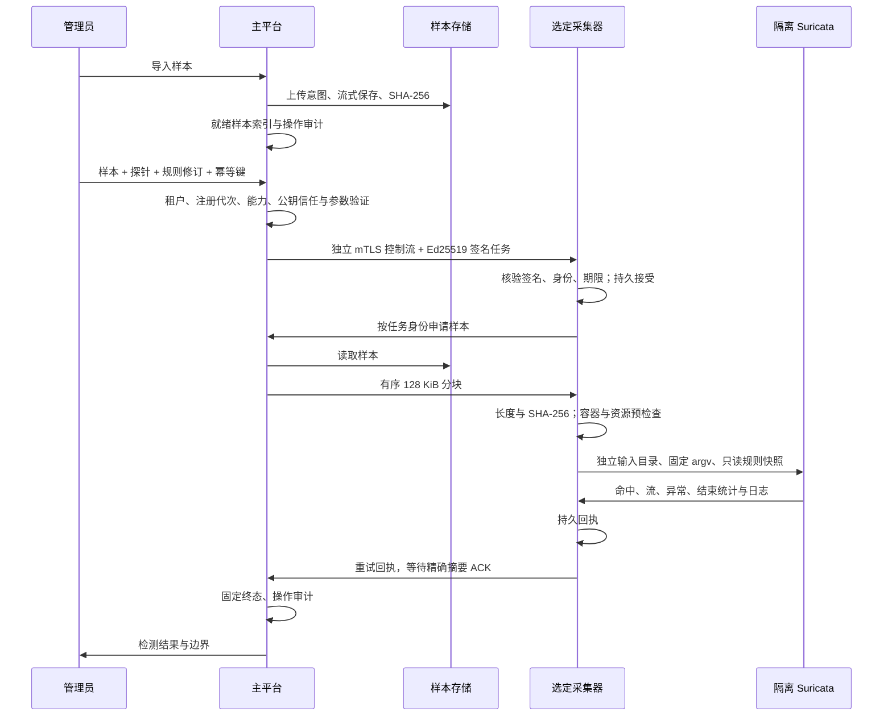

# 星烽 StarBeacon PCAP 重放与规则验证

本文对应 `web/` 与 Go 工程的实际实现。采集器可独立导入 PCAP，在本机使用指定规则或登记规则快照运行 Suricata 离线检测；主平台可导入样本，选择具有重放能力的探针以及规则包修订，下发受签名保护的任务并查看回执。离线重放使用 `suricata -r` 读取文件，不向网卡发包，不更改实时规则，不触发自动阻断或正式告警推送。

## 1. 页面与操作

| 入口 | 操作 | 结果与权限 |
| --- | --- | --- |
| 采集器「网络与采集」→「重放样本」（`/network?view=samples`） | 导入 PCAP／PCAPNG；点击样本的「重放测试」；输入指定规则，或选择管理员登记的规则快照 | 本地管理员权限，独立会话及 CSRF；任务保存在本机，不作为平台任务回执上报 |
| 主平台「规则管理」→「重放样本」（`/rules?view=samples`） | 导入样本；选择执行探针；选择指定规则包修订或该探针登记的规则快照 | 平台管理员权限，当前租户范围；仅允许信任匹配且上报重放能力的探针 |
| 主平台「重放任务」／采集器「任务记录」（两端均 `view=tasks`）→「查看」 | 核对结论、包数、命中数、耗时、SID／修订、地址、捕获时间及包序号 | 先呈现检测结果；样本／规则／配置摘要、任务生命周期与原始执行回执用于追溯 |
| 主平台规则包列表 | 创建规则包、保存不可变修订、选择探针执行原生装载检查 | `-T` 装载通过不等于样本通过，也不授予在线发布资格 |

样本列表最多返回最近 200 个有效样本；任务列表最多返回最近 200 条记录，页面分别按 5／10 行分页。指定规则在采集器页面称「本次输入规则」，与平台的「规则包修订」身份区分。记录未命中属于完成的检测结果，执行失败与未命中不能互相替代。自动刷新以 5 秒为正常间隔，失败后按 5／10 秒退避，连续三次失败停止自动刷新并保留手动重试；旧结果明确提示尚未更新。

上传使用原始二进制及 `Content-Length`，不使用 Base64 JSON。PCAPNG 通过 GoPacket 校验后，转换为纳秒精度的经典 PCAP 供原生引擎读取，保持原始帧、捕获长度、原长度及时间戳；原始归档文件不被替换，回执另外记录转换文件摘要。单次任务不混合不同链路类型。

## 2. 执行流程与信任



本地任务使用同一检测器和执行预算，样本从本机私有目录读取。它使用独立 `localtask_` 身份，不伪造平台签名，也不进入平台回执待确认队列。

平台签名域为 `StarBeacon/sensor.command.v1\x00` 加原始 JSON 字节，公钥固定配置在采集器；平台比对采集器心跳中的公钥摘要与自身签名公钥。身份由 mTLS URI 确定，消息不能自行选择租户。命令包含租户、探针、注册代次、样本长度／摘要、规则文本／修订／摘要以及 30 分钟投递期限。任务重复投递只返回已有回执；同一幂等键对应不同参数会冲突。任务状态与内容保存在 PG，Redis 不承担任务权威状态。

探针串行执行受限任务，执行中最多另排队一条本地任务；主平台每探针仅允许一个未结束任务。运行中崩溃后记为「结果待核实」，不自动重放。已投递但无回执不能标成成功或盲目解除占用；当前尚未提供管理员核实／解除未知任务的完整工作流。平台仅能取消从未投递的排队任务。

样本下载同时检查证书身份、启用状态、任务归属、注册代次、任务执行阶段、到期时间和样本引用；任务结束后不能再次借其下载。每个进程最多四路传输，期限 90 秒，在开始、每 4 MiB 和结束核验设备状态；控制 ACK 与数据上传使用各自连接。客户端复核每块偏移及长度，最终摘要与签名任务不符时拒绝执行。

## 3. 输入与资源边界

| 项目 | 实际上限与行为 |
| --- | --- |
| 单样本 | 24 字节至 100 MiB；PCAP／PCAPNG；拒绝 ZIP 等压缩容器 |
| 样本数量／容量 | 单租户／本地目录最多 10000 个；默认 1 GiB，可通过 `SB_REPLAY_BYTES` 调整容量；达到额度拒绝导入，不提前清理有效样本 |
| 指定规则 | UTF-8 文本最大 900 KiB；编码后的任务载荷最大 1 MiB；当前仅接收 `alert` 规则，禁止 Lua／dataset／bypass／filestore 等动态或有副作用选项 |
| 登记规则快照 | 管理员固定的单文件路径；最多 64 MiB；复制快照并记录摘要，不能声称它必然是实时进程当前已加载的规则 |
| 容器预检查 | 最多 100 万包、1 MiB 单帧、100 万 PCAPNG 块、256 个接口；在解析器分配前校验块长度、对齐、尾长度及 snaplen；拒绝携带解密密钥的 PCAPNG DSB |
| 执行预算 | 整体 2 分钟（含下载、校验及检测）；CPU 90 秒；Linux 地址空间 1.5 GiB；每 100 ms 监视引擎及子进程 RSS 和输出目录；RSS 超过 1.5 GiB、总输出超过 64 MiB 时中止 |
| 检测配置 | 单线程；流表 32 MiB、流内存 32 MiB、重组内存 64 MiB、重组深度 1 MiB、分片内存 16 MiB；校验和检查；文件存储与 Unix 控制 socket 禁用 |
| 引擎日志／回执 | 日志最多保存 8 KiB；回执预留在 60 KiB 内；保留实际命中总数、最多 200 个 SID 汇总、前 30 条命中、前 10 条流样本；超预算继续缩减明细并设置截断标记 |
| 上传期限 | 本接口读取期限 5 分钟，响应期限 6 分钟；其他 JSON 接口不随之扩大输入额度 |

进程监视属于运行期限额，可能存在采样间隔内的短暂超量；生产还须为离线作业配置独立 cgroup／服务内存与 CPU 配额，并为实时 Suricata 预留资源。不得用离线单线程样本的耗时推定实时镜像吞吐或多探针 SLA。

共享 CodeMirror 6 编辑器提供行号、撤销、折行、高亮和错误定位。本地基础诊断核对 `alert` 规则的七个头字段、引号、括号、末分号、SID 范围／重复及 rev，不是完整 Suricata 语法或语义解析器。

未知关键词、变量和目标引擎兼容性须由选定探针原生 `-T` 验证。正式规则应用接口被禁用并返回 409（`release_validation_required`）；检查或重放通过不授予在线发布资格。

检测调用使用固定参数 `-c … --include … -S … -r … --runmode single --init-errors-fatal --strict-rule-keywords=all`；路径通过 argv 传递，不作为用户 shell 命令。基础配置由管理员固定，平台复制必要分类及引用文件，记录基础配置与离线覆盖配置摘要。平台指定规则包使用 `-S` 独占装载，不悄悄叠加其他规则。[Suricata 8.0.7 命令行](https://docs.suricata.io/en/suricata-8.0.7/command-line-options.html)

## 4. 部署配置

### 4.1 采集器

必须提供可信的原生 **Suricata 8.0.7** 和配置文件。Linux 重放另需 **bubblewrap 0.13.0**、内核 user／PID／mount／network namespace 能力及允许运行的受限服务配置。bubblewrap 隔离网络，移除 capabilities，只读绑定运行库与任务输入，仅任务输出可写；不绑定采集器状态、管理凭据或证书目录。隔离条件不可用时拒绝执行，不退化为普通子进程。[bubblewrap 发行](https://github.com/containers/bubblewrap/releases/tag/v0.13.0)

```text
SB_SURICATA_BINARY=/usr/bin/suricata
SB_SURICATA_CONFIG=/etc/suricata/suricata.yaml
SB_SURICATA_RULES_PATH=/var/lib/suricata/rules/suricata.rules
SB_COMMAND_PUBLIC_KEY=/etc/starbeacon/command.pub
SB_REPLAY_DIR=/var/lib/starbeacon/replay
SB_REPLAY_BYTES=1073741824
SB_REPLAY_RETENTION_DAYS=180
```

`SB_SURICATA_RULES_PATH` 仅在需要「登记规则快照」时配置；不设置仍可验证指定规则。主平台按探针健康快照中的登记状态禁用不可用选项，服务端再次核验；登记状态不等于实时规则已加载。无需启用实时规则应用权限。生产样本目录必须为绝对路径，0700 且非符号链接，文件为 0600；默认在采集器状态文件同级 `replay/`。检测子进程继承固定的最小环境，不能获得平台／本地管理员密码或对象存储密钥。

macOS 只在开发模式使用系统 `sandbox-exec`，拒绝网络和凭据读取；不作为 Linux 生产隔离验收。普通 `deploy/Dockerfile` 是纯 Go scratch 镜像，不包含 Suricata、动态库、shell 或 bubblewrap，不能直接作为重放采集器制品。Linux 安装包／镜像须单独冻结发行物摘要、系统库、原生特性及 namespace／cgroup 验收。

### 4.2 主平台

开发默认以 `.local/replay-platform` 保存样本。生产选择 MinIO AIStor 或已验收的 S3 兼容服务，提前建立专用 bucket，提供仅限样本前缀的读／写／删凭据；平台不会调用创建 bucket 的管理接口。SDK 固定 `minio-go/v7 v7.3.0`，使用流式暂存、已知长度的单对象上传及 SHA-256 元数据，不把 100 MiB 文件放入 HTTP JSON 或签名任务。

```text
SB_REPLAY_BACKEND=s3
SB_REPLAY_S3_ENDPOINT=对象存储域名:443
SB_REPLAY_S3_BUCKET=starbeacon-replay
SB_REPLAY_S3_ACCESS_KEY=由凭据管理注入
SB_REPLAY_S3_SECRET_KEY=由凭据管理注入
SB_REPLAY_S3_SECURE=true
SB_REPLAY_DIR=/var/lib/starbeacon/replay-staging
SB_REPLAY_BYTES=1073741824
SB_COMMAND_SIGNING_KEY=/etc/starbeacon/command.key
```

生产模式禁止文件系统后端，要求 S3 TLS 和绝对暂存目录；未配置后端时页面明确显示存储未配置。此容量目前同时用作每租户样本额度与单进程暂存额度。暂存只用于上传，在完成后回收，不属于已归档样本；暂存恢复与容量需纳入部署验证。服务账号不得使用 bucket 管理员凭据；加密、HA、存储版本化／保全与生命周期删除必须与平台策略协同验收，不让外部 bucket TTL 提前删除有效样本。

## 5. 保留与清理

原始重放样本默认保存 **180 天**。平台从当前租户 `retention_policies` 的 `pcap` 类别计算导入时的 `expires_at`；采集器本地从 `SB_REPLAY_RETENTION_DAYS` 计算，范围 1–3650 天。平台当前尚未提供策略编辑／历史数据重新计算的完整页面，既有样本不因环境变量修改而自动变更到期日。

平台先保存上传意图及预占容量，再写对象和就绪索引；失败只有在确认对象删除后才释放容量，未知结果由恢复清理处理。每分钟扫描到期样本与超过一小时的未完成上传，每租户每轮最多 100 个，先确认删除对象再删除索引；仍在有效执行期的任务所引用样本不被清理。到期样本停止列表及执行授权，物理清理保留五分钟执行缓冲。导入后即使未执行也保持相同留存策略。

本地采用内容身份摘要构成文件名，避免租户／样本名称拼接碰撞；索引与操作审计原子保存。清理同时回收超过一小时、没有索引的业务对象和上传临时文件。容量不足只拒绝导入，不能以保留期内淘汰换取空间。任务及审计默认记录 180 天期限，但 PG 全域物理清理、历史策略变更和法律保全仍未完成；不能据此宣称所有业务生命周期已经验收。

## 6. 结果解释与验证范围

回执中的 `duration_ms` 为原生检测进程启动后的执行耗时；任务起止包括接受／队列、下载、容器检查和检测，客户端看到更新还包含控制回执及页面刷新。二者不是同一统计口径。完成检测需有结束统计，并且引擎处理包数与预检查包数一致；缺少统计、包数不符、超时或超限均不标记完成。

原始样本若缺少 SYN／SYN-ACK／ACK、单向镜像、截断、GRO／TSO 造成校验和差异、重组深度不足或 TLS 加密，检测效果可能与真实流量不同。当前回执明确标记握手完整性「未验证」，不伪造完整通信，也不尝试推断或自动恢复 TLS 明文。PCAPNG 内嵌密钥被拒绝；未来密钥管理须使用独立授权及隔离流程。

本机已使用真实 Suricata 8.0.7 验证 PCAP 与 PCAPNG 的命中、未命中和非法关键词拒绝；工程样本包含九个帧，涵盖 TCP 建立、HTTP 请求／响应和结束，使用保留示例地址。两个页面均通过实际上传、执行及结果查看链路，主平台任务使用真实签名控制和样本传输，本地任务独立保存。单元／竞态测试验证容器边界、摘要、租户文件身份、额度不淘汰、临时对象恢复以及 S3 SDK 协议适配；真实 PG／mTLS 集成验证 RLS、异租户／异设备拒绝、分块传输及结束后下载拒绝。

S3 SDK 测试使用受控 HTTP 协议服务，未将其描述为真实 MinIO HA 验收；Linux 交叉编译也不等于 Linux 原生隔离和生产容量通过。持续捕获、压缩归档、完整会话导出、在线规则发布资格、TUF／灰度／回滚、用户自定义留存页面及故障设备恢复仍按相关设计继续实施。
