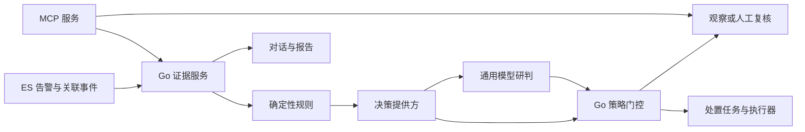

# 星烽 StarBeacon AI 决策与 MCP 调研

调研日期：2026-09-28。适用范围：单组织、集团及 SaaS 部署，1–200 台以上探针。本文区分可从一手资料核实的产品事实与 StarBeacon 的工程建议；没有运行供应商模型、购买服务或完成安防数据集实测。性能、准确率与资源占用中的供应商数字均不作为平台验收承诺。

## 1. 技术结论

建议采用“确定性规则 → 专项决策模型 → 通用大模型 → 人工复核”的分层方式。规则承担权限、白名单、时间窗口和处置边界；决策模型承担有限类别的判断；大模型承担关联解释、调查计划和报告撰写。任何模型给出的建议，都经过独立策略服务才能成为处置任务。

Jev 与 Laya 应作为可替换的决策提供方接入，不能承担全部告警判定。优先交付告警辅助研判、证据检索和报告，再根据实测逐项开放自动化。正常检测、存储与检索链路不依赖 AI 服务可用性。

业务后端、任务调度、策略与 MCP 服务使用 Go。Laya 与通用模型本地推理通过独立模型服务提供 HTTP 接口，不能把“Go 后端”误写成“这些模型具有官方纯 Go 推理实现”。若要求所有自研运行服务均为 Go，则先通过 Go 调用远端模型 API；本地推理仍需纳入独立的软件运行时交付边界。

## 2. Jev 与 Laya 的真实定位

### 2.1 一手项目识别

| 项目 | 可核实的正式来源 | 输出与部署 | StarBeacon 适用位置 |
|---|---|---|---|
| Jev | [TypeSafe 官网](https://typesafe.ai/)、[官方文档](https://docs.typesafe.ai/introduction)、[官方 GitHub 组织](https://github.com/typesafe-ai) | 托管决策 API；有限选项、等级评分、二元概率 | 外部决策提供方、路由和专项判定 |
| Laya | [NandhaKishorM/laya](https://github.com/NandhaKishorM/laya)、[Convai Innovations 模型卡](https://huggingface.co/convaiinnovations/laya) | 开放权重，可本地部署；支持相似的三种决策结构 | 私有化分类、领域微调、批量分流 |

检索出现的 `typesafeai.org`、`jevtypesafe.org`、`jevmodel.org` 等页面不属于上述一手来源链。它们可用于发现线索，不承担接口、许可、价格或准确率结论的依据。Laya 是独立项目，接口兼容不能解释为 TypeSafe 官方开源 Jev。

### 2.2 Jev 接入事实与限制

已核实接口为 `POST https://api.typesafe.ai/v1/systemone`，使用 Bearer API key。请求含 `model`、`state`、`questions`，响应含 `model`、`answers`、`usage`。`choice` 返回选项及概率分布，`score` 返回等级上的加权值，`noul` 返回“是”的概率。官方列出的客户端为 Python、JavaScript/TypeScript；Go 可直接调用 HTTP API。[API 文档](https://docs.typesafe.ai/api)、[SDK 目录](https://docs.typesafe.ai/sdk)

当前正式模型 ID 为 `jev-1.13.0`；`jev-latest` 是会移动的别名。官方输入价格为每百万 token **0.042 美元**，输出免费；总请求窗口 64k token，`state` 加最长问题不得超过 32k。生产配置应固定模型 ID，并记录实际返回的版本。官方注明主要训练语言为英语，中文等语言的质量需自行检验。[模型与定价](https://docs.typesafe.ai/models)

本次只核实到托管服务，没有找到官方开放权重或可直接交付的本地推理包，因此不能承诺 Jev 私有化离线部署。官方的“类型安全”“不生成文字”不能推出“业务判断正确”。文档明确列出数学、时间比较、复杂间接推理、过长无关上下文以及恶意输入影响答案等问题。[已知限制](https://docs.typesafe.ai/model-jaggedness/jev-1.13)

`choice`/`score` 的 `confidence` 是从概率分布计算的统计量，不等同于“这一条告警有多少概率判断正确”；`noul` 的输出也不能直接移用另一任务的阈值。不同模型、问题、语言和规则族必须分别验证。[置信度说明](https://docs.typesafe.ai/confidence)

数据出域与训练用途必须按供应商配置管理。官方说明企业 ZDR 需另行安排；“不用客户请求训练模型”不等于默认不保留请求。当前客户协议 2.3(b) 限制利用服务或输出进行模型蒸馏、训练模仿模型等用途。因此不能默认将 Jev 输出批量充当 Laya 的训练标签，标签闭环应优先使用人工审核且具有训练权利的数据。[数据政策入口](https://docs.typesafe.ai/legal)、[客户协议](https://typesafe.ai/legal/mca)

### 2.3 Laya 接入事实与限制

代码仓库及模型卡标注 Apache-2.0。当前模型入口为 `convaiinnovations/laya`，包含英语根 checkpoint、`multilingual` 与 `typed-decisions` 子目录；官方 Python SDK 使用 `laya.load(...)`，支持本地 CPU/GPU。模型卡中的约 808 MB、647 MB 指相应权重规模，不能当作生产进程内存预算。[模型卡](https://huggingface.co/convaiinnovations/laya)

仓库的 HTTP 服务提供 `/v1/systemone`，可从 Go 以 HTTP 调用，支持通过 `LAYA_API_KEY` 设置 Bearer 认证。建议将其放在内网，以镜像摘要、模型 revision、tokenizer 和校准参数锁定完整制品；生产环境显式开启认证、预热和并发限制。[服务实现](https://github.com/NandhaKishorM/laya/blob/main/laya/serve.py)

作者基准报告承认：基础模型在 typed-decisions 上低于多数类基线，表现较好的 checkpoint 来自任务微调；多语言 checkpoint 未预先拟合校准温度。报告中的 Jev 数字来自第三方材料，并非同一实验中调用 Jev 的结果。这些数据不能证明 Laya 在 StarBeacon 中文日志、Suricata 告警或误报识别上优于 Jev。[作者基准及实验边界](https://github.com/NandhaKishorM/laya/blob/main/BENCHMARKS.md)

工程上应把 Laya 视为可训练的低成本候选，而非可直接上线的安防专家。明确选择语言和任务 checkpoint，控制输入长度与选项数；截断、缺字段及未知语言进入拒答或升级路径。官方 README 也将其定位为需要领域专门化的基础，并说明不同 checkpoint 存在过度自信、标签措辞敏感等限制。[运行与限制说明](https://github.com/NandhaKishorM/laya#honest-limits)

## 3. Go 业务架构与模型适配

上述链路在原始告警入 ES 后异步执行。降噪只能改变展示、关联与通知策略，不能删除原始证据。PG 保存提供方配置、策略版本、任务状态、审批及处置记录；ES 保存告警、检索型研判结果；MinIO 保存报告制品和按权限访问的证据附件。PG 中的任务只引用事件 ID，不复制完整原始告警。

Go 后端定义两类接口：`DecisionProvider.Evaluate` 与 `GenerativeProvider.Generate`。前者适配 Jev、Laya、传统分类服务及使用结构化输出的通用模型，后者服务对话和报告。每个适配器声明能力：输出类型、上下文限制、中文能力实测结果、部署区域、是否出域、是否可训练、超时、并发和价格。禁止只因支持某种兼容 API 就假设全部能力一致。

通用模型可通过 JSON Schema 限制输出格式。vLLM 当前支持结构化输出，并使用 `structured_outputs` 或对应 `response_format`；旧 `guided_json` 等字段不可直接照搬。约束解码只能改善格式符合性，证据引用是否存在、枚举值是否可用、处置权限是否满足仍由 Go 校验。[vLLM 结构化输出](https://docs.vllm.ai/en/stable/features/structured_outputs/)

统一结果建议包含：

| 字段组 | 内容 |
|---|---|
| 追溯 | `analysis_id`、`event_id`、模型实际版本、问题模板版本、策略版本、校准版本 |
| 判断 | 检测有效性、行为性质、攻击结果、流量处置观察、候选响应；允许 `unknown` |
| 证据 | 证据 ID、支持或反驳关系、缺失证据、采集时间与覆盖范围 |
| 不确定性 | 原始概率、供应商置信指标、平台校准结果、拒答原因 |
| 运行信息 | 输入摘要 hash、耗时、token、费用、错误码、是否升级 |

请求与缓存键至少绑定租户、证据快照、模型版本、问题模板及校准版本。模型超时、返回格式错误、证据失效或预算耗尽时进入待复核，不自动解释为误报。相同告警组可共享特征，但新资产、新规则版本或新的攻击结果证据必须触发重新判断。

### CEL 策略实现

推荐用 CEL 表达租户可配置的有限条件，Go 负责调度和动作。CEL 只访问宿主提供的数据，适合重复求值的规则。当前正式仓库为 `cel-expr/cel-go`；**v0.32.0 起模块路径为 `cel.dev/cel-go`**，导入 `cel.dev/cel-go/cel`。较早版本使用 `github.com/google/cel-go`，Context7 中仍存在旧示例，应以锁定版本的 `go.mod` 为准。[官方仓库说明](https://github.com/cel-expr/cel-go#why-are-there-multiple-entries-for-cel-go-on-pkggodev)、[v0.32.0 模块定义](https://github.com/cel-expr/cel-go/blob/v0.32.0/go.mod)

策略保存时解析、类型检查并编译，发布后复用；限制表达式长度、集合大小、运行成本和自定义函数。不能给表达式添加任意网络访问、文件访问或命令执行函数。CEL 的非图灵完备特征不替代应用侧资源限制。[CEL 设计](https://cel.dev/)、[成本限制示例](https://github.com/cel-expr/cel-go/blob/master/examples/README.md)

## 4. 误报、攻击结果与封禁的产品规则

以下是 StarBeacon 建议采用的业务定义，不代表模型已经具备相应识别能力。

“是否误报”“是否恶意”“攻击是否成功”“流量是否被阻断”“是否需要封禁”必须独立保存。授权扫描可能真实命中检测规则，但业务上允许；观察到某包被阻断，不能排除同一攻击此前已成功；真实攻击也不必然达到执行封禁的条件。

| 维度 | 推荐状态 | 判定边界 |
|---|---|---|
| 检测有效性 | 有效、误报、未知 | 是否符合规则检测语义 |
| 行为性质 | 恶意、授权行为、普通业务、未知 | 结合资产和业务上下文 |
| 攻击结果 | 未知、攻击尝试、已到达服务、疑似成功、已证实成功 | 与攻击目标对应的结果证据决定结论 |
| 流量处置 | 观察到放行、观察到阻断、未知 | 标明观测点、时间及包／流范围，不代表端到端攻击结果 |
| 处置 | 观察、补充证据、人工复核、建议封禁、执行封禁 | 受独立策略和授权约束 |

证据服务需要组合告警规则及版本、会话与协议摘要、相关请求响应、资产归属和重要性、已知漏洞、历史同类事件、情报来源及有效期、探针丢包与覆盖情况。需要判断成功时，再按需取关联主机、应用、身份或 EDR 记录。

单条签名告警、HTTP 200、连接建立、目标字节数增加，只能作为线索。确认成功应有与具体攻击目标相对应的可核查结果，例如命令执行记录、异常进程及回连关联、越权读取对象的审计或被写入文件的取证。旁路流量遇到加密、非对称路由、丢包或主机侧盲区时应显示“证据不足”；没有成功证据也不能反推“没有入侵”。

处置策略分为观察、需审批、有限自动执行三档。自动封禁至少检查：目标 IP 归属可确认、不是受保护对象、证据满足该规则族门槛、模型已通过该任务验证、动作在租户授权范围内。CDN、NAT 出口、代理、DNS、网关、集团关键服务及白名单资产设保护规则；共享地址不能仅凭一次命中整体封禁。

执行器从固定动作目录选择目标设备和动作，不接受模型生成的 Shell。每个动作包含对象、范围、有效期、幂等键、策略版本和回滚方式；执行后回读设备实际状态。自动动作设置租户和设备级数量限制、短时异常熔断、最大 TTL、紧急停用与解除封禁能力。模型不能修改白名单、给自己扩大权限或续期封禁。

## 5. LLM 配置、对话与日周月报

模型中心应支持多个提供方和用途档案：交互对话、轻量研判、深度研判、报告写作、嵌入与重排。配置包括 endpoint、固定模型版本、密钥引用、网络区域、允许发送的数据等级、上下文预算、超时、并发、费用上限和降级路径。密钥加密保存并按用途发放，前端仅显示掩码；自定义 endpoint 经管理员配置并限制可达目标，避免配置测试接口成为访问内网的代理。

通用模型候选可包含本地 `Qwen/Qwen3.5-9B`、`Qwen/Qwen3.8-27B` 及托管 `deepseek-flash`。Qwen 上述模型卡标注 Apache-2.0；选择 9B 或 27B 应比较中文证据理解、GPU 资源和响应时间，不以参数规模替代验收。DeepSeek 模型别名、价格与服务条件以配置时的官方文档固定快照。[Qwen3.5-9B](https://huggingface.co/Qwen/Qwen3.5-9B)、[Qwen3.8-27B](https://huggingface.co/Qwen/Qwen3.8-27B)、[DeepSeek 定价](https://api-docs.deepseek.com/quick_start/pricing/)

对话工作台支持选择时间范围、资产、事件和报告；展示检索条件、工具调用、证据卡片与引用。每轮以当前权限执行检索，禁止通过历史聊天恢复已失去权限的数据。自然语言查询先生成受限查询计划，再由 Go 编译为允许的 ES 查询；不开放任意 SQL、任意 ES DSL 或脚本字段执行。统计数字由数据库计算，模型负责解释。

日报聚焦当日风险、待办及探针健康；周报聚焦攻击活动、处置效率和规则质量；月报聚焦风险趋势、资产暴露变化和治理成效。三者共用报告模板，但聚合粒度和受众不同。报告定义应包含组织范围、时区、自然日或业务周期、延迟数据等待窗、接收角色与计划。

报告流水线为：冻结统计快照 → 生成图表及数字 → 检索关键事件 → 模型撰写解释 → 校验数字和引用 → 审核或发布。每个结论绑定快照或证据 ID；迟到数据导致重算时保留历史发布记录。没有告警时仍需显示覆盖范围及数据完整性，不能生成“环境安全”的无依据结论。报告制品存 MinIO，配置和任务状态存 PG，失败可重试并防止重复发布。

所有日志、URL、HTTP 载荷、情报描述和检索片段都按不可信数据处理。攻击者可把提示指令写进流量；清洗或另一个模型的检测结果都不能成为唯一防线。工具白名单、授权、数据范围、预算和处置控制放在 Go 服务；模型只接收最小必要证据，不接收密钥或对象存储凭据。

## 6. MCP 对外能力与安全边界

采用官方 `github.com/modelcontextprotocol/go-sdk`。官方兼容表显示 v1.7.0+ 支持 MCP `2026-07-28`，同时支持若干旧协议。当前协议的 Streamable HTTP 已取消协议级 session 与独立 GET 长流，采用每条 POST 及请求范围内的 JSON/SSE 响应。应锁定 SDK 版本并测试目标 Agent 的兼容性，不将旧版会话粘性设计为永久依赖。[Go SDK](https://github.com/modelcontextprotocol/go-sdk)、[当前传输规范](https://modelcontextprotocol.io/specification/2026-07-28/basic/transports/streamable-http)

第一阶段工具目录建议为：

| 工具 | 用途 | 限制 |
|---|---|---|
| `alerts.search` / `alerts.aggregate` | 告警搜索与统计 | 固定字段、时间窗口、分页及返回量 |
| `events.get` / `events.timeline` | 事件和时间线 | 每次检查租户与资产范围 |
| `assets.get` / `intel.lookup` | 资产与情报上下文 | 敏感字段裁剪、标注更新时间 |
| `evidence.get_metadata` | 证据可用性与摘要 | 不默认返回原始 PCAP |
| `reports.list` / `reports.get` | 获取已发布报告 | 继承报告权限 |
| `analysis.create` / `analysis.get` | 提交并查询异步分析 | 配额、幂等、最大执行时长 |
| `response.propose` | 创建处置建议 | 返回建议或审批任务，不直接封禁 |

以 JSON Schema 明确工具输入输出，并使用结构化结果及证据资源链接。工具注释是元数据，不能代替服务端授权。[工具规范](https://modelcontextprotocol.io/specification/2026-07-28/server/tools)

远程 MCP 使用 TLS、OAuth 资源服务器机制和 Protected Resource Metadata；每次请求验证令牌签名或内省结果、签发者、目标受众、有效期与 scope。官方 Go SDK 的 `auth.RequireBearerToken` 可承担中间件入口，但租户、资产和字段权限仍由平台业务层校验。租户不能只取自模型填写的参数。[授权规范](https://modelcontextprotocol.io/specification/2026-07-28/basic/authorization)、[Go 认证示例](https://github.com/modelcontextprotocol/go-sdk/tree/main/examples/server/auth-middleware)

默认发放只读权限，分析任务另设配额权限，处置申请与执行分离。令牌不透传给 ES、PG、MinIO 或设备；这些后端使用平台受控凭据。HTTP Origin 校验、限流、审计、跨租户查询测试、资源链接二次鉴权和导出限额必须覆盖 MCP。对外返回 PCAP 时创建有时限、可审计的下载授权，避免永久暴露对象地址。[安全实践](https://modelcontextprotocol.io/docs/2026-07-28/tutorials/security/security_best_practices)

## 7. 上线评测与标签闭环

下列为平台验收建议，具体阈值需要业务方结合损失成本制定。

1. 建立覆盖扫描、注入、暴力破解、C2、数据外传及普通业务的标注集，包含中文、混合语言、真实误报、授权测试、未知攻击与缺失证据。公共数据只能补充，不能代替本组织流量。
2. 按时间、资产、攻击活动和规则族划分训练、校准与测试集，避免同一会话或近似重复载荷跨集合。人工双人复核争议样本，记录证据和结论依据。
3. 对比确定性规则、简单传统分类器、Laya、Jev、通用模型，使用相同证据预算和任务定义。先检验是否胜过便宜基线，再比较成本；LLM 给出的自评分不能作为金标准。
4. 分别统计误报过滤精确率、真实攻击被错误压制率、成功判定精确率、拒答率、自动覆盖率、Brier/ECE、分组偏差、P95 时延和每条有效结论成本。类别不均衡时不能只报总体准确率。
5. 以“覆盖率提升会增加多少错误”为依据选阈值；给比例指标同时报告样本数和置信区间。零误封的小样本不能证明误封概率为零。
6. 回放验证后进入影子运行，再允许建议、需审批动作和有限自动动作。遇到模型升级、规则变化、校准漂移或误封立即回退；定期抽查被压制的告警，避免只看进入人工队列的数据。

专项对抗集应包含载荷中的“忽略规则”、伪造引用、标签互换、长文本截断、跨租户资源 ID、过期情报、共享公网 IP、缺失日志和相互冲突证据。评测不仅测分类分数，还要测是否越权、是否错误执行动作以及故障时是否保留告警。

## 8. 成本模型与实施顺序

不能仅凭每 token 单价宣称某模型最划算。月总成本应包含模型调用、推理机器及空闲率、特征检索、网络传输、运维、标注校准，以及漏报和误处置的业务代价。本地 Laya 没有托管按 token 费用，但有机器、维护和训练成本。

示例假设：每天 100 万条原始告警，经归并和规则后 2 万组进入模型，每组 Jev 输入 1,500 token。按当前单价，Jev 为 **1.26 美元/日、37.8 美元/30 日**。如果原始告警全部逐条调用，则约 **1,890 美元/30 日**。这只是调用费；2% 候选比例不是已经实现的压缩率。[Jev 当前报价](https://docs.typesafe.ai/models)

再假设其中 5% 升级通用模型，每次输入 4,000、输出 800 token；按 DeepSeek Flash 当前高峰未缓存输入 0.30 美元/百万、输出 1.20 美元/百万估算，约 **2.16 美元/日**。两层合计约 **102.6 美元/30 日**，不含对话、报告、重试、工具检索和其他基础设施。正式预算须以实测调用量、供应商账单和采购约定替换这些假设。[DeepSeek 当前报价](https://api-docs.deepseek.com/quick_start/pricing/)

实施顺序建议：先完成证据服务、Go 提供方接口、配置中心及只读 MCP；随后交付对话与可追溯报告；再上线多提供方影子评测及人工标签；最后对通过验收的具体规则族开放有限自动化。200 台以上探针时，模型扩容依据候选事件量、输入长度和升级比例，按租户队列限额与背压调度，不为每个探针常驻一套大模型。
