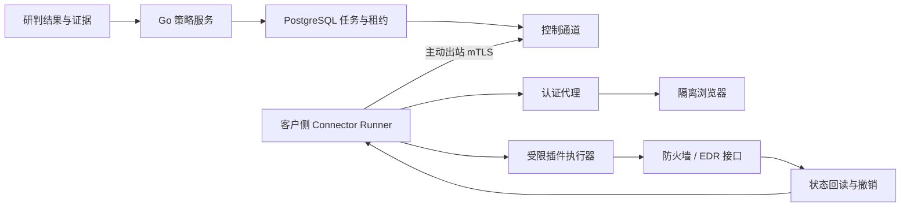

# 星烽 StarBeacon 响应联动与插件调研

调研日期：2026-09-28。范围：防火墙、EDR 等设备的自动响应、API 连接器、浏览器辅助认证及插件运行机制。本文以官方技术资料为依据，明确区分工具能力与 StarBeacon 的设计建议；尚未连接客户设备、执行封禁或完成兼容性实测。

## 1. 产品与执行边界

StarBeacon 应正式提供“观察”“审批执行”“自动执行”三种策略模式。自动执行模式在租户管理员授权的动作和目标范围内，根据校准后的研判结果、证据要求及策略阈值，直接创建并执行封禁、终端隔离等任务；无需为每次满足策略的动作再次人工确认。人工复核是证据不足、影响面超限或认证需要交互时的分支。

模型输出“恶意概率较高”不能独自构成执行授权。建议将执行条件写成可版本化的策略：`置信度门槛 + 证据门槛 + 目标匹配 + 动作权限 + 影响面限制 + 连接器能力 + 有效期`。不同模型、任务、语言、规则族使用不同的校准版本；模型自己报告的 confidence 不直接成为统一概率刻度。阈值通过本租户验证集、误阻断成本和影子运行确定，不预设一个适用于全部业务的数值。

阻断可以针对证据充分的恶意尝试提前发生，不要求先证明攻击已经成功。应分别保存检测有效性、行为性质、攻击结果和处置结果：授权扫描可能是有效检测且非恶意；设备成功创建阻断规则，不代表之前的攻击未成功。界面分别展示“研判结论”“设备执行状态”“流量处置观察”。

自动动作采用有限类型：`block_ip`、`unblock_ip`、`isolate_endpoint`、`unisolate_endpoint`、`query_state`。防火墙动作包含方向、源/目的地址、网络域、协议、端口和期限；EDR 动作以稳定终端标识为主键，不能仅凭 DHCP 地址隔离设备。共享出口、NAT、代理、CDN、核心资产等影响面由租户策略限制；需要时缩小到目的资产、协议或端口。模型和 MCP 客户端不能把任意命令、URL 或脚本直接下发到执行器。

## 2. 连接器和插件的职责

建议区分三个概念：**连接器定义**描述设备能力和接口协议；**连接器实例**绑定租户、设备地址、认证与权限；**插件制品**提供可安装的适配实现。认证方式与接口类型分别声明，不能把“使用浏览器认证”等同于“只会操作页面”。

| 接入方式 | 实现与适用情况 | 必须验证的边界 |
|---|---|---|
| 官方 API | Go HTTP/gRPC 客户端；API key、服务账号 OAuth、mTLS 等 | 设备版本、权限范围、限流、动作语义和撤销能力 |
| HTTP 表单认证 | 受限 HTTP 客户端完成正常登录、保存 Cookie、处理 CSRF | 登录响应与失败语义、重定向来源、Cookie 属性、会话期限 |
| 浏览器辅助认证后调用接口 | 登录目标管理控制台，取得被授权账号的有效会话，再调用官方 API 或控制台接口 | SSO、CSRF、前端令牌、浏览器会话绑定、私有接口版本 |
| 页面动作适配 | 只有缺乏可用接口且通过专项验收时，使用固定页面步骤完成指定动作 | 选择器稳定性、明确目标、提交回执、独立回读、可撤销性 |

私有控制台接口属于需要维护的兼容性适配，不等同于正式开放 API。插件应声明已验证设备和控制台版本、接口契约指纹、所需账号权限；升级后执行契约测试，失败时停用受影响动作并保留查询、撤销和诊断能力。页面内容、错误提示及设备日志均按不可信数据处理，不作为插件的运行指令。

优先交付声明式 HTTP 插件：宿主解释固定请求模板、字段映射、分页、认证、回读和撤销步骤，插件不能任意执行代码。复杂设备使用独立 Go 子进程或容器，通过类型化 RPC 接口接入。Go 标准库动态插件存在平台支持和构建依赖耦合限制，且不能卸载，不适合作为跨客户插件体系的默认格式。[Go plugin 文档](https://pkg.go.dev/plugin)

若采用 `go-plugin`，其作用是子进程 RPC 和故障隔离，不能替代操作系统沙箱；文档明确说明握手 magic cookie 不是安全机制。首期也可直接使用既有 gRPC 技术，不必为统一接口再引入一个插件框架。[go-plugin](https://github.com/hashicorp/go-plugin)、[握手说明](https://github.com/hashicorp/go-plugin/blob/main/docs/extensive-go-plugin-tutorial.md)

## 3. 浏览器登录、认证缓存与会话复用

### 3.1 运行方式

Go 后端采用 `chromedp` 控制独立 Chrome/Chromium 进程，可实现导航、表单提交和正常认证流程；Go 编排不意味着浏览器本身也是 Go 程序。对于必须依赖官方 Playwright 功能的复杂 SSO，可选配隔离的 Node 运行服务，由 Go 调度；无需把它引入所有部署。[chromedp](https://github.com/chromedp/chromedp)

登录完成后，先校验当前账号、组织、角色及设备标识，再授予会话可用状态。可迁移的会话交给 Go HTTP 客户端使用；浏览器绑定的会话留在原浏览器工作进程内执行限定请求。Playwright 的 `browserContext.request` 与浏览器上下文共享 Cookie，说明“浏览器登录后直接调用接口”具有明确技术路径；但该能力并不保证任意控制台都能只复制 Cookie 完成调用。[APIRequestContext](https://playwright.dev/docs/api/class-apirequestcontext)

适配器同时处理 CSRF token、Cookie、必要请求头和前端令牌。`localStorage`、IndexedDB、`sessionStorage`、分区 Cookie 或设备绑定证明不能假设等价于普通 Cookie。Playwright 的认证状态文件包含敏感信息，且不能自动覆盖所有会话状态；生产只保存经审计的必要字段，确需保留浏览器 profile 时单独加密并限定生命周期。[认证状态复用](https://playwright.dev/docs/auth)、[CSRF 防护机制](https://cheatsheetseries.owasp.org/cheatsheets/Cross-Site_Request_Forgery_Prevention_Cheat_Sheet.html)

HTTP 客户端按租户和会话独立构建 Cookie jar，配置公共后缀规则，保留正确的域、路径、有效期和安全属性；不能把浏览器所有 Cookie 拼成通用 `Cookie` 头发送到任意 URL。重定向到其他来源时重新验证权限，禁止凭证跟随未授权跳转。[Go cookiejar](https://pkg.go.dev/net/http/cookiejar)

### 3.2 认证状态设计

建议会话主键包含 `tenant_id + connector_instance_id + auth_realm + account_id + credential_version + runner_scope`，状态至少包括 `unconfigured`、`authenticating`、`ready`、`refreshing`、`needs_human`、`denied`、`revoked`。缓存期限取服务端有效期、平台最大期限和空闲期限中的有效约束；没有服务端过期时间的 session cookie 也必须设置本地上限。JWT 的 exp 是刷新依据之一，仍需接受提前撤销。

Cookie、refresh token 和浏览器状态采用信封加密，密钥由 KMS 或客户侧密钥服务管理，数据库仅保存密文及密钥引用。AEAD 附加认证数据绑定租户、连接器、账号与凭证版本，防止密文跨实例替换；日志、审计、报错、追踪、截图和调试包默认不包含凭证明文。不同会话使用独立临时目录，禁止复用工作人员个人浏览器 profile。[Go AEAD 接口](https://pkg.go.dev/crypto/cipher#AEAD)

同一进程用 `singleflight` 合并同一会话的并发刷新；它只合并本进程调用。跨 Runner 采用数据库租约、递增 fencing token 和会话版本 CAS，使过期的刷新者不能覆盖较新的令牌。延迟到达的 401 只能失效其使用的会话版本，不能清除刚刷新的版本。限制单账号登录频率和并发，对不允许多会话的设备绑定主 Runner。[singleflight](https://pkg.go.dev/golang.org/x/sync/singleflight)

部署可选择客户侧凭证托管：Runner 在客户网络加密保管凭证，平台 PostgreSQL 仅保存引用、版本、健康状态和审计摘要。需要集中托管时则使用平台密钥服务加密，并明确允许哪些 Runner 解密。两种模式均禁止跨租户共用账号、Cookie 缓存或浏览器目录。

### 3.3 过期、权限不足和人工接管

| 识别结果 | 处理方式 |
|---|---|
| 确认认证过期或撤销 | 同版本会话失效，合并刷新；限制刷新次数，再验证身份与权限 |
| 权限不足、目标被策略拒绝 | 记录 `auth_denied`/`insufficient_permission`，不反复登录 |
| HTTP 429 | 按设备限流和 Retry-After 退避，不视为登录失败 |
| 网络超时、5xx 或异步结果未知 | 查询原任务或目标状态；不可直接判定动作失败并重复创建 |
| 200 返回登录页、CSRF 错误、私有状态码 | 按适配器的响应类型与业务错误映射分类，不依赖 HTTP 码单独判断 |
| MFA、CAPTCHA、需要人工扫码 | 进入 `needs_human`，创建有期限的认证接管任务 |

OAuth Bearer 标准通常使用 401 表示无效 token、403 表示权限范围不足，但私有设备接口可能不同，因此必须按已验证的错误映射处理；不能把全部 403 当成凭证过期。[RFC 6750 §3.1](https://datatracker.ietf.org/doc/html/rfc6750#section-3.1)

人工接管入口只向有权限的租户人员开放，通过短期会话访问当前认证浏览器，完成设备要求的验证后重新检查身份。不得绕过 MFA/CAPTCHA、关闭设备认证要求或导出用户通行密钥。接管任务结束后关闭访问通道；等待期间到期的执行任务重新研判、重新检查策略，不能用过时授权补发。需要频繁交互的设备可使用其支持的服务账号认证，提高自动响应可用性。

## 4. 插件制品、沙箱与浏览器安全

插件 manifest 建议至少声明以下内容，安装后形成不可变版本：

| 字段组 | 关键内容 |
|---|---|
| 身份与完整性 | `plugin_id`、`version`、制品 digest、签名者、许可证、最低 Runner 版本 |
| 兼容性 | 厂商/产品标识、设备版本范围、控制台版本、接口契约指纹、认证模式 |
| 能力 | 动作与目标 JSON Schema、查询/预检/执行/回读/撤销入口、原生 TTL、幂等支持 |
| 权限 | 允许的动作、HTTP 方法和路径、出站 origin/端口/CIDR、登录与 IdP 来源、秘密引用 |
| 资源 | CPU/内存/执行超时、浏览器数、并发数、请求速率、响应与日志大小 |
| 验证 | 健康检查、错误分类、回归样例、支持的 dry-run、回读及撤销验收版本 |

采用制品摘要加可信签名验证。Sigstore/Cosign 支持签名及身份验证，部署应固定信任的公钥或证书身份与签发者；签名只能证明来源和完整性，不能证明代码安全。离线部署可以交付签名验证材料并配置本地信任根，不要求每次执行联网查询公共服务。[Cosign 签名验证](https://docs.sigstore.dev/cosign/verifying/verify/)

运行边界建议：非 root、只读根文件系统、专用可写临时目录、资源限制、收紧 capabilities 与系统调用、禁止 Docker socket 和任意宿主目录挂载。插件不可持有平台通用管理员令牌；通过宿主秘密代理取得仅限本连接器的凭证。多租户不可信代码和浏览器按进程/容器隔离，浏览器上下文的 Cookie 隔离不能代替系统隔离。

出站网关逐次验证 DNS 解析、目标 IP、重定向与协议，防止插件借目标地址访问平台内部服务。客户侧允许明确登记的管理网段；默认拒绝云元数据地址和无关内网目标。登录所需的 IdP 域名单独登记。设备自签名证书通过租户 CA 或明确的信任配置接入，不默认忽略 TLS 校验。

`chromedp v0.15.1` 在 root 环境可能自动加入 `--no-sandbox`，默认自动化选项也会关闭部分浏览器功能。生产须使用非 root 账号和经审查的最小启动选项，显式禁止 `no-sandbox`，启动时检查沙箱与隔离是否实际启用；不能原样复制开发参数。[固定版本启动实现](https://github.com/chromedp/chromedp/blob/v0.15.1/allocate.go)

Playwright 官方容器默认 root 的使用方式会关闭 Chromium 沙箱，其文档要求对不可信站点采用额外隔离；不能将测试镜像示例中的特权参数直接用于生产。CDP 调试端口限定在所属容器或受认证的本地代理内，不能暴露给租户或公网；认证浏览器使用专用 profile。[Playwright 容器说明](https://playwright.dev/docs/docker)、[Chrome 远程调试安全变化](https://developer.chrome.com/blog/remote-debugging-port)

浏览器按需要启动，登录后能转为 HTTP 的会话释放浏览器资源；无法迁移的会话采用有限暖池、空闲超时和租户配额。人工接管需要完整浏览器及受控交互通道，纯 headless shell 不能单独承担可视认证接管。

## 5. 客户网络 Runner 与可靠执行

Runner 主动连接平台，客户侧无需开放入站管理端口。Runner 身份绑定租户、站点和允许连接器；任务包含签名或等价完整性保护的执行票据，绑定 `tenant_id`、`runner_id`、`action_id`、目标及参数摘要、策略版本、期限和 fencing token。Runner 在本地再次校验范围、期限和防重放状态，不因拿到一条消息就获得无限执行权。

若设备接口不识别 fencing token，平台租约不能撤回已经发送到网络的旧请求。每个设备采用单执行者或经验证的并发模型，Runner 接管时协调未决操作和设备现状；依靠稳定设备资源 ID、动作幂等和回读处理迟到请求。无法限制这类重复副作用的具体动作不能获得自动执行资格。

平台通过 PostgreSQL 事务 outbox 创建任务，Runner 拉取并持有执行租约。设备产生副作用前，在本地持久日志记录动作 ID 和目标，防止重启后丢失状态。整个路径采用“至少一次投递 + 幂等执行 + 回读协调”，不承诺跨数据库和外部设备的 exactly-once。

建议执行顺序：预检 → 检查现存规则/终端状态 → 提交 → 保存设备操作 ID → 回读 → 确认或等待协调。HTTP 200/202 只按设备接口语义处理；若是异步提交，持续查询到已生效、失败或超时。执行确认丢失时，优先按动作 ID、设备规则 ID 或唯一所有权标签查找，不能简单创建另一条规则。幂等规则遵循具体接口契约，不能假设所有 POST 可安全重试。[HTTP 幂等语义](https://datatracker.ietf.org/doc/html/rfc9110#section-9.2.2)

响应状态至少分为 `queued`、`waiting_auth`、`preflight`、`submitted`、`verifying`、`effective`、`unknown`、`failed`、`revoking`、`revoked`、`revoke_failed`。认证刷新后重放写操作之前也执行回读；权限错误不重试，未知结果进入协调队列。设备规则有效只能证明策略配置存在，流量是否实际被挡住需要结合设备计数器、执行日志和相应时间范围的流量证据。

### 5.1 封禁期限与撤销所有权

每次自动封禁建立持久化的阻断租约，记录生效时间、期限、所属策略、设备资源 ID 和撤销方法。优先使用设备原生 TTL；缺少原生 TTL 时，客户 Runner 必须持有可恢复的本地撤销队列，平台另设协调任务。平台断网期间本地仍按期限撤销，重启后先恢复和协调存量租约。

同一目标被多个策略封禁时，用“共享设备资源 + 多个有效租约”表达；仅在最后一个有效租约结束后撤销 StarBeacon 创建的资源。不能删除设备中原有的人工规则，不能用目标 IP 相同作为资源归属证明。若设备不能标记规则所有权，必须通过可验证的专用规则集、唯一规则 ID 等方式隔离管理范围。

升级、停用插件或轮换凭证前检查活动租约，保留撤销所需的签名制品、权限和可用认证路径。到期只表示“应撤销”，必须回读确认后才能显示“已解除”。撤销失败持续重试并触发高优先级运维事件；不能静默把本地状态改成已解除。

自动执行能力按动作逐项验收：目标可精确绑定、提交可去重或可协调、结果可回读、权限可限制、期限可撤销。无原生 TTL 且认证可能在断网后过期、到期撤销需要无法保证及时完成的 MFA 时，不能宣称具备可靠自动到期解除；应调整服务账号或部署方式后开放有期限的自动封禁。其他已通过验收的连接器继续正常自动执行。

## 6. 持久化字段与接口契约

| 对象 | 建议字段 |
|---|---|
| 连接器实例 | `tenant_id`、`instance_id`、`plugin_version`、`artifact_digest`、`device_version`、`base_origin`、`network_zone`、`runner_id`、`auth_mode`、`credential_ref`、`credential_version`、`capabilities`、`compatibility_status` |
| 认证会话 | `session_id`、`auth_realm`、`account_id`、`session_generation`、`encrypted_state_ref`、`expires_at`、`idle_expires_at`、`refresh_lease_until`、`fencing_token`、`last_verified_identity`、`auth_status`、`failure_category` |
| 响应策略 | `mode`、`policy_version`、`decision_task`、`model_revision`、`calibration_id`、`confidence_threshold`、`evidence_requirements`、`allowed_targets`、`protected_targets`、`max_impact`、`max_actions_per_window`、`ttl` |
| 响应任务 | `action_id`、`idempotency_key`、`alert_group_id`、`evidence_refs`、`decision_snapshot`、`target_identity`、`payload_hash`、`execution_ticket`、`deadline`、`attempt`、`device_operation_id`、`device_resource_id`、`status` |
| 回读结果 | `observed_state`、`observed_at`、`verification_method`、`device_revision`、`error_category`、`retry_after`、`session_generation_used`、`evidence_digest` |
| 阻断租约 | `lease_id`、`action_id`、`ownership_marker`、`effective_at`、`expires_at`、`ttl_mode`、`revoke_payload_ref`、`last_reconcile_at`、`revoke_status` |
| 人工认证任务 | `handoff_id`、`tenant_id`、`connector_instance_id`、`required_role`、`reason`、`expires_at`、`claimed_by`、`completed_at`，不存 MFA 验证码 |

接口建议统一为 `DescribeCapabilities`、`CheckHealth`、`EnsureAuth`、`Preflight`、`Execute`、`GetOperation`、`ReadTargetState`、`Revoke`。`EnsureAuth` 可返回等待人工认证；`Execute` 返回操作 ID 和已接受状态；只有 `ReadTargetState` 或等价可靠机制才能推进为已生效。dry-run 必须声明是本地策略模拟还是设备原生预检，不能把真正的封禁操作称为测试连接。

MCP 的查询和动作入口复用平台鉴权及策略服务。对外可提供动作预检、创建响应任务、查询状态、申请撤销等有限能力，不能暴露 `EnsureAuth` 的密文内容、任意浏览器会话或任意插件执行。外部 Agent 提交动作不绕过租户范围、自动执行条件和审计；凭据始终留在执行边界内。

## 7. 固定版本与验证范围

以下为本次核实的固定版本，避免在部署清单使用移动的 `latest`。业务编译器按项目要求固定 **Go 1.26.0**。Go 指令满足只是静态前提，不等于已经完成全部依赖、CDP 协议和设备运行测试。

| 组件 | 固定版本 | 官方 go.mod / 版本事实 | 与 Go 1.26.0 的关系 |
|---|---|---|---|
| chromedp | `github.com/chromedp/chromedp v0.15.1` | `go 1.26`；2026-04-01 发布 | 满足其最低 Go 指令 |
| MCP Go SDK | `github.com/modelcontextprotocol/go-sdk v1.8.0` | `go 1.25.0`；2026-09-14 发布 | 满足其最低 Go 指令 |
| CEL Go | `cel.dev/cel-go v0.32.0` | `go 1.23.0`；2026-08-19 发布 | 满足其最低 Go 指令 |
| singleflight 所在模块 | `golang.org/x/sync v0.20.0` | `go 1.25.0` | 满足其最低 Go 指令 |
| 认证浏览器 | Chrome for Testing `154.0.8037.57` | 官方 Stable 元数据更新时间 2026-09-26 | 独立浏览器进程；需实际 CDP 兼容测试 |

来源：[chromedp release](https://github.com/chromedp/chromedp/releases/tag/v0.15.1)、[chromedp go.mod](https://raw.githubusercontent.com/chromedp/chromedp/v0.15.1/go.mod)、[MCP release](https://github.com/modelcontextprotocol/go-sdk/releases/tag/v1.8.0)、[MCP go.mod](https://raw.githubusercontent.com/modelcontextprotocol/go-sdk/v1.8.0/go.mod)、[CEL release](https://github.com/cel-expr/cel-go/releases/tag/v0.32.0)、[CEL go.mod](https://raw.githubusercontent.com/cel-expr/cel-go/v0.32.0/go.mod)、[x/sync go.mod](https://raw.githubusercontent.com/golang/sync/v0.20.0/go.mod)、[Chrome 官方版本面板](https://googlechromelabs.github.io/chrome-for-testing/)。

chromedp 的固定依赖 `cdproto` 提交 `e3e3800016bc` 与 `go-json-experiment/json` 提交 `d219187c3433` 也声明 Go 1.26。项目应提交实际解析后的 `go.mod`、`go.sum`，使用 `GOTOOLCHAIN=local` 在 Go 1.26.0 中构建并检查，不允许工具链自动升级掩盖版本不符。[cdproto go.mod](https://raw.githubusercontent.com/chromedp/cdproto/e3e3800016bc/go.mod)、[JSON 依赖 go.mod](https://raw.githubusercontent.com/go-json-experiment/json/d219187c3433/go.mod)、[Go 1.26.0 工具链约束测试](https://github.com/golang/go/blob/go1.26.0/src/cmd/go/testdata/script/mod_get_exec_toolchain.txt)

浏览器采用官方固定版本下载制品自建非 root 镜像，生产再锁定本项目产出的镜像 digest；本次没有核实可直接采用的第三方容器摘要，不编造 digest。Linux amd64 可使用官方 `154.0.8037.57/linux64/chrome-linux64.zip`；纯无界面场景对应 `chrome-headless-shell-linux64.zip`。支持人工认证接管的部署优先选择完整 Chrome。[官方制品元数据](https://googlechromelabs.github.io/chrome-for-testing/last-known-good-versions-with-downloads.json)

## 8. 交付验收

连接器管理页应呈现认证健康、兼容版本、自动执行能力、原生/平台 TTL、活动封禁、待人工认证任务和最近回读时间。策略页清晰显示启用模式、置信度对应的校准版本、证据要求、影响面与期限。动作详情能追溯证据、模型输出、策略快照、执行账号、设备操作 ID 和撤销结果。

首批验收至少覆盖：满足策略的高置信度告警实际自动执行；保护目标与影响面规则生效；授权扫描不污染误报标签；不同租户会话完全隔离；并发过期只触发一次有效刷新；403 权限不足不形成登录风暴；MFA 接管完成后正确恢复；超时与丢失回执不重复创建规则；设备异步提交需回读；平台断网及 Runner 重启后的到期撤销；共享租约和人工既有规则不被误删；插件升级失败仍可撤销存量动作。

上线成本由设备适配维护、认证复杂度、浏览器并发和动作量共同决定。API/HTTP 模式优先，浏览器只用于确有需求的认证和绑定会话，能减少资源开销；是否优于其他方案需根据真实设备兼容率、登录频次、接口变化率、自动执行成功率和撤销成功率测量。

## 9. 可选模型服务的制品锁定

平台默认提供 Go HTTP 提供方适配，不随平台捆绑 Python、PyTorch、CUDA 或 GPU 推理服务。Jev 接入固定 `model=jev-1.13.0`。本地 Laya 是另行选择、构建和验收的独立制品；配置远程 HTTP 端点也不意味着平台承诺端点内部的运行时组合已经验证。

截至本次查询，Laya 官方 GitHub `main` 的实际代码提交为 `9d955671415fc19f069b9cc998928075c1f255ec`，提交时间为 2026-09-27 19:27:17 UTC，对应 `pyproject.toml` 中版本 `0.3.21`。部署锁定 commit，不能仅依赖会移动的分支或浮动安装命令。[代码提交](https://github.com/NandhaKishorM/laya/commit/9d955671415fc19f069b9cc998928075c1f255ec)、[冻结的包定义](https://github.com/NandhaKishorM/laya/blob/9d955671415fc19f069b9cc998928075c1f255ec/pyproject.toml)

推荐统一使用官方 bundle 仓库 `convaiinnovations/laya`，当前 API 返回的 revision 为 `55cf4c4ebb4ebe31b2550e8bdf3bd21b99753851`，最后修改时间为 2026-09-24 05:39:22 UTC。三个检查点同属这一仓库快照，依靠子目录区分，不需要分别猜测模型版本。[HF 模型元数据](https://huggingface.co/api/models/convaiinnovations/laya)、[固定模型快照](https://huggingface.co/convaiinnovations/laya/tree/55cf4c4ebb4ebe31b2550e8bdf3bd21b99753851)

| 检查点 | HF 仓库 | revision | 子目录 |
|---|---|---|---|
| 英语 | `convaiinnovations/laya` | `55cf4c4ebb4ebe31b2550e8bdf3bd21b99753851` | 根目录 |
| 多语言 | `convaiinnovations/laya` | `55cf4c4ebb4ebe31b2550e8bdf3bd21b99753851` | `multilingual` |
| typed-decisions | `convaiinnovations/laya` | `55cf4c4ebb4ebe31b2550e8bdf3bd21b99753851` | `typed-decisions` |

该映射与冻结代码的 `DEFAULT_MODELS` 一致。SDK 支持显式 `revision` 和按模型指定 `revisions`；服务还支持 `LAYA_REVISION`。生产固定实际 SHA，并为每个检查点记录权重、tokenizer、配置的独立摘要；不将上游 `reviewed` 别名等同于经过 StarBeacon 业务验收。[固定版本 Router](https://github.com/NandhaKishorM/laya/blob/9d955671415fc19f069b9cc998928075c1f255ec/laya/router.py)、[revision 与摘要校验实现](https://github.com/NandhaKishorM/laya/blob/9d955671415fc19f069b9cc998928075c1f255ec/laya/revisions.py)

官方包的依赖约束如下，均为上游声明的要求，并非本项目已验证的完整锁定组合：

| 范围 | 上游声明 |
|---|---|
| Python | `>=3.10` |
| 核心推理 | `torch>=2.0.0`、`transformers>=4.48.0`、`safetensors>=0.4.0`、`huggingface_hub>=0.20.0`、`numpy>=1.20.0` |
| HTTP 服务 extra `serve` | `fastapi>=0.110.0`、`uvicorn>=0.27.0`、`python-multipart>=0.0.9` |
| 构建 | `setuptools>=61.0` |

依赖依据是该 commit 的 `pyproject.toml`，不是一个完整 `requirements` 锁文件；其中没有固定所有传递依赖、wheel 构建或平台版本。TileLang、ONNX、模型自己的 MCP、LangChain 等均为可选 extra，不因提供 HTTP 推理自动安装。[依赖定义](https://raw.githubusercontent.com/NandhaKishorM/laya/9d955671415fc19f069b9cc998928075c1f255ec/pyproject.toml)

上游 Dockerfile 默认采用 `python:3.11-slim-bookworm` 和 `torch==2.14.0` 的 CPU wheel，可作为构建参考；它仍有浮动基础镜像及未完全锁定的其他依赖。本次未构建此镜像、下载权重或执行推理，因此不能称为已验证部署矩阵。[固定版本 Dockerfile](https://github.com/NandhaKishorM/laya/blob/9d955671415fc19f069b9cc998928075c1f255ec/Dockerfile)

交付本地推理时，另行形成包含 Python 补丁版本、全部依赖版本和哈希、CPU/GPU 构建类型、适用硬件、模型文件摘要、镜像 digest 与校准制品的清单，并验证离线启动、认证、模型身份、中文样本和资源上限。Qwen3.5-9B、Qwen3.8-27B 当前仅作为模型候选；尚未验证的推理框架、量化格式、驱动与硬件组合不列为可直接交付的部署组合。
