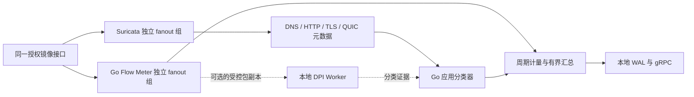

# 星烽 StarBeacon 应用识别与流量分析调研

调研日期：2026-09-28。范围是百度网盘、爱奇艺等应用产品的流量归因、分类规则、实时计量和应用流量大屏。本文使用官方文档、固定版本源码与协议标准，区分已核实能力、平台设计和待测指标。平台采用 Go 1.26.x、Suricata 8.0.7、PG 控制面、ES 检索与 S3 证据存储；统一实施规范以[应用识别与响应性能设计](../应用识别与响应性能设计.md)、[架构设计](../架构设计.md)和[运营与集成设计](../运营与集成设计.md)为准。

## 1. 选型结论与版本依据

默认路径是 **Suricata 协议元数据 + Go 应用分类器 + Go Flow Meter**。分类器利用域名、可见 Host/SNI、协议与指纹作有证据的产品归因；Flow Meter 独立提供周期字节计数，避免长连接直到结束才出现在流量大屏。nDPI 作为可选的本地增强引擎，不是首期强制依赖。

| 组件 | 已核实版本与能力 | StarBeacon 使用方式 |
| --- | --- | --- |
| Suricata | 固定 8.0.7；协议解析、EVE 元数据、检测规则 | 保持安全检测权威；提供 HTTP/DNS/TLS/QUIC 等证据 |
| GoPacket | `github.com/gopacket/gopacket v1.7.2`，2026-09-15 正式发布，BSD-3-Clause | Linux Flow Meter 的 AF_PACKET 采集与包头解码候选 |
| GoPacket 工具链 | 固定 tag 的 `go.mod` 为 `go 1.25.0`；README 的 1.24 表述不能覆盖模块要求 | 应用使用指定补丁的 Go 1.26.x、`GOTOOLCHAIN=local`；完整构建待验收 |
| nDPI | **6.0 Stable**，2026-08-28 正式发布；核心 LGPLv3，部分解析器双许可 | 商业部署按实际解析器许可启用；不笼统承诺全部能力免费 |

版本依据：[GoPacket Release](https://github.com/gopacket/gopacket/releases/tag/v1.7.2)、[固定 go.mod](https://github.com/gopacket/gopacket/blob/v1.7.2/go.mod)、[许可证](https://github.com/gopacket/gopacket/blob/v1.7.2/LICENSE)、[nDPI 6.0 Release](https://github.com/ntop/nDPI/releases/tag/6.0)。GoPacket 当前直接依赖的 `x/net v0.55.0` 与 `x/sys v0.45.0` 也声明 Go 1.25.0；这只是该库自身的声明，平台代表性组合经 MVS 实际选择 `x/net v0.58.0`、`x/sys v0.48.0`；详见[统一图核验](依赖版本核验.md#九go-工具链与统一依赖图复核)，不作为吞吐或应用构建证明。

产品需要分别表达三个问题：观测到什么网络协议、流量最可能属于哪个服务、终端上实际运行哪个进程。被动网络分类通常只能回答前两项；访问网盘网站不能证明安装了网盘客户端，访问视频域名不能证明正在播放视频。

## 2. Suricata 8.0.7 的能力边界

### 2.1 协议识别不等于产品识别

`app_proto` 表达解析器识别的应用层协议，如 HTTP、TLS、DNS、QUIC，而不是一个覆盖所有互联网产品的应用目录。`app-layer-protocol` 可按识别结果匹配，HTTP/DNS/TLS sticky buffer 可表达更细的内容条件，但命中一个名称仍需平台规则决定其产品语义。[应用层规则](https://docs.suricata.io/en/suricata-8.0.7/rules/app-layer.html)

应用识别规则与威胁检测规则分开管理。普通网盘或视频访问产生流量分类记录，不因“识别为某应用”自动变成安全告警。需要“非工作时间访问”“某应用异常外发”等策略时，再由明确的行为策略引用分类结果和字节证据。

| 证据 | 可见条件与用途 | 不能作出的推断 |
| --- | --- | --- |
| HTTP Host、URI、User-Agent | 明文 HTTP 或受授权的解密后观测点；可区分服务入口、接口及客户端线索 | 加密 HTTP 内容在旁路默认不可见；UA 可以伪造 |
| DNS 名称与 A/AAAA/CNAME | 观察到对应客户端的查询和应答；有时间、TTL 与网络域约束 | 查询不等于实际连接；共享解析器回答不能无条件归到所有终端 |
| TLS SNI | 观察到可解析的 ClientHello，名称未被 ECH 隐藏 | 名称不是服务器身份验证结果；共享域名不证明具体产品行为 |
| TLS 证书 | 可见证书握手、证书日志或授权外部证据 | 不能假定 TLS 1.3 旁路总能读取证书；共享证书不等于同一产品 |
| QUIC Initial 元数据 | 支持的版本、完整 Initial/CRYPTO 数据和可见 ClientHello | 不等于解密 HTTP/3 请求、路径或视频内容 |
| JA3/JA4、ALPN、流量形态 | 作为客户端实现与协议线索，辅助已验证的组合规则 | 浏览器或公共 SDK 指纹不能单独唯一定位某产品 |
| IP、ASN、端口 | 专用且有期限的地址清单可辅助归因 | 443、共享 CDN IP、某厂商 ASN 不能直接等于百度网盘或爱奇艺 |

HTTP 与 DNS 规则字段以锁定版本能力为准。[HTTP 关键字](https://docs.suricata.io/en/suricata-8.0.7/rules/http-keywords.html)、[DNS 关键字](https://docs.suricata.io/en/suricata-8.0.7/rules/dns-keywords.html)、[TLS 关键字](https://docs.suricata.io/en/suricata-8.0.7/rules/tls-keywords.html)

TLS 1.3 在 ServerHello 之后加密握手消息，因此旁路证书取证不能沿用 TLS 1.2 的可见性假设。ECH 加密 ClientHelloInner；外部可见的 public name 不等于真实目标名称。记录 ECH 扩展线索也不能证明已恢复内部名称，更不能仅凭扩展存在就断言协商成功。[TLS 1.3](https://www.rfc-editor.org/rfc/rfc8446.html)、[ECH](https://www.rfc-editor.org/rfc/rfc9849.html)

### 2.2 QUIC 与指纹应按固定源码验收

Suricata 8.0.7 的 QUIC 规则页仍以版本和早期 CYU 为主，但固定源码已经处理 Initial、提取 SNI 和 JA3/JA4；密钥推导代码包含 QUIC v1/v2。EVE 的 QUIC 输出有 `sni`、`ja4` 等字段。不能据旧说明把它误写为“只能看 QUIC 版本”，也不能反向夸大为可解密 HTTP/3 正文。[QUIC 解析器](https://github.com/OISF/suricata/blob/suricata-8.0.7/rust/src/quic/quic.rs)、[Initial 密钥处理](https://github.com/OISF/suricata/blob/suricata-8.0.7/rust/src/quic/crypto.rs)、[QUIC EVE 输出](https://github.com/OISF/suricata/blob/suricata-8.0.7/rust/src/quic/logger.rs)

QUIC Initial 的密钥与应用数据密钥具有不同安全含义；能解析 Initial 不意味着获得后续握手和应用内容。[QUIC TLS 标准](https://www.rfc-editor.org/rfc/rfc9001.html#section-5.2) JA4 还需要编译特性和运行配置支持；未明确开启时，不能把“没有匹配规则”误当成“仍必然生成指纹”。平台能力页记录实际生效配置、功能探测与样本验证结果。[Suricata JA3/JA4](https://docs.suricata.io/en/suricata-8.0.7/rules/ja-keywords.html)

### 2.3 EVE flow 不是周期活跃流计量接口

8.0.7 的 flow logger 挂在 flow 生命周期处理链；源码在流移出哈希并准备回收时调用输出。EVE flow 的 `reason` 包括 timeout、forced、shutdown，字节值是累积量。不能仅靠调整文件 flush、stats interval 或缩短 flow timeout，宣称获得无损的周期活跃流明细。[Flow Worker](https://github.com/OISF/suricata/blob/suricata-8.0.7/src/flow-worker.c)、[Flow 输出注册](https://github.com/OISF/suricata/blob/suricata-8.0.7/src/output-json-flow.c)

`heartbeat.output-flush-interval` 仅刷新已经产生的 EVE 输出；默认 0，非零输出缓冲可能带来额外延迟。它不提前生成还未触发的 HTTP/TLS/flow 事件。时延监控必须区分“协议元数据尚未产生”“日志已产生但未刷新”“上报积压”“ES 未可见”。[8.0.7 配置](https://github.com/OISF/suricata/blob/suricata-8.0.7/suricata.yaml.in)

## 3. nDPI 的真实覆盖与商业成本

### 3.1 目标应用的源码证据

| 应用 | 6.0 固定源码核验结果 | 交付含义 |
| --- | --- | --- |
| 爱奇艺 | 有 `NDPI_PROTOCOL_IQIYI`，数值为 54；独立 UDP 解析器匹配特定长度范围中的 `PPStream` 特征 | 是确实存在的签名；仅据它不能保证现代网页、App、所有 CDN 与 QUIC 都能识别 |
| 爱奇艺域名 | 内置映射包含 `iqiyi.com`、`iqiyipic.com`、`qy.net`、`iq.com`、`pps.tv` | 可作为候选来源；其中静态图片、入口和内容传输的业务作用仍需区分 |
| 百度网盘 | 对协议 ID、协议说明和内容映射核验，未发现独立百度网盘产品 ID/签名 | 不能把“安装 nDPI”写成已经满足百度网盘识别验收 |
| 泛百度域名 | `baidu.com` 出现在搜索引擎类别映射 | 不能转换成网盘产品标签；必须维护更具体、有证据的网盘规则 |

来源：[协议 ID](https://github.com/ntop/nDPI/blob/6.0/src/include/ndpi_protocol_ids.h)、[爱奇艺解析器](https://github.com/ntop/nDPI/blob/6.0/src/lib/protocols/iqiyi.c)、[域名及类别映射](https://github.com/ntop/nDPI/blob/6.0/src/lib/ndpi_content_match.c.inc)、[协议说明](https://github.com/ntop/nDPI/blob/6.0/doc/protocols.rst)。这里的“未发现”限定于本次所列固定版本与文件核查，不是对所有外部分支的断言。

百度网盘需建立平台自有的产品条目和样本集，分别覆盖网页入口、登录、目录操作、上传、下载、分享和可能的加速传输。域名清单必须依据产品官方材料、授权测试抓包与变更记录逐条批准；本次不把网上流传的泛域名清单包装为经过验证的完整签名库。

### 3.2 6.0 许可直接影响可用解析器

官方说明将核心库与额外双许可组件分开。为直接或间接收益使用 nDPI 时，不能用非盈利项目模式启用全部组件。核心模式与签约授权模式分别由初始化参数表达；这需要进入制品清单和启动能力校验。[6.0 许可说明](https://github.com/ntop/nDPI/blob/6.0/README.license.md)、[初始化模式枚举](https://github.com/ntop/nDPI/blob/6.0/src/include/ndpi_typedefs.h)

固定源码中，TLS/DTLS、QUIC、DNS 解析器标为 `DISSECTOR_LICENSE_NTOP_DUAL_LICENSE`；HTTP 和爱奇艺专用 UDP 解析器标为 LGPL。`NDPI_LICENSE_FOR_PROFIT_LGPL` 会跳过双许可解析器。因此 **nDPI 6.0 的商业 LGPL 核心模式不能作为免费 TLS/QUIC/DNS 增强路径**；不能根据库根目录 LGPL 标记推断这些功能都可直接启用。[TLS](https://github.com/ntop/nDPI/blob/6.0/src/lib/protocols/tls.c)、[QUIC](https://github.com/ntop/nDPI/blob/6.0/src/lib/protocols/quic.c)、[DNS](https://github.com/ntop/nDPI/blob/6.0/src/lib/protocols/dns.c)、[注册过滤逻辑](https://github.com/ntop/nDPI/blob/6.0/src/lib/ndpi_main.c)

采用独立进程有助于工程隔离，但不会自动消除上游的用途许可条件。交付时核实实际构建文件、解析器清单、链接和分发方式、许可文本与商业授权范围；授权费用不在没有正式报价时填成零，也不编造金额。

### 3.3 Go 集成、规则及维护方式

nDPI 是 C 库，固定版本仓库未提供官方 Go 模块。核心处理接口接收从 IP 头开始的 L3 字节、长度、时间和外部管理的 flow state；GoPacket 的整个 Ethernet 帧不能直接作为该接口输入。每个有状态 Worker 使用独立检测上下文，按对称会话键固定分配；初始化接口明确不能并行调用。[C API](https://github.com/ntop/nDPI/blob/6.0/src/include/ndpi_api.h)

可选部署优先是 Go 编排本地 DPI Worker，使用有版本的 Unix socket/共享内存消息，传入受控的早期包或后续补充包，返回分类证据；Worker 崩溃不能带走告警上传。另一种方案是在独立 Go 进程内通过 cgo 调用 C 库，需承担 C 内存、跨编译和崩溃影响。不能把任意社区 Go 封装当作官方、当前兼容的 SDK。

自定义规则可表达端口、主机、IPv4/IPv6 地址与子协议；`ndpi_load_protocols_file` 加载规则文件，官方示例给出 `host:"..."@产品名` 等形式。地址或端口识别属于较弱证据；新增 C 解析器属于受控软件发布，不允许租户直接上传共享库执行。[规则文件示例](https://github.com/ntop/nDPI/blob/6.0/example/protos.txt)

6.0 的 `packets_limit_per_flow` 默认值为 32，是 DPI 检查预算，不是“只统计前 32 个包”。准确带宽仍要对该流后续报文持续计数；达到预算后保留未知状态或已有归因，并记录预算耗尽原因。[参数定义](https://github.com/ntop/nDPI/blob/6.0/doc/configuration_parameters.rst) 引擎升级与域名库更新独立版本化；上游 PCAP 回归测试之外，还需本项目中国应用的正负样本集。

## 4. 采集部署与重复开销

### 4.1 默认的两条采集路径



AF_PACKET `PACKET_FANOUT_HASH` 是组内按流分发，`PACKET_FANOUT_LB` 是组内轮转，不是给每个消费者复制完整流量。将 Suricata 和 Flow Meter 放入同一 fanout 组会使它们各自只拿到部分报文；必须分配不同且受控的组 ID。同一组内保持会话两向落在同一 Worker，不用逐包轮转破坏状态。[Linux PACKET_MMAP](https://docs.kernel.org/networking/packet_mmap.html#af-packet-fanout-mode)

独立组意味着内核对两个消费路径分别送包，存在额外内存带宽、ring 与 CPU 开销。Flow Meter 不再做 L7 重组、正文识别和重复 PCAP 落盘；完整原包由独立记录器负责，因此生产预算须包括记录器、检测器、计量器三路，不是“同口抓多次零成本”。若启用 nDPI，应复用 meter 的有界包副本，不再默认增加第四路全量抓包，也不通过循环读取落盘 PCAP 来实现实时识别。

真正统一的捕获分发器必须显式支持复制引用、消费者独立背压和 Suricata 可用的接入方式，并验证 GPL/插件、升级与丢包边界；不能假定标准 Suricata 已支持项目自定义的任意共享 ring。此项只在双路径压测证明有必要时实施，不作为首期已经具备的能力。

### 4.2 Go Flow Meter 的可落地实现

使用 GoPacket `afpacket.NewTPacket`、TPACKET_V3、`ZeroCopyReadPacketData` 和复用的 `DecodingLayerParser`；只解码链路类型、VLAN、IPv4/IPv6、必要扩展头、TCP/UDP/ICMP 与长度。当前 `afpacket` 包使用 Go 与 `x/sys/unix`，不依赖该包内 cgo；不要无意导入 libpcap 路径使生产 Linux 代理承担另一套依赖。[AF_PACKET 实现](https://github.com/gopacket/gopacket/blob/v1.7.2/afpacket/afpacket.go)、[复用解码器](https://github.com/gopacket/gopacket/blob/v1.7.2/parser.go)

零复制返回的字节在下一次读取后可能失效。默认在采集循环内完成包头计数；交给异步 DPI Worker 的数据必须复制到有上限的自有池，或有明确的共享内存所有权。每包分配完整对象、复制整包和逐包 JSON 都应从热路径移出。

计量键包含网络域、观测点、VLAN/隧道层级、IP 版本、协议、对称端点和本地 flow 代次。不能仅以五元组无限复用：TCP 重连、UDP 空闲超时、引擎重启都产生新的生命周期。非首片 IP 分片可能没有端口；有界分片关联失败时进入“未归属分片”，不能漏出总字节或错归其他连接。

物理接口配置需检查对称 RSS、NUMA、队列与 IRQ 亲和，Suricata 需要同流双向报文按可用顺序到达。GRO/LRO 合并会改变包数与可见包形态，应按监测网卡配置验收；不能把业务服务器上所有网卡的 offload 无差别关闭。[Suricata 抓包性能说明](https://docs.suricata.io/en/suricata-8.0.7/performance/packet-capture.html)

Flow Meter 自己记录捕获丢包、解析失败、分片未归属、表项驱逐、ring 等待与导出延迟。达到资源上限时显示缺口，并保证 Suricata 安全检测和告警上报具有预留资源，不能为了大屏反压检测链路。

## 5. 应用目录与分类规则

### 5.1 产品目录

PG 管理 `app_products`、`app_categories`、`app_rule_sets`、`app_rule_versions`、`app_rule_test_runs`、`app_rule_releases`。应用产品使用平台稳定 ID，显示名称、厂商、类别、服务端点角色、适用地区/客户端版本、证据来源、维护责任人和有效期；不直接把可能变动的 nDPI 数字 ID 当平台主键。

类别如网盘存储、在线视频、即时通信、办公协作、系统更新、游戏平台、远程访问等，表达业务用途；它们与恶意性、攻击结果和处置风险是不同维度。“未知应用”与“已识别为 TLS”可以同时成立。

### 5.2 平台规则形式

Go 分类器使用受限、可签名的 JSON AST，不接受任意脚本；若支持 YAML 编写，发布前转换为同一规范 JSON 结构。匹配条件支持字段精确值、按域名标签的后缀、集合、协议组合、有限长度模式与证据时间关系。域名经固定 IDNA/大小写/尾点策略规范化，原值保留；`iqiyi.com` 的后缀匹配不能错误命中 `notiqiyi.com`。

下面仅展示规则结构，属于待回放验证的候选，不能直接作为完整网盘识别签名发布：

```yaml
schema_version: 1
rule_id: app.baidu-netdisk.entry-domain
revision: 1
product_id: baidu-netdisk
category_id: cloud-storage
service_role: web-entry
status: candidate
match:
  any:
    - field: tls.sni
      op: domain_exact
      value: pan.baidu.com
    - field: quic.sni
      op: domain_exact
      value: pan.baidu.com
    - field: http.host
      op: domain_exact
      value: pan.baidu.com
result:
  activity: service-access
  confidence_level: medium
  client_application: unknown
  claims_file_transfer: false
```

入口名称归因不覆盖上传下载数据连接。要识别“上传”“下载”“视频播放”，需要独立规则、内容端点角色、方向和样本证据；不能把域名命中后的所有字节直接称为文件内容字节或观看时长。共享 CDN 只提供平台级、厂商级或未知归因时，就按该粒度展示。

DNS 缓存键至少包含租户、网络域、客户端身份、应答 IP、名称链和有效时间；尊重 TTL，保留一对多候选。不通过“最近某人解析过该 IP”给其他资产的连接贴同一产品标签。DoH/DoT、缓存命中、硬编码 IP、代理、VPN 和 ECH 都会降低可见性，未知是合法结果。

### 5.3 优先级与发布

依据为“明确的应用协议特征/已验证复合规则 → 专用服务名称 → 有时限 DNS 关联 → 专用 IP 辅助 → 指纹/行为线索”。这是设计优先级，不是统一的统计概率。租户明确的业务标注独立保存，不能删除原识别证据；冲突时显示候选与冲突原因，不以最后到达的消息无条件覆盖。

规则包包含 schema、平台产品目录版本、规则版本、域名库版本、引擎能力、许可证来源、测试摘要和签名。发布前检查域名交叠、公共后缀、过宽 IP 段、正反例、升级前后差异；按探针灰度，监测未知率、产品跳变和 CPU 成本。探针确认的是实际生效摘要。旧流可以固定创建时规则版本，或经明确策略再分类；两者不能混为一次无痕热更新。

## 6. 分类数据模型与跨引擎关联

| 字段组 | 建议内容 |
| --- | --- |
| 网络协议 | `network.transport`、`network.protocol`、协议版本；端口与协议分别保留 |
| 应用产品 | `application.product_id`、`application.category_id`、`application.vendor_id`、服务子类 `service_id` |
| 客户端和行为 | `application.client_application`、`application.activity`；无证据保持 unknown |
| 识别状态 | 已确认、规则推断、冲突、混合、未知；候选规则的发布状态与识别状态分开 |
| 证据 | 引擎、来源事件、名称字段、规则 ID、命中值摘要、时间、scope、冲突与缺失 |
| 置信度 | 等级、方法；只有经过标注集校准的模型才展示概率数值 |
| 版本 | 分类器、规则包、目录、DPI 引擎、决策修订、数据 schema |
| 可见性 | encrypted、ECH 线索、midstream、单向、缺包、截断、采样与解析预算耗尽 |

Suricata 会话身份沿用 `tenant + sensor + engine_run_id + flow_id`。Flow Meter 和 DPI Worker 使用自己的稳定 flow ID，不伪造 Suricata flow_id。以同一网络域/观测点、规范五元组、方向与时间重叠关联；`community_id` 只是候选键，不含连接代次，也不能自动解决 NAT 或 QUIC 迁移。

连接迁移、多条 HTTP 事务复用一个连接、共享代理和隧道会破坏“一条 L4 流只属于一个产品”的假设。能按可验证事务范围归因时保存范围；不能可靠拆字节时标记 mixed/ambiguous，不把整条 TLS 连接重复分配给所有候选应用。

分类结果是带版本的派生事实。迟到 SNI/Host 或人工标注可提升分类，原证据与原结论保留；重算聚合使用确定性的修订与水位。当前解释与当时解释分别可查，报告冻结采用的分类库与数据修订。

## 7. 带宽、会话与资产的计量契约

### 7.1 定义字节与方向

大屏默认使用选定计量点的 **L3 IP 字节**，明确 `byte_basis`，L2/NIC 观测与应用有效载荷另列。Flow Meter 同时保存原报文长度与实际捕获长度用于核对，不能用 `len(captured_bytes)` 把 snaplen 截断变成小带宽；内核 `tp_len` 与 `tp_snaplen` 本来就是不同字段。L3 计量校验 IP 声明长度与实际报文范围，畸形或无法解析的长度标为质量异常，不能让伪造头字段放大总量；注明 VLAN、FCS、隧道和 offload 处理方式。[GoPacket ring 长度读取](https://github.com/gopacket/gopacket/blob/v1.7.2/afpacket/header.go)

Suricata `bytes_toserver/bytes_toclient` 在固定源码以 `GET_PKT_LEN(p)` 累加；不是纯 HTTP body 大小。EVE 总量已经包括其 bypassed 子量时，不能再把 bypassed 加一次。重传消耗链路资源，应进入观测带宽；应用去重有效载荷另算。[字节累加实现](https://github.com/OISF/suricata/blob/suricata-8.0.7/src/flow.c)、[Flow 字段输出](https://github.com/OISF/suricata/blob/suricata-8.0.7/src/output-json-flow.c)

`toserver/toclient` 是引擎角色方向，不天然等于企业出口上传/下载。平台依据资产边界、观测位置和已验证角色计算 `asset_tx/asset_rx`、`egress/ingress`；看不到握手时保留方向不确定。内网两端同时作为资产统计时可各有收发视图，但租户总流量不能把两端视图相加。

### 7.2 长流与时间窗

Flow Meter 对活跃流持续计数，按事件时间进入固定短窗口；采集循环、窗口输出和网络上传解耦。统一默认值是 5 秒窗口及 5 秒视图刷新，历史使用分钟/小时等汇总；聚合进入大屏 P95 ≤10 秒是整体主文的设计目标，需要压测，不是上游保证。

每个窗口记录 `meter_epoch`、稳定流/聚合键、`window_start/end`、`sample_seq`、累计量、窗口增量、归因修订与完整性。正常窗口带宽为 `8 × 窗口字节 / 窗口秒数`；峰值来自保留的短窗口，不从整条长连接的平均速率推算。流结束补发最后未封口窗口并对账，不把最终累计量再累加一次。

本地窗口先进入 WAL 再上报，重试沿用记录 ID 与固定逻辑分区；下游按键/修订幂等，不能使用重复消息驱动的无条件加一。采集进程崩溃前未持久化的内存窗口仍可能损失；显示最后持久水位和中断范围，不承诺抓到的每个包都已落盘。序号缺口、乱序和计数器复位需要单独处理，不能把跨多个缺失窗口的差值全部归到最后一个窗口。

默认总量以 Flow Meter 为唯一计量来源，Suricata flow 累计用于可比范围对账。未部署 meter 的站点可展示“已结束会话统计”，但不能与实时带宽无标记混合。最终 flow 字节不能全归入结束时刻，也不能假装知道其历史秒级分布。

### 7.3 多观测点及会话去重

为每条链路配置 `measurement_domain`、计量层级、主观测点和生效时间。同一出口同时被 TAP、核心镜像和防火墙侧看到时，主带宽只取一个已选定观测面；其他点用于覆盖与路径分析。故障切换带明确时界与代次，避免重叠窗口计量两遍。

社区 ID/五元组相同不证明两条观测能直接相减；NAT、路径变化、时钟偏差、丢包和聚合出口可能产生歧义。跨观测点做会话关联时保留置信度，计费级精确去重不能仅靠模糊时间窗口。

指标分开定义“本窗新建会话”“本窗出现流量的会话”“当前活跃会话”“窗口内唯一资产”。它们不能通过累加每秒 gauge 得到。长窗活跃峰值取有时间对齐的 gauge；唯一计数可使用受控精确集合或估算算法，估算时明确标记误差性质。QUIC 迁移未可靠关联时展示观测流段数，不冒充用户会话数。

## 8. 存储、成本与大屏

PG 只保存应用目录、规则、发布、计量域和任务；不为每个包、每个活跃 flow 或每秒样本建 PG 行。ES 保存可检索的会话/分类事实和流量聚合；必要的原始回放 PCAP 仍在 S3。应用统计是派生数据，归因重算不能修改原始告警事实。

探针默认按计量域、资产、方向、时间窗等固定维度作有界汇总，文档内保存完整应用分布；保留 15 分钟修正窗内的必要逐流状态供迟到分类和核对，上传会话开始、结束、分类变化等明细。逐流高频历史按站点/资产范围或调查任务显式启用，产生后的业务记录默认保留 180 天，用户可按类别调整；15 分钟修正窗仅是在线计算状态 TTL，不是历史删除期限。应用数和资产组合无上限时同样会爆炸，聚合维度和热表均需预算；Top N 展示必须带“其他”和“未知”，不能悄悄丢掉尾部流量。只有资产组/网段汇总而无资产级数据的部署模式，不能宣称提供完整精确的 Top 资产排行。

迟到分类将未知流量重新归因到产品时，采用主文的完整分布替换：`aggregate_id` 不包含应用，包含采集器注册、计量器代次、计量域、时间窗和固定维度键；同一有界文档保存总量与应用分布。单调 revision 拒绝旧值覆盖，OCC 保护并发，整体替换避免先盲减后盲加。物理索引/路由绑定窗口固定逻辑桶，不随当前日期或 rollover 改变，否则跨索引会残留两份分布。超出本地细粒度留存的历史重算能力必须声明，不能声称只有分钟总量也能重新拆出每条流。

成本估算采用以下公式，参数必须从代表性 PCAP 与真实部署压测获得：

| 项目 | 估算方法 |
| --- | --- |
| 抓包负载 | `PPS ≈ 观测比特率 / (8 × 平均同口径报文长度)`；小包压力需单独测试 |
| CPU | `所需核 ≈ (PPS×每包处理ns + 新流率×建流ns + 元数据率×分类ns) / (10⁹×目标利用率)` |
| 流表内存 | `峰值活跃流 × 单流状态实测字节 + DNS缓存 + 窗口桶 + ring + 输出队列` |
| 全量逐流周期事件 | `有变化活跃流数 / 周期秒数 × 探针数` |
| 上报与存储 | `事件/聚合速率 × 平均编码字节 × 留存 × 索引放大 × 副本` |

示例：每探针 20,000 条有流量的活跃流、每 10 秒一条、200 个探针，等于 400,000 条/秒；按 500 字节即约 17.28 TB/日的编码体积，尚未包含 ES 放大和副本。这是算例，不是实测；说明“每条 flow 周期全量入 ES”必须先核算。不要给出没有包长、PPS、新流率、规则规模、丢包率和机器型号的“单核支持若干 Gbps”承诺。

应用流量页与大屏至少提供：

| 视图 | 展示与下钻 |
| --- | --- |
| 应用排行 | 当前/平均/峰值带宽、累计上下行、占比、已识别与未知；下钻应用→资产→会话→证据 |
| 应用类别 | 网盘、视频、办公等带宽和趋势；业务类别与威胁严重度分开 |
| 资产视图 | 每资产应用占比、发送/接收、并发、异常增长；资产身份随事件时间解析 |
| 会话视图 | 原始端点、协议、产品、证据、识别版本、持续时间、方向、缺口 |
| 趋势视图 | 秒/分钟/小时分辨率，标记实际水位、迟到修订、采样和缺测；缺测不画成 0 |
| 覆盖视图 | 可见名称率、未知产品率、加密/ECH线索、分类冲突、各观测点丢包和元数据延迟 |

点击应用名称继承时间窗、计量域、租户和资产权限。所有占比明确分母：全部观测字节或已识别字节；默认包含未知，避免通过隐藏未知制造高识别率。报告同时给出样本覆盖与规则版本，不能把界面中漂亮的产品名替代识别质量证据。

## 9. 验收数据与实施顺序

第一阶段交付 Go Flow Meter、应用目录、域名 AST、EVE 关联、窗口幂等与大屏。第二阶段按实测未知流量分布评估是否值得引入有授权的 nDPI 或专用解析；第三阶段只针对瓶颈评估统一捕获分发、硬件分流或更复杂的流处理。每一步都保留可单独关闭的增强功能，告警采集不依赖应用产品能否判定。

验收集按产品、操作、客户端/浏览器、地区、IPv4/IPv6、TLS/QUIC、ECH、共享 CDN、代理、单向与缺包分层；授权真实 PCAP 与合成协议边界样本分开。爱奇艺需要至少区分登录、封面/页面、播放、下载与其他业务；百度网盘需要区分入口、上传、下载、分享以及泛百度服务负例。

识别报告公布每产品 precision/recall、未知率、冲突率、首次有效识别时延、字节加权覆盖率和样本量；未知不简单计为误报，指纹误归因需独立分析。线上未标注流量不能用来声称准确率已经达到某个百分比。

可靠性验收包括：持续数小时的流不结束仍有带宽、WAL 重放不增加累计量、末尾窗口不重复、分类迟到修订不改变总字节、多观测点切换不重叠、IPv6 分片和 VLAN 不漏总量、snaplen 不压低长度、采集丢包可见、meter/DPI 崩溃不阻断 Suricata、许可模式与实际启用解析器一致。完整系统尚未实现和压测，文中的周期与预算均为实施起点。
