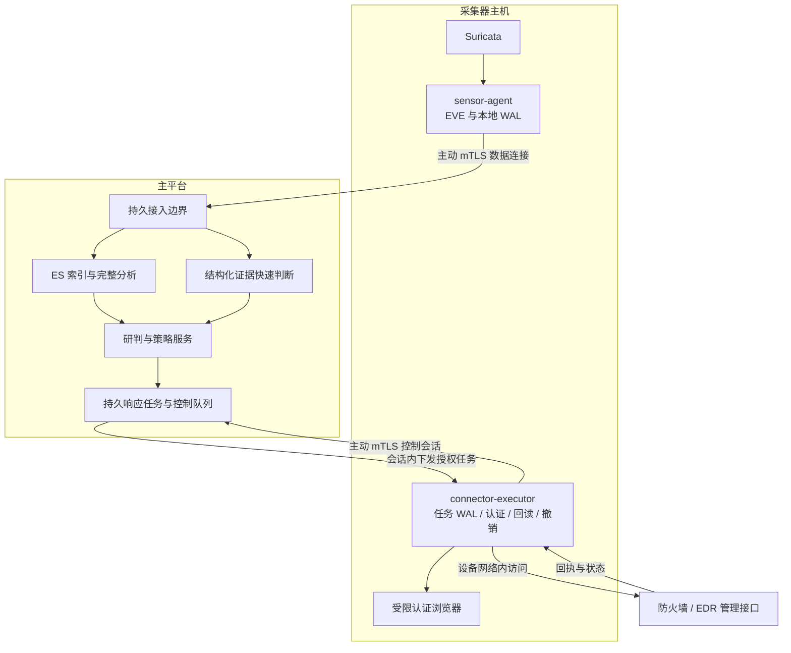

# 星烽 StarBeacon 采集器联动与响应时延调研

调研日期：2026-09-28。部署前提：采集器所在网络可以访问已授权的防火墙或 EDR 管理接口；平台负责研判、策略和任务，采集器负责设备访问、提交、回读及撤销。默认不要求客户部署独立 Runner。本文中的时间范围是待压测验证的工程目标，不是 Suricata、设备或模型供应商的性能保证；本次未操作实际安全设备。

## 1. 默认执行拓扑

采集器安装包同时交付 `sensor-agent` 与受限 `connector-executor` 运行角色，自研服务使用项目指定的 Go 1.26.x 补丁。前者管理 Suricata、日志读取、本地 WAL 和数据上报；后者管理设备连接器、认证、动作日志与撤销定时器。默认在同一台采集器主机运行，建议使用独立 Go 进程和独立系统账号；轻量模块可以共用安装及升级机制，设备凭证不交给 Suricata。

复用现有平台代理入口、证书体系和主动建立的控制通道，不增加采集器公网入站端口。上报与执行使用不同的服务身份、权限和连接配额。可以给采集器的控制角色签发独立用途证书；若复用同一 TLS 连接，必须用明确的签名委派票据表达执行身份，不能声称一条 TLS 连接同时呈现两个证书身份。Go gRPC 支持配置客户端证书校验，业务层还须验证证书身份与注册记录、租户和 RPC 权限。[gRPC Go mTLS 示例](https://github.com/grpc/grpc-go/tree/master/examples/features/encryption/mTLS)

进程间需要通信时，Linux 默认使用受权限保护的 Unix socket 和调用者身份检查。执行器仅能访问登记设备及其认证来源；外部 API 联动通常不需要采集器本机的网络管理权限。浏览器工作进程按连接器隔离，并设置 CPU、内存、文件目录和出站范围，不能挤占抓包与 WAL 的保留资源。

独立 Runner 是可选形态，用于特殊网络区域、将浏览器资源移出采集主机或提供冗余，不作为首期安装的强制前提。两种形态实现相同连接器协议，平台调度的是已登记的执行能力。

## 2. Suricata 与外部联动的实际边界

Suricata 的旁路 IDS 读取镜像/TAP 流量，没有原始链路的转发控制权。仅把规则写成 `drop`，不能让旁路探针阻止原始网络通信。IPS 则处在实际转发路径，通过 AF_PACKET、NFQUEUE 等机制执行包处置；IPS 的 TCP 流检查会及时检查新到达的数据，行为与被动 IDS 等待 ACK 等场景不同。[Suricata 8.0.7 IPS 概念](https://docs.suricata.io/en/suricata-8.0.7/ips/ips-concept.html)、[Linux inline 配置](https://docs.suricata.io/en/suricata-8.0.7/ips/setting-up-ipsinline-for-linux.html)

正确配置的 inline IPS 可以在命中包转发前丢弃它；如果第一包已具备规则所需信息，可以保护该包。但跨包、HTTP body、文件内容等规则可能需要后续字节，不能承诺所有攻击都在“首包”被识别。现有 bypass、流检查深度、资源异常策略和实际经过的网络路径均需纳入验收。

平台研判后经设备 API 封禁属于事后联动：它可能阻止重试、后续利用、横向移动或持续外联，却不能追溯撤回已经送达应用的数据。即使后续流量成功被挡住，也不能据此推导此前攻击未成功。Suricata 的规则 `alert.action`、最终包 `verdict`、外部设备配置结果和攻击结果必须分别记录。[EVE 动作语义](https://docs.suricata.io/en/suricata-8.0.7/output/eve/eve-json-format.html#action-field)

日志本身也会引入延迟。EVE 的 `buffer-size` 默认 0；启用缓冲后，周期 flush 的配置单位为秒，区间为 1–60 秒。秒级甚至更长的输出缓冲不能与毫秒级上报目标混用。快速告警通道应选择经过压测的输出配置、增量读取与小批次 WAL 提交；文件写入可见不等于平台已经持久接收。[EVE 输出与缓冲](https://docs.suricata.io/en/suricata-8.0.7/output/eve/eve-json-output.html#output-buffering)

## 3. 可核实的设备接口样本

### 3.1 防火墙：OPNsense

OPNsense 官方提供机器调用 API，认证使用账号关联的 key/secret。每个应用使用独立密钥，并按目标版本验证所需 ACL；采集器校验设备 TLS 证书，不能把文档中用于测试的跳过证书验证参数搬到生产。[官方 API 认证](https://docs.opnsense.org/development/how-tos/api.html)

建议为 StarBeacon 预置专用阻断规则和专用 External alias，在已确定的接口、方向和规则顺序中引用该地址表。日常动作只更新明确目标的地址成员，减少每条告警重建整份规则集的开销。官方接口提供：

| 用途 | 路径与方法 | 适配注意事项 |
|---|---|---|
| 添加地址 | `POST /api/firewall/alias_util/add/{alias}` | 请求包含 `address`；操作已存在的受管 alias |
| 删除地址 | `POST /api/firewall/alias_util/delete/{alias}` | 仅删除该任务拥有管理权的地址成员 |
| 回读运行表 | `GET /api/firewall/alias_util/list/{alias}` | 按版本处理分页与规范化 IP 表示 |
| 应用规则配置 | `POST /api/firewall/filter/apply` | 规则 CRUD 后激活配置；不是每次地址表操作都必须执行 |

来源：[防火墙 API](https://docs.opnsense.org/development/api/core/firewall.html)、[地址表控制器](https://github.com/opnsense/core/blob/master/src/opnsense/mvc/app/controllers/OPNsense/Firewall/Api/AliasUtilController.php)。当前文档中的 `filter_base` 是抽象控制器，不能直接把它列成可调用路径；适配使用具体控制器和目标版本实际支持的端点。

配置 CRUD 与运行策略不是同一阶段。官方说明规则管理接口的变更需要 `apply` 才激活。地址表更新则有独立的运行表接口；其成功返回不能替代后续回读，更不代表原有会话已经中止。不能假设 API 能读取和管理所有历史 UI 页面生成的规则。[规则应用流程](https://docs.opnsense.org/development/api/core/firewall.html#concept)

两个限制直接影响联动设计：External alias 的运行内容不跨设备重启持久化；已有连接可能继续使用原有 state，需要清理对应 state 后，变更才影响该连接。采集器必须在设备重启/HA 切换后协调仍有效的租约。若动作目标包含“终止现有连接”，需要独立授权、精确到目标的 state 清理能力；禁止用全设备状态清空代替单目标处理。[External alias 与持久性](https://docs.opnsense.org/manual/aliases.html#external)、[有状态规则](https://docs.opnsense.org/manual/firewall.html#states)

本次没有从上述 alias 接口核实到原生逐地址 TTL，因此该连接器的 `native_ttl` 应为待验证或不支持，不能填入猜测能力。设备升级后重新验证接口、运行表、既有连接和重启行为。当前官方文档和主分支源码是设计依据，不替代已支持设备版本清单。

### 3.2 终端响应：Wazuh Active Response

Wazuh 可作为开源终端响应接口的验证样本，不代表所有 EDR 产品采用相同语义。其 `PUT /active-response` 接收目标 agent 列表与配置好的响应命令，结果包含成功发送及失败的 agent 集合。官方实现把命令提交到 Active Response 队列；返回 200 和“已发送”不能证明终端已经执行，`wait_for_complete` 也不能解释成终端防护生效确认。[API 文档](https://documentation.wazuh.com/current/user-manual/api/reference.html)、[命令分发实现](https://github.com/wazuh/wazuh/blob/master/framework/wazuh/active_response.py)、[API 控制器](https://github.com/wazuh/wazuh/blob/master/api/api/controllers/active_response_controller.py)

有状态 Active Response 通过 `add`/`delete` 和 timeout 实现执行与撤销，并可检测重复键。StarBeacon 需要将它包装成固定动作目录，结合终端实际状态或经验证的执行回执确认效果；不开放任意脚本名或任意命令参数。原生响应的超时及去重逻辑不自动等同于平台所需的多租约合并语义，须专项验证续期和撤销。[响应配置](https://documentation.wazuh.com/current/user-manual/capabilities/active-response/how-to-configure.html)、[有状态响应协议](https://documentation.wazuh.com/current/user-manual/capabilities/active-response/custom-active-response-scripts.html)

其他 EDR 连接器同样要区分：管理接口接单、任务排队、终端在线、终端执行、隔离状态回读和解除隔离。使用稳定终端 ID 与所属管理实例确定目标；终端离线时展示等待或失败原因，不能把提交成功显示成已隔离。主机阻断脚本也不天然等价于完整终端网络隔离。

## 4. 设备与执行采集器的注册绑定

平台维护独立 `device_id`，不能用地址字符串代替设备身份。建议绑定表包含：

| 对象 | 核心字段 |
|---|---|
| 设备 | `tenant_id`、`device_id`、设备序列号/管理实例 ID、管理来源、信任配置、设备版本、站点/网络域、HA 成员 |
| 执行绑定 | `binding_id`、`binding_version`、`device_id`、`collector_id`、`executor_id`、网络命名空间/代理、主备优先级、允许动作、目标范围 |
| 能力与健康 | 插件版本及 digest、认证方式、原生 TTL、回读/撤销/幂等能力、最近授权探测时间、身份核对结果、网络/认证/执行健康 |
| 所有权 | 当前执行者、`executor_epoch`、租约期限、设备资源命名空间、接管方式、最后协调序号 |

注册过程由采集器执行受控连接测试，读取设备身份和能力，并将结果绑定到平台配置版本；TCP 可连通不等于 API 已授权。凭证通过客户侧加密存储或已有秘密管理机制保管，平台保存引用和版本；禁止因设备路径相同而跨租户复用会话。

优先选择已经登记、与设备同网络域、认证可用且具备动作能力的主采集器。告警来源采集器只有满足绑定时才优先；其他探针发现的告警，也可以由该设备的主执行采集器处理。健康不合格时只在明确登记的候选中选择备用，不对任意探针广播封禁请求。

同一设备的写操作默认串行或按经过验证的独立资源组并发。调度采用设备亲和，限制认证刷新和同时修改，避免多个采集器以不同会话争抢控制台。平台以设备资源为粒度分配执行租约，采集器以动作 ID 和请求摘要拒绝重放及同 ID 不同参数。

## 5. Go 控制协议与队列隔离

默认使用采集器主动发起的双向 `AgentControl.OpenSession`。重连携带最后持久确认序号，平台重投尚未确认的命令；采集器先写本地动作 WAL，再返回 `durable_received`。`Send` 成功只表示交给 gRPC 发送过程，不是对端持久化确认；设备返回成功也不是平台任务完成。[gRPC 流控](https://grpc.io/docs/guides/flow-control/)

执行器接口建议包含 `CheckDevice`、`Preflight`、`Execute`、`GetOperation`、`ReadTargetState`、`Reconcile`、`Revoke`。请求必须固定动作类型和目标 schema。任务至少绑定 `action_id`、租户、设备/绑定版本、执行者、`executor_epoch`、`policy_version`、`scope_version`、`scope_hash`、证据引用、幂等键、有效区间、绝对到期时间和签名。

执行前再次检查：票据和设备归属、最新已接收的策略/保护范围版本、目标规范化、现存设备状态、活动租约、有效期、动作数量及影响面。发现策略版本落后、遗漏撤销序号、配置缓存过期或目标受保护时暂停写入并同步状态。模型不能扩大目标网段、修改设备地址或增加自己未获授权的动作。

控制任务使用独立的持久队列/消费组、保留工作协程、带宽和磁盘额度。到期撤销与紧急停用优先于新封禁，新封禁优先于规则包、软件包和 PCAP 传输；每类设置有界队列及公平调度，避免单租户占满资源。执行回执不等待大批日志上传完成。

数据传输与控制流使用独立 HTTP/2 连接，复用地址与认证基础设施即可。仅将两个 stream 放入同一连接，不能保证不受连接资源和流并发限制影响。gRPC 官方性能指导建议对高负载区域使用独立 channel，避免长流和并发流限制造成排队。[gRPC 性能指导](https://grpc.io/docs/guides/performance/)

长控制会话设置健康检测与重连机制，单个执行请求单独设置 deadline。gRPC 默认不会自动给每个请求一个业务超时，超时值需结合实测确定。写操作得到 `DEADLINE_EXCEEDED` 仍可能已经成功，不能直接重放；应按原动作 ID 回读并协调。[截止时间](https://grpc.io/docs/guides/deadlines/)、[状态码语义](https://grpc.io/docs/guides/status-codes/)

## 6. 原生 TTL、租约合并与离线撤销

每个封禁意图形成独立租约，资源键至少包含租户、设备、动作、规范化目标、网络域与作用范围。对共享的同一阻断资源，期望到期时间为 **全部有效租约 `expires_at` 的最大值**。撤销某个租约后重新计算，只有最后一个有效租约结束才移除资源；不能因一条告警关闭而提前解除其他事件仍需的封禁。

平台签发绝对到期时间及最大授权期限，重试不重新计时，模型不能自行续期。支持设备原生 TTL 时优先下发剩余期限，并回读设备实际过期时间；扩展租约要确认设备支持相应更新。没有原生 TTL 时，采集器先持久记录期望状态、所有权、撤销参数和到期任务，再提交副作用，使用本地定时器撤销。

平台断网时，采集器停止接受或推导新的外部处置，继续已经授权动作的状态协调和到期撤销。重启先恢复本地日志、核对时间可靠性和设备状态，再恢复新任务。无法确认设备认证在到期时仍可用，或者采集器掉电后无人能撤销，均意味着不能承诺到期必然解除；应优先配置原生 TTL 或经过验证的冗余机制，界面明确剩余风险。

设备重启后可能丢失运行地址表；只恢复仍有效、范围仍被授权的租约，过期任务不重建。正常插件升级、凭证轮换和采集器卸载必须处理活动租约，并保留撤销所需制品与权限。`expired` 表示应解除，只有回读确认后才能标记 `revoked`；失败进入持续协调与运维告警。

### 6.1 HA 与离线撤销不能只依靠平台租约

平台看不到心跳，不代表旧采集器失去设备访问能力。若旧采集器按旧定时器删除共享 alias 中的 IP，而备用采集器刚延长同 IP 的租约，就会提前解除新封禁。数据库 fencing token 不能阻止设备已经接收的旧请求，也不能直接约束离线定时器。

按连接器能力选择一种已验证方案：设备支持带版本的条件更新/撤销；不同执行代次拥有独立设备资源且旧执行者仅能删除自己的资源；或在可靠隔离旧执行者之后接管。若设备既不支持条件写入，也不能隔离资源所有权，则不能在网络分区时自动切换写执行者；保持单主并报告不可接管原因。使用原生 TTL 能降低撤销依赖，但仍要验证租约续期与旧撤销请求的竞争关系。

OPNsense 单个共享 alias 成员没有天然的执行代次所有权。需要自动 HA 时可专项设计预置的主备受管资源范围并验证合并效果，不能默认将“备用采集器可访问同一 API”视为安全接管能力。

## 7. 分阶段响应时延

统一关联 `event_id`、`decision_id`、`action_id` 和设备操作 ID，保留以下时间点：

| 时间点 | 含义 | 可证明的事实 |
|---|---|---|
| `t0 event_seen` | 测试攻击数据首次到达被观测链路 | 网络观察起点 |
| `t1 detected` | Suricata 形成检测结果 | 满足当前检测规则条件 |
| `t2 agent_wal_committed` | 采集器将完整事件提交至 WAL | 采集器可恢复并续传 |
| `t3 central_durable` | 平台达到已验收的持久接入边界 | 事件可重放并继续进入 ES |
| `t4 decision_committed` | 研判和策略判断被持久记录 | 获得具体动作授权或拒绝结论 |
| `t5 command_received` | 指定采集器持久接收响应命令 | 可以恢复执行任务 |
| `t6 device_accepted` | 设备管理接口接受操作 | 已接单，可能尚在排队 |
| `t7 effective_verified` | 设备/终端状态回读符合动作目标 | 指定范围的配置或隔离状态已验证 |
| `t8 traffic_effect_observed` | 关联流量/受控验证证实拦截效果 | 该观测点和时间窗内效果可见 |

不能直接把 EVE 中的一个 `timestamp` 同时当作 `t0` 和 `t1`。生产若未埋点到检测器内部，可记录 `eve_observed_at` 作为检测发布的可测上界，并明确其中混合了日志输出延迟。全链路压测以流量发生器与接收端观测建立基准；历史 PCAP 的原始时间不能直接拿来计算实时处理延迟。

同一进程使用单调时钟测量阶段耗时；跨主机记录墙钟、时钟同步状态与误差上界，不能直接相减不同主机的单调时间值。`t8` 没有后续流量时可能不可观测，此时状态是“设备状态已验证，流量效果暂无证据”，不能伪造一个阻断耗时。主动验证只对事先授权的测试目标执行。

### 7.1 持久化之后、ES 查询之前的快速路径

可以在 `t3` 之后直接使用已持久化事件的结构化快照进行判断，无需等待 ES refresh 或案件页面可检索。快照应包含原始事件引用/摘要、规则版本、资产身份、采集点、证据字段及缺失标记，并与正常消费链路使用相同事件 ID。

快速路径必须保留原始事件、维持全部告警入 ES 的重放和补偿，不能以“已经封禁”为理由跳过存储。它同样执行租户授权、校准版本、证据门槛、保护范围和策略检查，生成持久任务后再下发。如果结论需要历史关联、终端证据或完整 PCAP，就转入取证/完整分析，不能为了速度把缺失证据视为攻击成功。ES 完整分析后来到达时通过相同幂等键关联任务，不重复封禁。

### 7.2 更严格实验条件下的候选预算

**产品默认 SLO 以[应用识别与响应性能设计 §9.2](../应用识别与响应性能设计.md#92-初始-slo)为准：确定性自动阻断整体 P95 ≤8 秒，小模型路径 P95 ≤15 秒，通用 LLM 路径 P95 ≤60 秒。**主文假设平台 RTT ≤100 ms，并规定其他准入条件；起点 `t_packet` 是标注回放中满足检测所需的最后相关字节，终点是设备配置回读验证。本文 `t0` 另保留首次观测攻击数据的时间，用于分析证据等待；两种起点不同时不能直接比较耗时。

下表仅为更严格实验条件的候选预算：平台控制 RTT 不高于 50 ms、采集器到设备 RTT 不高于 20 ms；认证已就绪；使用预置地址表或已验证的终端动作；设备与采集器无重启/切换；负载不超过已压测容量的 70%；控制资源已保留。它不替代产品默认验收条件，需以实际设备和规则集验证：

| 阶段 | 起始预算范围 | 常见放大因素 |
|---|---|---|
| `t0 → t1` | 5–100 ms，仅适用于测试中数据立即齐备的规则 | 等待后续包/ACK、重组、规则复杂度、CPU 饱和 |
| `t1 → t2` | 10–100 ms | EVE 缓冲、读取轮询、磁盘提交、日志轮转 |
| `t2 → t3` | 20–200 ms | WAN RTT、批次等待、平台持久队列积压 |
| `t3 → t4` | 确定性路径 20–200 ms；暖模型另预算 0.1–2 s | 查询缺失证据、模型排队、外部服务时延 |
| `t4 → t5` | 25–250 ms | outbox、调度、控制流背压、连接重建 |
| `t5 → t6` | 50–500 ms | 设备锁、接口限流、认证刷新 |
| `t6 → t7` | 地址表路径 0.1–1.5 s；其他动作单列 | 全规则重载、终端排队、状态回读间隔 |
| `t7 → t8` | 无统一上界 | 后续报文、既有会话状态、受控探测周期 |

在上述实验条件及检测数据立即齐备的样本中，可以探索确定性路径 P95 ≤5 秒、暖模型路径 P95 ≤8 秒、通用模型路径 P95 ≤30 秒的更紧候选预算；尚未实测，不作为产品默认资格门槛。EDR 隔离、整份规则重载、浏览器冷启动、MFA 和离线设备另建档位；需要人工交互的认证没有可保证的固定完成时间。

阶段范围不是厂商基准，分段 P95 相加也不等于总体 P95。SLO 统计全部满足该档位准入条件的任务，超时、失败、结果未知均计入未达标；另报覆盖率和降级比例，不能只统计成功且快速的样本。对于取证必须等待后续事务完成的规则，分别报告“证据等待”和“证据齐备后的处置耗时”。

## 8. 异常与恢复语义

| 异常 | 处理方式 |
|---|---|
| 采集器到设备不可达 | 标记具体连接器不可达并退避；只在登记且满足接管条件的执行者之间调度 |
| 凭证过期 | 同一会话合并刷新，限制尝试次数；写请求是否已生效先回读 |
| 权限不足 | 保留拒绝原因，停止自动重登录；403 不一律当作过期 |
| MFA/CAPTCHA | 当前采集器的受限认证会话进入人工接管，任务受截止时间约束 |
| 提交后超时/回执丢失 | 标记 `unknown`，按设备操作 ID、受管资源及目标状态协调，不能盲目重建 |
| 设备已接单但未生效 | 保持 `submitted/verifying`，到期转超时事件；不能显示已阻断 |
| 平台控制链路断开 | 保存回执和活动租约；保持已有动作协调/撤销，不本地推导新封禁 |
| 本地 WAL 满或损坏 | 停止无法可靠记录的新副作用；保留撤销资源并触发高优先级运维事件 |
| 策略/绑定版本不匹配 | 同步并重新预检，拒绝过期授权，不能用旧范围继续执行 |
| 设备重启或 HA 漂移 | 重新核对设备身份、运行表与有效租约，禁止恢复过期或已撤销目标 |

平台记录期望状态、设备最后观测状态和观测时间。自动重试有幂等边界、退避与总期限；任务租约、封禁期限、RPC deadline 和设备原生 TTL 是不同概念，字段与界面不应混用。

## 9. 压测与交付验收

建立隔离测试链路，使用可回放的正常业务与受控攻击样本，记录发包时间、Suricata 告警、各持久化边界、API 回执、运行状态和目标接收结果。先验证单设备单任务，再测试约定峰值、突发、持续长连接以及多租户并发；固定规则包、配置、插件、模型和设备版本，使结果可重复。

重点测试：抓包和 PCAP 上传满载时控制任务仍能及时调度；ES 不可检索但持久接入正常时快速路径可执行且告警最终完整入 ES；设备 API 200 但未应用、已有连接继续放行、异步终端未执行等情况不会误报成功；断线后恢复重投不产生重复副作用；时间跳变、采集器重启、设备重启和 HA 分区不会提前删除仍有有效租约的资源；到期撤销失败可见且持续协调。

报告至少包含 P50/P95/P99、各阶段排队时间、控制连接重建次数、丢包与日志积压、自动执行覆盖率、提交成功率、生效回读率、流量效果可观测率、误封率、到期撤销成功率和恢复耗时。按设备类型、动作、规则族、网络档位及认证状态分组，分别标注没有准确 `t1`、存在时钟偏差或缺乏 `t8` 证据的样本。

产品详情页展示完整时序及等待原因，而不是只有一个“耗时”。正式交付应对每个连接器写清楚：覆盖的新建连接/既有连接范围、支持的目标标识、原生 TTL 或采集器撤销方式、设备重启后的恢复行为，以及是否具备安全自动接管资格。
