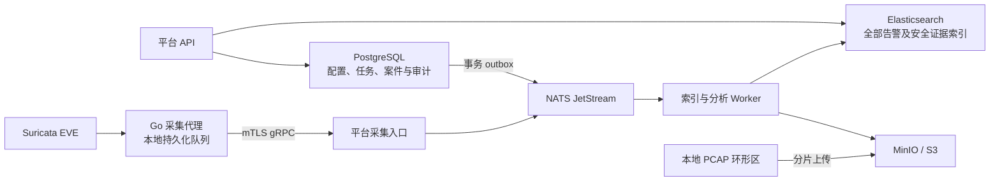

# 星烽 StarBeacon 采集链路与存储调研

调研日期：2026-09-28。范围：单用户、集团和 SaaS 场景下的 1–200+ 探针部署。本文保留 Go、Suricata、gRPC、PostgreSQL、Elasticsearch 和 MinIO/S3 的既定边界。引述部分是已核实事实，其余标为设计建议；容量数值是计算示例，不代表硬件性能承诺。

## 1. 版本与组件边界

官方发布页当前列出的 Suricata 稳定版为 **8.0.7，发布于 2026-09-15**；7.0.17 已列为生命周期结束版本。实施以受支持的 8.0.x 补丁版本验收，固定镜像摘要、配置和规则包，不将指向 9.0.0-dev 的 `latest` 文档当作生产基线。[Suricata 下载页](https://suricata.io/download/)、[官方 GitHub](https://github.com/OISF/suricata)

设计建议：首期采用一个 Go 代码库、三个可独立扩容的运行角色：`sensor-agent`、`platform-api`、`worker`。采集入口可先作为 API 进程模块，只有连接数或写入负载形成竞争时才拆出 `ingest-gateway`。JetStream 承担缓冲与重放；不引入 Kafka、独立工作流平台或每功能一个微服务。



## 2. Suricata 的证据语义

EVE 的 `flow_id` 用于关联同一引擎产生的告警、流、协议及文件事件；平台关联键补充 `tenant_id + sensor_id + engine_run_id`，不把一个裸整数视为跨采集器全局主键。`pcap_cnt`、`pcap_filename` 是离线 PCAP 处理字段，伪包事件可能没有这些字段，不能用它们定位在线采集后上传的任意 PCAP 对象。[EVE 格式](https://docs.suricata.io/en/suricata-8.0.7/output/eve/eve-json-format.html)

启用 `community-id` 可与 Zeek 等工具关联，并统一 seed。它是流五元组等信息的规范化哈希，不含时间，也不代表全局唯一会话；重复五元组、地址复用和 NAT 仍需结合采集点、网络域和时间窗口消歧。Suricata 原生 `tenant_id` 是引擎租户标识，须经注册配置映射到平台租户，不能直接信任来包中的租户字段。[EVE 输出](https://docs.suricata.io/en/suricata-8.0.7/output/eve/eve-json-output.html)、[Community ID 规范](https://github.com/corelight/community-id-spec)

`alert.action=allowed` 表示规则动作语义；同包匹配多个规则时甚至可能最终被其他规则丢弃。`verdict` 表达最终包处理动作，两者均不能证明业务入侵成功。[动作与最终裁决](https://docs.suricata.io/en/suricata-8.0.7/output/eve/eve-json-format.html#action-field)

设计建议：拆分 `detection_verdict`（真阳性／误报／待确认）、`attack_outcome`（尝试／疑似成功／确认成功／未知）和 `response_state`（待执行／成功／失败／已撤销）。规则命中只创建证据；成功判定需结合响应内容、应用审计、终端行为或人工结论。HTTP 200、网络可达、IDS 未阻断都不是“已入侵”的充分证据。TLS 明文不可见、单向镜像或丢包时显式记录证据缺口，降低决策置信度。[官方告警解读](https://docs.suricata.io/en/suricata-8.0.7/make-sense-alerts.html)

## 3. PCAP 采集与对象目录

Suricata 支持 `pcap-log` 的 `all`、`alerts`、`tag` 条件。告警模式会利用 TCP 流引擎仍保有的数据记录触发内容；文档没有承诺完整回溯任意告警前窗口。`tag` 标记当前及后续包。因此不能把 `conditional: alerts` 等同于“完整会话 PCAP”或“告警前后各 60 秒”。线程模式的文件数限制按线程生效，容量预算必须乘线程数。[PCAP 配置](https://docs.suricata.io/en/suricata-8.0.7/configuration/suricata-yaml.html#packet-log-pcap-log)、[Tag](https://docs.suricata.io/en/suricata-8.0.7/rules/tag.html)

设计建议提供三档策略：告警证据包为默认低成本档；环形全量捕获支持提取告警前后窗口；全量归档用于明确要求取证的网络区域。第二档需独立环形抓包器或经实测可完整捕获的 Suricata 配置，核实 stream depth、pass、加密流处理、snaplen 与镜像丢包；仅在本地环形保留窗口内承诺回溯。采集结果附 `capture_completeness`、缺口原因、截断长度和实际起止时间。

采用 128–512 MiB 或 30–120 秒切片作为压测起点；告警切片去重复用，避免每个告警复制整条会话。对象键由平台生成，例如 `tenant/sensor/date/capture_id.pcap`，客户端不能指定跨租户路径。持久化以下目录：

| 目录 | 存储与字段 |
| --- | --- |
| 对象清单 | PG：`capture_id`、租户、采集器、起止时间、bucket/key、version、字节数、SHA-256、留存、状态；仅对象级元数据 |
| 证据检索索引 | ES：流键、时间窗、对象 ID、方向、五元组、包数、截断与丢包情况；高基数字段不进入 PG |
| 切片内部索引 | S3 sidecar：包偏移、时间和流键；按流或时间提取，不能仅凭 community ID 下载全部匹配对象 |

上传状态为 `pending → uploading → verified → available`：完成分片上传后校验大小与 SHA-256，再提交对象清单；补偿任务处理孤立对象、未完成分片和目录缺失。整文件压缩后不能沿用未压缩偏移做 Range 读取；选择原始 PCAP 或带独立块索引的压缩格式。ETag 不作为通用内容哈希，尤其不能假设分片上传后仍等于 MD5。[S3 对象 ETag 定义](https://docs.aws.amazon.com/AmazonS3/latest/API/API_Object.html)

## 4. 可靠投递与可测试持久化契约

gRPC 流写成功只表示框架接收了数据，未必已发送到网络；长连接断开后，应用必须恢复未确认事件。传输层流控不能替代业务确认、持久化和重放。[gRPC 流控](https://grpc.io/docs/guides/flow-control/)、[重试边界](https://grpc.io/docs/guides/retry/)

设计建议：读取 EVE 后先写本地 WAL，再推进文件检查点。每条事件携带稳定的 `event_id`、`source_epoch`、`sequence`、事件时间、代理接收时间、schema 版本和逻辑分区。ID 由租户、采集器注册代次、持久化日志代次、原始记录序号确定；文件轮转后保持代次记录，不能只用 inode、文件名或正文哈希。重试不得重建事件 ID、分区或批次 ID。

JetStream 提供至少一次投递；`Nats-Msg-Id` 去重有配置窗口，消费 ACK 丢失也可能重投，不能据此宣称 ES、对象存储和封禁操作具备端到端 exactly-once。[官方去重与 ACK 说明](https://github.com/nats-io/nats.docs/blob/master/using-nats/jetstream/model_deep_dive.md)

生产建议使用 File Storage、3 副本、分离故障域和 durable pull consumer。尤其需要明确：官方配置默认 `sync_interval=2m`，确认可能先于物理落盘；3 副本可改善单节点故障恢复，但不能消除多节点同时断电的风险。严格告警接收档采用 `sync_interval: always`，代价是吞吐降低；以小批次聚合减少每事件同步开销，并在目标磁盘上实测，不引用通用 TPS 作为承诺。[官方持久化说明](https://github.com/nats-io/nats.docs/blob/master/nats-concepts/jetstream/README.md#syncing-data-to-disk)、[服务端配置](https://github.com/nats-io/nats.docs/blob/master/running-a-nats-service/configuration/README.md)

| 确认阶段 | 契约与释放条件 |
| --- | --- |
| `edge_persisted` | 事件及检查点进入已同步本地 WAL；承诺覆盖此后的代理进程重启，不覆盖网卡、内核或 EVE 写出前丢失 |
| `ingest_accepted` | 收到严格持久化配置下的 JetStream PubAck 后才向代理确认；返回连续确认序号及缺口，代理据此回收本地批次 |
| `indexed` | ES Bulk 每一项成功，或相同 ID、相同内容摘要的 409 已核实；此后 ACK 对应消息 |
| `searchable` | ES refresh 后可被搜索；与持久化成功分开计量，界面允许短暂索引延迟 |

ES 保持 `index.translog.durability=request`；官方默认在主分片和已分配副本的 translog 同步后才报告成功。生产设至少 1 副本，并在请求中要求足够活跃分片、检查响应中的分片失败，不能把仅主分片可写等同于冗余达标。[ES translog](https://www.elastic.co/docs/reference/elasticsearch/index-settings/translog)

重试 429、暂时性 5xx 和超时；映射错误及格式错误持久化到隔离队列，保留原文和失败原因，再结束本轮消费。隔离不是“成功入 ES”，必须列入待补入计数。`MaxDeliver` 只产生 advisory，平台要实现隔离搬运与重放，不能假设自动生成 DLQ。[消费与失败投递](https://github.com/nats-io/nats.docs/blob/master/using-nats/developing-with-nats/js/consumers.md)

队列保留大于约定最大故障与补偿窗口；容量达到上限时拒收并让代理积压，不静默淘汰未处理告警。代理为告警预留空间、优先暂停可选遥测；磁盘耗尽时保留缺口记录并告警，不能承诺无限断网无损。`MaxAge` 仍可能使旧消息过期，必须在最老未处理消息接近期限前升级告警。

## 5. ES 分区、幂等和生命周期

Data stream 的写入落到当前 backing index，rollover 会创建新的写索引；`_id` 唯一性不能扩展为跨索引约束。由此可推导：同一事件跨 rollover 重放会再插入一次，改成 rollover 写别名也不会自动解决。官方明确 data stream 适于追加式时序数据。[Data stream 机制](https://www.elastic.co/docs/manage-data/data-store/data-streams)

设计建议：全部告警、研判事实使用**固定逻辑分区 + 确定性 ID + Bulk create**。例如 `sb-alert-v1-p03-2026.09.28`；分区日期取首次进入代理 WAL 的接收日期，连同分区版本写入不可变信封，网络事件时间单独保存。不要在每次重试时取当天日期，也不要因 schema 升级将重投事件写入另一套当前索引。

逻辑分区映射由平台注册并版本化；租户迁移、索引拆分和重建需要暂停对应分区写入、保存映射、回填并原子切换，重放仍解析到唯一目标。超过留存期的迟到事件进入受控补录流程，禁止自动创建已删除日期的索引。只读查询可使用跨日期别名；告警索引不通过 rollover 改变其唯一写入位置。

小部署按月或周分区避免碎片；持续高吞吐按日并提前确定分片数。集团和 SaaS 按留存、安全隔离等级建立少量共享池，大租户迁往独立池；不按“200 租户 × 每天 × 每数据类型”无条件创建索引。以 10–50 GB 主分片和单分片低于 2 亿文档作为压测起点，测量真实查询与恢复时间后调整。[Elastic 分片建议](https://www.elastic.co/docs/deploy-manage/production-guidance/optimize-performance/size-shards)

Flow 和指标可使用 data stream + ILM rollover，但相应计数应标明至少一次投递语义；要求精确计数的事件仍采用固定分区，或先以稳定事件键生成去重后的汇总。告警数量、账单和封禁次数不能直接累计未去重流。告警留存使用删除／迁移策略，写入及补录窗口关闭后再转只读，删除前执行留存与案件证据保全检查。

Mappings 白名单化，IP、时间、端口、规则 ID 有明确类型；原始 EVE 保留但不无限动态展开 HTTP header 等字段。高频筛选字段索引，其余原文关闭索引或以受控 flattened 字段保存。研判记录为追加事实，最新结论是可重建投影，避免覆盖原始检测证据。

## 6. PostgreSQL 与租户隔离

设计建议：PG 管租户、用户、资产配置、采集器注册、规则发布、模型配置、审批策略、案件流程、任务、对象清单和审计；只引用告警 ID，不复制全部告警原文。告警事实只有 ES 一条入库路径，避免每条告警同时事务写 PG 和 ES。

PG 业务状态与 outbox 在同一数据库事务提交；dispatcher 将 outbox 发布到 JetStream 后标记，崩溃时允许重发，消费者以 `command_id` 幂等。ES 不参与 PG 事务。案件关联、索引投影、报告任务分别暴露 `pending/ready/failed` 并由对账任务补偿。封禁命令还需设备执行回执与到期撤销，不能因消息 ACK 就标记网络侧已封禁。

所有 API、MCP、导出、后台任务和对象下载使用同一租户授权层。租户由认证上下文与采集器注册关系决定，不接受请求正文覆盖；按 ID 读取后仍校验所有权。共享 ES 不直连客户，查询、聚合和导出强制租户条件，缓存键带租户及权限版本。更高隔离要求使用独立索引池或集群。

Filtered alias 不是安全边界：官方说明其过滤不适用于按 ID 读取。DLS 是订阅功能，而且主要针对只读账号，不能代替写入端校验；成本方案不得默认 Basic 免费提供 DLS。[Alias 限制](https://www.elastic.co/docs/manage-data/data-store/aliases#filter-an-alias)、[DLS 许可](https://www.elastic.co/docs/deploy-manage/users-roles/cluster-or-deployment-auth/kibana-role-management)、[DLS 写入边界](https://www.elastic.co/guide/en/elasticsearch/reference/current/field-level-security.html)

## 7. MinIO 当前状态与 S3 长期边界

截至调研日，官方 `minio/minio` 仓库显示 **2026-04-25 归档、只读且不再维护**。社区版采用 AGPLv3，README 仍记录 source-only 分发和历史二进制不更新政策。因此旧 README 中“源码构建获取最新安全更新”的文字不能推翻当前不再维护声明。[MinIO 官方仓库](https://github.com/minio/minio)

AIStor Free 是专有免费许可，条款仅允许 standalone 单节点、没有分布式集群或 HA，并限制再分发；它不能被预算为可免费随产品交付的高可用对象存储。[AIStor Free 条款](https://www.min.io/legal/aistor-free-agreement)

设计建议：保留 MinIO 作为产品支持的对象存储，社区版限验证环境；生产优先选择有维护及授权承诺的 MinIO AIStor，或经兼容性和运维验收的 S3 实现。采购前核实维护期、部署方式、再分发和灾备授权，具体费用以合同为准。Go 仅依赖 S3 对象接口，bucket、endpoint、区域、寻址方式和凭据来源可配置，不绑定厂商控制台。

验收至少覆盖 multipart、中断续传、Range、校验和、签名 URL、生命周期、版本化、服务端加密、对象保全及 ES snapshot repository 兼容性；“S3-compatible”本身不是这些能力全部可用的证明。PCAP 下载签名短时有效，签发前校验案件和租户权限；不向 LLM 暴露整桶凭据或任意对象读取能力。

## 8. 容量与恢复验收

以下为设计公式，统一使用十进制容量。`E_i` 为各数据类持续 EPS，`B_i` 为平均序列化字节，`F_i` 为实测索引放大／压缩系数，`D_i` 为保留天数，`r` 为副本数，`u` 为目标最高利用率：

```text
ES 磁盘 ≈ Σ(E_i × 86400 × B_i × F_i × D_i) × (1+r) / u
队列磁盘 ≈ 峰值 EPS × 平均消息字节 × 最大积压秒数 × 副本数 / u
代理 WAL ≈ 单代理峰值 EPS × 平均事件字节 × 允许断网秒数 / u
PCAP 磁盘 ≈ 实际捕获 bit/s ÷ 8 × 86400 × 留存天数 × 存储冗余系数 / 压缩比
补偿时间 ≈ 积压事件数 / (恢复后消费 EPS − 持续进入 EPS)
```

例：1000 EPS、每条 3000 B、索引系数 1.3、30 天、1 副本、利用率 70%，约需 **28.9 TB** ES 磁盘，尚需核算重建／合并工作空间与快照。1 Gbit/s 持续全量抓包约 **10.8 TB/天**，与告警数量无关。3 KB、1000 EPS 的 24 小时队列原始数据约 259.2 GB，3 副本及 70% 利用率后约 1.11 TB，另计协议与日志开销。恢复吞吐不高于持续进入量时永远无法清空积压。

生产前以实际规则、报文大小、TLS 比例和查询并发跑持续负载，并执行以下验收：

| 故障或场景 | 通过标准 |
| --- | --- |
| 代理进程退出、日志轮转、断网重连 | 已 `edge_persisted` 事件可恢复；源序号缺口可观测；同一源记录不变 ID |
| PubAck 前后断开连接、消费 ACK 丢失 | 允许重投；ES 每个事件只保留一个原始事实，副作用不重复 |
| JetStream 丢失单节点、整体异常断电 | 分别测试；严格档在验证的存储故障模型内已确认批次不丢失，测量恢复时间，不以杀进程替代断电测试 |
| 跨日重放、版本升级、历史补录 | 固定分区仍唯一；不会自动复活已删除索引 |
| ES Bulk 部分失败、队列达上限 | 不提前 ACK 失败项，不静默丢弃；隔离及积压能重放对账 |
| PCAP 上传成功但目录提交失败 | 可补全目录；失败分片可清理；下载内容与 SHA-256 一致 |
| 租户越权与 MCP 恶意参数 | 查询、按 ID 获取、聚合、缓存、导出和对象签名均不能跨租户 |
| 规则发布与回滚 | `suricata -T` 配置检查、标注 PCAP 回放、性能预算、灰度和失败回滚均通过 |

`-T` 只验证配置和规则可加载；是否正确检出、误报及性能需要回放测试。规则包签名、版本、校验和与目标引擎版本一起下发；代理暂存验证后热加载，成功回执后才标记生效。热更新会同时保有新旧检测引擎并消耗额外内存；预留内存，不把非阻塞命令返回视为已完成。[命令行检查](https://docs.suricata.io/en/suricata-8.0.7/command-line-options.html)、[规则重载](https://docs.suricata.io/en/suricata-8.0.7/rule-management/rule-reload.html)

备份同时覆盖 PG 及 outbox、ES 快照、S3 对象、对象清单与密钥；ES 节点目录复制不替代官方快照机制。按快照时间恢复 ES，再从仍保留的 JetStream 区间重放；快照 RPO、队列保留期和重放带宽共同决定可恢复边界。定期在隔离环境验证整套恢复，避免 PG 案件恢复后指向已过期的证据。[Elastic 快照与恢复](https://www.elastic.co/docs/deploy-manage/tools/snapshot-and-restore)
