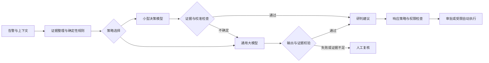

# 星烽 StarBeacon 产品设计

调研基准日：2026-09-30。适用范围：1–200 个探针及可继续横向扩展的单组织、集团、多租户 SaaS。本文定义拟实现能力；外部产品事实标注来源，其他流程与门槛为 StarBeacon 设计建议。完整交付目录见[功能覆盖与验收矩阵](功能覆盖与验收矩阵.md)，每项区分内置能力、连接器能力、条件依赖和验收责任。

产品部署采用采集器与主控平台两种形态。采集器提供独立本地管理入口，配置管理网卡、镜像采集、平台注册、规则同步及系统维护；主控平台集中管理探针和发布任务，两端分别鉴权。具体页面、网络变更与升级边界见[采集器管理与部署设计](采集器管理与部署设计.md)。

## 1. 产品定位与设计结论

StarBeacon 是以网络安全监测为入口、以证据为基础、可接入 AI 辅助决策的安全运营平台。核心成果是让安全人员明确：哪些资产受到什么威胁、证据能支持什么结论、下一步由谁执行、处置后是否有效。

平台形成五个连续工作环节：

1. **发现**：Suricata 检测、资产上下文、威胁情报和协议行为关联。
2. **研判**：保留原始告警，聚合同类信号，区分真实威胁、误报和证据不足。
3. **取证**：关联网络会话、协议日志、PCAP，以及后续接入的终端和业务日志。
4. **处置**：创建事件、人工审批或按授权策略执行响应，并验证执行结果。
5. **复盘**：日周月报、运营指标、误报反馈、规则与模型评估。

用户确定的技术边界是 Go、Vue 3 + Ant Design Vue、Suricata、gRPC、PostgreSQL + Elasticsearch、MinIO/S3。方案补充消息缓冲、身份隔离、审计与任务调度，以满足完整交付。PG 的“CRUD”包含配置、事件工单、审批、报告任务等业务状态；不保存高频原始告警副本。

Suricata 原生提供 IDS/IPS 和 EVE 输出，平台仍需实现探针管理、可靠上报、关联分析与运营流程。镜像口被动探针不能天然封禁原链路流量。[Suricata 项目](https://github.com/OISF/suricata)

## 2. 参考产品的设计取舍

| 参考方向 | 借鉴的产品理念 | StarBeacon 的落地取舍 |
| --- | --- | --- |
| Security Onion、Malcolm | 告警、检索、会话与取证在同一调查路径中衔接 | 统一证据工作台，避免多个工具间手工复制 IP 和时间范围 |
| Wazuh | 集中管理采集端、规则与资产关联 | 管理 Suricata，并以生产连接器接入已有主机与身份信号 |
| Arkime | 从会话索引定位数据包证据 | 借鉴会话到 PCAP 的索引，不默认引入完整第二套平台 |
| MISP、OpenCTI | 情报来源、置信度、有效期和关联关系 | 首期 IOC 接入与有效期管理，复杂知识图谱作为后续能力 |
| TheHive、DFIR-IRIS | 告警需要转化为有责任人、任务与证据的安全事件 | 实现轻量事件管理，保留外部工单双向同步接口 |
| Shuffle、Tracecat | 响应流程需要可追踪、可重试和人工节点 | 内置受控模板与有限剧本，复杂任意代码编排不作为默认能力 |

这些是产品设计借鉴，不代表把相关代码或商业版能力直接打包使用。维护状态、许可证及具体来源见[开源安全平台调研](research/开源安全平台调研.md)。Security Onion 当前产品也包含 AI 和 MCP 能力，说明这类能力应与调查上下文整合，而非另做一个脱离数据的聊天页。[Security Onion MCP](https://docs.securityonion.net/en/3/main/mcp-server/)

## 3. 使用场景与角色

| 场景 | 产品行为 | 部署差异 |
| --- | --- | --- |
| 单用户／小团队 | 默认一个租户、一个组织；安装后直接进入探针接入向导 | 可以合并进程和基础设施；不取消鉴权与审计 |
| 单组织私有化 | 多部门、多个园区，按组织或资产范围授权 | 模型可只用本地服务，支持离线规则包 |
| 集团 | 集团聚合授权子公司的风险，子公司管理自己的证据和处置 | 组织层级与数据驻留域独立建模 |
| 多租户 SaaS／MSSP | 每个客户独立租户；运营人员经客户授权跨租户处理 | 配额、计量、支持人员授权和独立数据单元 |

集团母公司并不自动拥有所有子公司原始数据权限；是否共享汇总、告警或 PCAP 由授权范围决定。同一人在不同租户可以拥有不同角色。

| 角色 | 主要权限 | 边界 |
| --- | --- | --- |
| 平台管理员 | 基础设施、租户生命周期、订阅配额 | 默认无客户 PCAP 和原始告警内容权限 |
| 租户管理员 | 成员、探针、规则、模型供应商、响应策略 | 不能访问其他租户；不能查看已有密钥明文 |
| 安全分析员 | 检索、研判、证据查看、事件处理、提出响应建议 | 按资产范围控制；PCAP 下载可单独授权 |
| 响应审批员 | 审批有业务影响的处置、撤销处置 | 高风险动作与申请人职责分离 |
| 审计员 | 查看操作记录、策略历史、报告与执行轨迹 | 只读，敏感证据仍受权限控制 |
| 外部 Agent | 通过 MCP 调用授权工具 | 使用独立服务身份、范围、配额与有效期 |

## 4. 核心概念与状态

**告警（Alert）**是一条检测信号；**告警组（Alert Group）**是便于处理的相关信号集合；**安全事件（Incident）**是需要调查与处置的业务对象；**证据（Evidence）**是可追溯的日志、会话、PCAP 或外部记录；**研判（Assessment）**是对特定证据快照作出的结论；**响应动作（Action）**是经过策略授权的执行请求。

告警严重度、资产重要性、研判可信度、攻击结果和处置状态分别存储。模型的概率不能覆盖 Suricata 原始检测信息。

### 4.1 告警状态维度

| 维度 | 状态 | 说明 |
| --- | --- | --- |
| 处理状态 | 待处理、处理中、已关闭、重新打开 | 描述工作进度 |
| 检测有效性 | 有效检测、误报、待确认 | 是否符合规则所描述的行为 |
| 行为性质 | 恶意、授权活动、普通业务、未知 | 结合业务授权判断行为意义 |
| 展示结论 | 真实威胁、授权活动、普通业务、误报、待确认 | 根据上述维度与人工结果生成 |
| 攻击结果 | 未知、攻击尝试、已到达服务、疑似成功、已证实成功 | 每次升级必须给出证据来源 |
| 流量处置 | 观察到放行、观察到阻断、未知 | 来自传感器或设备，不能代表端到端结果 |
| 模型任务 | 排队中、分析中、已完成、证据不足、失败 | 失败不等同于安全 |

“真实威胁”可以是未成功的攻击；授权扫描可以有效命中规则，同时不属于恶意活动。“已关闭”可能是误报、已处置或已接受风险。关闭需要原因，原始告警仍在保留期内可检索。

### 4.2 如何回答“攻击是否进来”

| 用户真正关注的问题 | 可以支持结论的证据 | 默认表达 |
| --- | --- | --- |
| 流量是否进入观测边界 | 探针部署点、接口方向、网络区域、会话 | 已观察到入站流量 |
| 是否到达应用服务 | 双向会话与应用响应；结合代理／NAT 信息 | 已到达服务／证据不足 |
| 漏洞利用是否成功 | 应用响应特征、业务日志、进程／文件等独立证据 | 疑似成功；证据达标后为已证实成功 |
| 主机是否失陷 | EDR、主机审计、持久化与异常执行证据 | 仅有网络告警时保持待确认 |
| 是否横向移动或外传 | 跨资产活动、身份／终端与网络时序关联 | 可疑行为及对应证据 |

HTTP 200、TCP 握手成功、Suricata `allowed`、告警优先级高，都不能单独证明入侵成功。加密流量、镜像丢包、不对称路由和采集空窗必须在证据完整度中可见。[EVE 告警字段](https://docs.suricata.io/en/suricata-8.0.7/output/eve/eve-json-format.html)

## 5. 功能全景与交付优先级

P0 为首个完整试点闭环，P1 为本需求的生产功能范围，P2 为复杂自学习和行业扩展。P0 的数据模型、鉴权和查询即具备租户边界，不能到 SaaS 阶段才补。主流基础关联、狩猎、情报、漏洞弱点闭环和受限剧本属于 P1；外部数据未接入时必须显示能力未就绪，不能以空页面视为交付完成。

| 模块 | 主要功能 | 优先级 | 关键验收 |
| --- | --- | --- | --- |
| 态势总览与大屏 | 待办风险、资产、攻击趋势、处置效率、采集健康、投屏模板 | P0 | 所有统计可下钻，标明时区、数据范围和缺口 |
| 告警中心 | IP/CIDR、方法、协议、path、研判与状态联合检索、聚合、分派 | P0 | 原始总量不因聚合或判误报减少，列表与导出条件一致 |
| 高级检索 | Wireshark 风格事件语法、字段提示、校验、执行计划、原生报文过滤作业 | P0/P1 | 字段与语义有能力矩阵，列表/计数/聚合/导出一致，不把未采集当不存在 |
| 证据工作台 | 协议、会话、原始 EVE、PCAP、HEX/ASCII、UTF-8 和受控解码 | P0 | 字节保持原始，偏移明确，缺失、过期、无权限分别显示 |
| 应用流量分析 | 按规则识别具体应用／类别，活跃带宽、会话、资产、趋势与未知流量 | P0/P1 | 长连接持续计量，跨观测点不重复，产品覆盖按授权样本验收 |
| 资产中心 | 资产导入、被动发现、责任人、资产组、IPv4/IPv6 网段、安全域、MAC/网卡/DHCP/NAT/身份历史 | P0/P1 | 动态 IP、地址转换与跨网络域同地址不导致无条件合并，歧义显式可见 |
| 暴露与弱点 | 端口/服务变化、漏洞/配置弱点、风险排序、修复工单、接受风险与复测 | P1 | 复用外部扫描结果，不以扫描失败或疑似版本判断完成修复 |
| 探针管理 | 注册、证书、健康、版本、配置、规则同步、远程任务 | P0 | 断网后续传，规则发布失败自动回退 |
| 检测规则 | 规则源、版本、自然语言／PCAP／HTTP Raw AI 生成、测试、灰度、回滚 | P0 | 生成与验证记录完整，可追踪每个探针实际生效版本 |
| 事件管理 | 告警升级事件、责任人、调查任务、证据、处置记录、值班/SLA/外部工单同步 | P0/P1 | 能还原事件何时由谁根据什么关闭，重开和同步冲突不丢历史 |
| 模型配置 | 多供应商、本地服务、能力检测、预算、路由 | P0 | 连通性、输出校验、额度与失败回退有效 |
| 智能研判 | 自动／手动分析、结构化结论、证据引用 | P0 | 证据不足允许拒答，历史结论不被覆盖 |
| 智能助手 | 自然语言检索、事件解释、调查建议 | P0 | 每条查询遵守当前身份，结果可回溯 |
| 安全报告 | 日报、周报、月报，统计、总结、建议、导出 | P0 | 数值由程序计算；失败可产出统计报告 |
| 响应中心 | 防火墙／EDR 联动、API／认证插件、封禁／解封、回读、到期撤销 | P0/P1 | P0 完成一个设备闭环；P1 通过指定产品版本的连接器矩阵 |
| 自动化策略 | 影子、审批、自动模式；置信度与证据门控、配额、熔断 | P0/P1 | P0 可配置和影子回放，P1 交付符合条件的真实自动阻断 |
| 通知中心 | 邮件、企业微信、钉钉、飞书、Webhook、模板、路由、投递日志 | P0 | 分渠道及接收人追踪，受理与送达有明确边界 |
| 数据接入 | Syslog 输入、设备/终端/身份/云日志连接器、解析器、字段映射、隔离与重放 | P0/P1 | 来源身份绑定租户，稳定源定位、质量水位和覆盖可验证 |
| 日志与审计 | Syslog 输出、操作日志、登录日志、调用与导出审计 | P0 | 关键操作可追溯，外部日志落盘确认不虚报 |
| 平台监控 | 服务、队列、数据库、对象、模型、连接器、备份与容量 | P0/P1 | 显示业务受影响范围，单项故障与整体服务健康区分 |
| 威胁情报 | IOC、来源、置信度、时效、白名单、撤回、衰减、追溯匹配与分享限制 | P0/P1 | 当前有效命中可重建，历史依据保留，撤回不遗留有效自动动作 |
| MCP 与开放接口 | 告警、资产、证据、报告查询及受控写入 | P0/P1 | 租户越权、范围越权与大查询受限制 |
| 多租户运营 | 集团授权、配额、计量、用量账单、数据导出删除 | P1 | 单租户突发流量不能拖垮其他租户 |
| 关联检测与狩猎 | 多源窗口/序列关联、Sigma 子集导入、保存查询、攻击链证据、可解释基线和 ATT&CK 覆盖 | P1 | 版本/水位/缺测/迟到可追溯，重复不增计数，无数据不产生否定结论 |
| 自动化剧本 | 富化、条件、案件、通知、审批、响应与核对节点，取消/补偿/版本 | P1 | 每节点有状态和幂等，不能绕过动作授权，不将取消显示为已回滚 |
| 身份与数据治理 | OIDC、MFA/Passkey、会话与服务身份、字段分级、驻留、保留/保全/删除 | P0/P1 | 撤权覆盖查询、字节、导出、缓存、MCP 与模型数据出域 |
| 行业与学习扩展 | 复杂自学习图谱、专项行业协议与检测内容包 | P2/条件能力 | 按样本、数据源和检测增益单独验收，不以图形数量验收 |

## 6. 态势总览、告警与资产

### 6.1 态势总览

默认首先展示待处理高风险事件、受影响关键资产、超过处理时限的任务和证据采集异常。趋势图支持按租户、组织、网络区域、时间和资产重要性过滤，且与告警中心保持同一筛选上下文。

风险分数的每个组成项可解释：检测严重度、资产重要性、近期行为、情报质量、证据等级与处置状态。初期使用有版本的规则评分；不把未经标定的模型概率直接称为整体安全指数。

看板同时展示接入延迟、离线探针和缺失数据窗口。“未发现告警”与“未收到数据”是不同状态。地图属于可选辅助视图，IP 地理位置不被当作攻击者真实所在地。

### 6.2 告警中心

提供时间、规则、严重度、源／目的 IP/CIDR 与端口、MAC、VLAN、观测接口、双向流 first/last 时间、HTTP 方法、host/path/状态码、传输层与应用层协议、两端资产、探针、组织、网段、研判、攻击结果、责任人、标签、情报和模型版本筛选。TCP/UDP 与 HTTP/DNS 属于不同协议层级；源地址不能无条件解释为攻击者。支持保存视图、共享给授权角色、批量分派和导出任务。

可视化条件和 Wireshark 风格文本共用类型化 AST，提供字段补全、示例、错误位置、类型检查和成本预览。事件模式只支持真实已索引字段；选择 PCAP 原生模式后用固定 TShark 执行报文过滤，支持其已验收的主流运算和协议字段。字段未采集、TLS 不可见、内容截断、已确认不存在和无权限分别处理，不静默改变查询语义。完整语法覆盖见[高级检索与数据包取证设计](高级检索与数据包取证设计.md)。

聚合键由租户、观测区域、资产、规则族、源／目的关系及时间窗口组成，并提供拆分操作。重复上报通过事件 ID 去重；同类攻击的业务聚合保留每条原始告警，二者不可混用。跨探针同一会话可以关联，但显示不同观测点。

列表默认提供严重度、资产、威胁类型、发生时间、聚合数、研判结论、攻击结果和处理状态；长字段按需展开。批量操作展示具体命中范围和数量，不能把“当前页全选”暗中变成“全部结果全选”。

### 6.3 资产中心

资产记录包含租户、组织、业务系统、责任人、重要性、地址有效区间、网络区域、标签、服务和证据来源。资产可以由 CMDB／CSV 导入或被动发现；被动发现仅证明被观察到，不能直接推定完整资产清单。

资产画像提供近期告警、关联事件、入站／出站活动、MAC/网卡与身份关系、命中情报、规则覆盖、漏洞弱点和调查记录。生产档通过已有扫描器/终端软件清单接入暴露发现，提供修复与复测闭环；主动扫描仅通过授权连接器安排，不自建扫描引擎。漏洞、情报、身份映射和剧本的字段/状态见[安全运营与数据治理设计](安全运营与数据治理设计.md)。

静态资产组手工维护成员，动态组使用受限条件求值；网段带站点、VPC/VLAN/VRF 等网络域、优先级和有效期。历史告警按发生时归属保存快照，当前资产归属可独立筛选；重叠网段按最长前缀及明确优先级，冲突配置不得发布。完整字段与验收见[运营与集成设计](运营与集成设计.md)。

### 6.4 应用流量与应用大屏

展示百度网盘、爱奇艺等产品的识别结果及网盘、视频、办公等类别，支持按资产、资产组、网段、站点、方向和时段分析。识别规则包含可见域名／HTTP／TLS／协议特征与例外；产品身份、L4/L7 协议、安全风险分开。证据不足显示未知，共享连接显示混合；不能把通用厂商域名当作具体产品或把普通应用活动自动标成恶意。

采集器的 Go Flow Meter 周期计量活跃流，Suricata 提供检测与协议元数据，应用规则给出可追溯归因。应用大屏默认使用 5 秒聚合，展示带宽、Top 应用、Top 资产、使用趋势、未知比例、数据缺口；综合态势和响应效能大屏提供下钻与只读投屏。应用规则共用样本、AI 生成、签名、灰度基础设施，但不与 Suricata 威胁 SID 混用。

详细规则模型、数据规模、SLO、设备执行与验证见[应用识别与响应性能设计](应用识别与响应性能设计.md)。识别覆盖、流量计算与自动封禁分别验收；展示应用不等于已经具备准确识别每次操作或设备级 QoS 控制。

## 7. 探针与规则生命周期

探针以安装令牌注册并换取独立证书，关联到唯一租户与指定组织。管理页面显示主机资源、捕获带宽／包速、丢包、EVE 输出、队列积压、上报延迟、时钟偏差、规则实际版本和 PCAP 可用时间段。

远程操作只提供声明式、白名单任务：采集诊断、申请 PCAP、发布配置、发布规则、滚动升级。管理平台不提供任意 Shell 执行功能作为日常管理通道。

规则流程为：导入来源 → 记录许可证与版本 → 静态校验 → 测试 PCAP 回放 → 小范围发布 → 观察丢包／误报变化 → 分批发布 → 生效回执。失败保留上一份规则。禁用和阈值抑制按租户、资产、规则、期限生效，不能无审计地覆盖公共规则。

例外规则需要理由、责任人和到期时间，支持到期提醒。规则与模型分别维护版本；规则制品在可输出的规则元数据中带发布标识，并验证 EVE 能保留该标识。热重载与日志延迟读取期间不能用代理读取时的“当前版本”代替事件实际版本；无法确定时明确记录未知。

### 7.1 AI 规则生成与规则管理

规则中心支持规则源同步、自定义规则、启停、SID/rev、适用引擎、变量、例外、阈值、版本差异和冲突检查。AI 入口接受自然语言、PCAP、HTTP Raw 或授权告警证据，生成具有匹配意图、证据定位、适用条件和验证记录的候选规则。请求文本中可指定“检测什么、排除哪些正常行为、适用资产与方向”，平台补齐必要上下文并允许证据不足时返回待补充。

一键生成触发受限生成任务、静态检查、目标引擎 `-T` 校验、正负样本回放与结果汇总。HTTP Raw 的合成 PCAP 明确标为合成样本；加密 PCAP 未解密时不能伪造明文特征。生成成功、语法通过、正样本命中、误报评估通过和生产发布是不同状态。

发布使用不可变签名规则包，默认经过审阅，已授权策略可在验证达标后自动灰度。页面显示每个探针 desired/active 版本、加载失败数、引擎回执、性能变化和回滚结果；下载成功不算实际生效。全流程、字段、状态机、接口和验收见[规则管理设计](规则管理设计.md)。

## 8. 证据与安全事件

告警详情采用统一调查工作台：顶部为结论与处置状态，中间为证据时间线和网络／资产关系，侧边为调查笔记与可用操作。证据分为观察事实、外部情报、模型推断和人工确认，禁止混在一个无法区分来源的说明段落里。

PCAP 全量原包与告警会话归档均默认保留 180 天，用户可按数据类别自定义；冷热迁移不改变删除期限。查询以租户、探针、网络域、接口、时间及会话代次定位，不能仅靠复用的五元组混合连接。默认完整会话导出要求实际握手证据和范围完整性；缺包、未结束、过期或启动前建连时显示原因，允许另行选择明确标记的部分证据导出，不能生成虚构 SYN/SYN-ACK/ACK。下载独立授权，归档和导出完整性分别展示。详见[PCAP 留存与会话完整性设计](PCAP留存与会话完整性设计.md)。

包详情提供 MAC、分层 VLAN、IP/IPv6、TCP/UDP、协议树、帧长度/截断长度、精确捕获时间、接口/时钟来源，以及可验证时的入站/出站观测时间。单臂镜像只观察到一侧时，另一侧时间显示未知；双向流的首末包时间不伪装成设备转发时间。共享捕获切片按授权包集合提取派生 PCAP，不能因有权查看一条告警就下载切片内其他组织流量。

事件支持一个或多个告警组、多个责任人与任务、调查时间线、证据保全、响应动作、根因、影响范围、修复建议和结案复核。结案要求结构化原因；事件可因新证据重新打开。重要事件的引用证据在授权保全期限内免受普通生命周期清理。

### 8.1 协议、检测覆盖与文件分析

协议目录按识别、事务字段、规则匹配、文件提取、原生取证及加密可见性分别呈现；不能把 TShark 可解析字段数量当作在线 Suricata 检测覆盖。用户可查看探针启用协议、实际 profile、必需来源、检测深度和受限原因。TLS/QUIC 密文保留原包与可见元数据；只有已授权的解密来源或离线会话密钥才提供相应明文分析，不承诺普通旁路自动解密现代 TLS。

文件中心提供样本来源、大小/摘要、提取完整性、静态与动态任务、命中规则、行为证据、当前结论和重分析。生产范围包含静态扫描及至少一个隔离动态沙箱连接器的授权样本验收；未配置沙箱时显示未启用，不将“没有报告”显示为安全。未检出、无法分析、不支持、超限、加密与恶意必须分开。具体能力、依赖与预算见[协议覆盖与文件分析设计](协议覆盖与文件分析设计.md)。

所有业务数据类别，包括告警、PCAP、操作/登录/投递日志、报告及已启用的流量明细，默认均为 180 天。设置中心提供分类时长、成本预览、生效范围、保全冲突和清理结果，详见[数据留存与生命周期设计](数据留存与生命周期设计.md)。

## 9. 模型配置中心

模型管理拆为供应商连接、模型能力、任务路由和评测发布四层。

| 配置层 | 字段／能力 |
| --- | --- |
| 供应商连接 | 名称、协议、API 地址、密钥引用、代理、区域、超时、TLS、并发、限流 |
| 模型能力 | 精确模型 ID、版本、上下文限制、结构化输出、工具调用、流式输出、价格快照 |
| 任务路由 | 对话、报告、解释、误报判断、攻击结果、响应建议分别选择模型 |
| 数据策略 | 允许出域的数据字段、脱敏、PCAP／载荷限制、数据驻留、日志保存期限 |
| 成本策略 | 租户日／月额度、任务上限、输入／输出 token 上限、熔断与降级 |
| 评测发布 | 数据集版本、校准参数、评测结果、影子流量、灰度比例、回滚 |

能力不能仅根据供应商自报或 `/models` 返回值判断：需用固定小样本验证 JSON 格式、工具调用、超时、拒绝输出和流式取消。兼容 Chat Completions 不代表兼容所有供应商的 JSON Schema 和工具协议。

首期接入三类模型：通用 LLM、Jev 托管决策接口、Laya 独立推理服务。后续可以接入传统分类器或领域微调模型。业务后端保持 Go；模型运行时作为独立基础服务，具体运行时在架构文档中说明。[Jev 官方文档](https://docs.typesafe.ai/)；[Laya 仓库](https://github.com/NandhaKishorM/laya)

## 10. 自动研判与决策策略

### 10.1 决策链路

策略支持仅规则、小模型优先、仅通用模型、串联复核以及多模型对照。多模型一致不等于事实正确；输入证据相同且偏差相似的模型不能算作独立证据。

### 10.2 决策输出

每次研判必须包含结论、攻击结果、证据引用、反证、缺失信息、建议动作、是否需要人工复核、模型与策略版本、耗时和费用。保留紧凑的判定理由，不要求保存模型内部思维过程。

模型返回的分数标注来源与语义：原始分数、供应商概率、自报置信度、平台已校准概率。未校准输出不能冒充“有 99% 的概率入侵成功”。对于没有足够安全领域样本的 Jev／Laya，首先用作分流与辅助判断。

### 10.3 自动化策略配置

策略编辑器包含适用租户／组织／资产、规则和威胁类型、证据最低要求、模型路由、阈值、动作、并发上限、冷却窗口、有效期、审批规则和异常回退。所有发布生成不可变版本，可用历史事件回放比较。

策略模式为影子、审批和自动。自动模式满足已授权的置信度、证据、对象与连接器条件后，实际下发限时封禁并验证和撤销；阈值由客户标注集和业务误封成本决定。例如 C2 外联策略需证据齐备、资产身份确认、非批准测试、情报有效、模型具备该场景自动化资格。模型建议与执行授权分离，使真实自动化具有可控范围。

自动判为误报只改变处理视图，不能删除告警。高重要性资产、证据矛盾、样本分布异常或新规则族默认进入复核。

### 10.4 模型评测中心

人工标注包括检测有效性、行为是否授权／恶意、攻击阶段、是否成功、证据是否充分、是否适合响应。训练／校准／测试按时间、事件和租户划分，避免同一攻击的重复告警跨集合泄漏。测试集覆盖中英文、正常扫描、业务异常、加密会话、缺包、设备故障和提示注入文本。

评价指标包括按威胁类型统计的精确率和召回率、PR-AUC、概率校准、自动覆盖率、拒绝判断率、误关闭／误封数量、每千个有效判断成本、端到端延迟。自动处置资格按场景授予，不能只看一个整体准确率。

上线顺序为离线评测 → 影子运行 → 只给建议 → 有限范围自动化。数据漂移、模型变更或校准失效时撤回自动化资格。

## 11. 响应中心

响应动作包括通知、创建工单、取证、临时封禁、解封及 EDR 资产隔离／解除隔离。被动探针通过防火墙／WAF／网关／EDR 等连接器实施动作；Suricata IPS 仅在确有 inline 部署和独立验收时使用。

执行前检查租户授权、目标资产、网络区域、设备归属、白名单、管理链路、共享出口／CDN、NAT、动作有效期、重复请求与影响范围。支持单 IP、明确方向和协议的最小范围动作，首期不默认开放大网段自动封禁。

每个封禁记录对应独立动作 ID 和设备回执，有到期时间、验证方式、撤销方式。设备接受请求、配置生效和攻击流量停止为三个状态。执行超时显示“结果待核对”，先读设备状态，再决定是否重试。

同一目标被多个合法策略封禁时使用有效租约集合；某一动作到期不会撤销其他仍有效动作。设备支持原生 TTL 时优先使用；不支持时部署可靠解封任务并定期对账。无法保证撤销的连接器仅开放人工操作。

连接器提供官方 API 与控制台认证插件，后者在授权设备登录并加密缓存会话后调用固定管理接口。默认通过采集器同机连接器主动连接平台：主平台下发任务，由具备网络可达性与授权的采集器执行设备 API，并回传结果；不要求把客户设备管理口暴露给主平台。认证过期、MFA 和控制台版本变化有明确不可用状态；插件能力按设备版本验收。通知与 Syslog 失败独立处理，不把消息发送成功算作封禁成功。

## 12. 智能助手

支持“过去 24 小时哪些核心资产最值得调查”“解释这组告警”“查找与该 IP 有关的内部访问”“生成事件调查提纲”等任务。对话保持当前租户、组织、时间范围和用户身份，界面始终显示查询范围。

助手只能使用注册的业务工具：检索告警、聚合指标、查看资产、读取授权证据、检索知识库、创建研判任务。模型不能直接提交 SQL、ES DSL、任意 URL 或设备命令。执行的筛选条件可展开查看，结果附告警或事件链接。

响应建议在聊天中形成可审阅草案，并进入与手工相同的审批流程。聊天记录不是处置授权。遇到权限不足、数据过期或工具失败时如实说明，不补写事实。

知识库首期收录授权的规则说明、内部处置手册和公开安全知识，分别记录来源与更新日期。使用 ES 检索即可；只有离线检索评测证明向量检索有增益时，才增加同一 ES 内的向量字段。知识库不能跨租户混用私有资料。

## 13. 日报、周报和月报

### 13.1 报告内容

| 报告 | 默认窗口 | 核心内容 |
| --- | --- | --- |
| 安全日报 | 租户时区前一个自然日 | 重点事件、告警变化、受影响资产、处置进度、采集异常、今日待办 |
| 安全周报 | 租户时区上一完整周，周一至周日 | 主要威胁、重复问题、规则与误报趋势、处置时效、整改追踪 |
| 安全月报 | 上一自然月 | 风险变化、重点事件复盘、资产覆盖、运营效率、资源与模型成本、治理建议 |

模板可按管理层、分析员和客户报告选择信息深度；所有图表使用相同统计口径。告警数、告警组数、事件数、受影响资产数分别计数，模型建议与人工确认分别统计。

### 13.2 报告生成机制

程序冻结查询窗口、数据水位、统计口径和证据清单，计算指标，再把结构化统计交给 LLM 总结。数值、百分比、排名和图表由程序渲染。生成后校验结论引用和数值，失败时仍可提供有数据的统计报告，标注智能总结不可用。

迟到事件与数据缺口写入报告说明。重新生成产生独立报告运行记录，旧报告保持可追溯；正式标题使用“星烽 StarBeacon 安全日报 · 日期”等业务名称，不使用过程性命名。

报告支持预览、审批发布、HTML/PDF 导出和可配置通知。报告任务与发布动作分开，定时生成不等于自动外发。月报基于保留的日汇总与事件快照生成，不依赖已过期的全部原始流量。

## 14. MCP 与开放平台

StarBeacon 提供 MCP Server，使其他 Agent 可以在授权范围内分析平台数据。首期以只读工具为主，提供告警检索、统计、资产上下文、证据摘要、事件和报告读取；P1 增加研判任务、事件草案和响应建议创建。

每个工具声明输入／输出结构、时间与结果上限，返回数据时间、覆盖范围、截断情况和证据引用。大结果返回异步任务或资源引用，PCAP 字节不直接塞入模型上下文。

远程接入采用官方 Go SDK 与 Streamable HTTP，协议版本以服务与客户端协商结果为准。身份验证、资源授权、租户隔离与审计在服务端执行；MCP 工具的只读提示不是安全边界。[MCP 规范](https://modelcontextprotocol.io/specification/latest)；[官方 Go SDK](https://github.com/modelcontextprotocol/go-sdk)

MCP 与网页、REST API 共用业务查询及响应服务，不存在权限更宽的“AI 专用数据库通道”。外部 Agent 不能传入任意租户 ID 来扩大范围，也不能获取模型或设备密钥。

## 15. 信息架构与前端设计

一级导航建议为：态势总览、告警中心、安全事件、资产中心、流量分析、检测与情报、响应中心、通知中心、智能助手、安全报告、探针管理、系统管理。决策策略与连接器位于响应中心；模型与 MCP 管理位于系统管理，可通过业务页快捷进入。

前端采用 Vue 3 Composition API、`<script setup lang="ts">`、Vue Router、Pinia 与 Ant Design Vue。Pinia 管理身份、租户和界面状态；告警列表使用服务端查询，不在浏览器保存全集。Vue 3.5.43、Ant Design Vue 4.2.6 等构建基线见[依赖版本与部署清单](依赖版本与部署清单.md)，实际构建仍需验收。[Vue TypeScript](https://vuejs.org/guide/typescript/overview.html)；[Ant Design Vue](https://github.com/vueComponent/ant-design-vue)

页面按业务域拆分；告警工作台拆为筛选区、列表、证据详情、研判摘要、处置面板，使用组合函数管理查询与任务状态。统一时间／IP／证据链接组件，事件 ID 与 `flow_id` 在前端始终按字符串处理。

操作界面以任务效率为目标，支持键盘操作、清晰焦点、非颜色唯一的严重度标识、浅深主题和长列表可读性。常用屏幕先保障 1440 与 1920 宽度；窄屏优先支持事件查看和审批，不承诺在手机上完成复杂 PCAP 调查。

| 状态 | 产品文案／行为示例 |
| --- | --- |
| 尚未接入探针 | 尚未收到安全数据。接入探针后可查看告警与流量。 |
| 查询无结果 | 当前条件下未找到告警，保留筛选并可调整时间范围。 |
| 采集延迟 | 该探针最近数据时间为……，此后的统计可能不完整。 |
| 证据过期 | 原始流量已超过保留期限，仍可查看会话与研判记录。 |
| 模型不可用 | 智能研判暂不可用，告警已保留，可继续人工分析。 |
| 动作未确认 | 设备暂未返回生效结果，平台正在核对。 |
| 权限不足 | 当前角色无权查看原始流量，可联系租户管理员授权。 |

## 16. 产品验收场景

1. 一个新租户完成探针注册，产生告警后可从看板下钻到 EVE、会话和可用 PCAP，所有对象租户一致。
2. 探针离线并恢复后，告警补传不重复计数；页面可识别数据迟到和采集空窗。
3. 分析员标注误报、关闭告警，原始记录仍可检索；反馈进入评测样本库，经审核后使用。
4. 模型认为威胁概率高但缺少成功证据时，平台保持“攻击结果待确认”，不生成确定失陷结论。
5. 同一事件在 Jev、Laya、通用 LLM 三种策略下可对照，均保存模型、输入、校准与策略版本。
6. 白名单 IP、管理地址或未授权租户请求被响应策略拒绝；合法封禁具有回执、到期撤销和审计。
7. 日／周／月报可复核全部关键数值；模型失败仍有统计内容，且不会伪造智能结论。
8. 外部 Agent 可通过 MCP 查询授权告警，但无法读取其他租户、越权下载 PCAP 或绕过审批执行封禁。
9. 集团用户只汇总获授权组织；SaaS 运营人员通过临时授权访问客户数据，授权到期自动失效。
10. 30 分钟未结束的应用长连接持续显示流量；未知、混合和已识别字节之和符合统一计量点总量。
11. 主平台不能直连客户设备时，绑定采集器仍能接收签名任务、执行、回读并到期撤销；旧执行者与新执行者不会竞争解封。
12. 应用、告警与响应效能大屏可下钻，检测、可检索、模型判断、命令到达、设备生效与实际流量效果分别计时。

容量、故障恢复和模型上线门槛见[实施与容量规划](实施与容量规划.md)。
