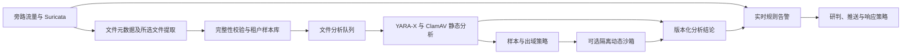

# 星烽 StarBeacon 协议覆盖与文件分析设计

核对日期：2026-09-30。在线检测基线为 Suricata 8.0.7，原生报文取证基线为 TShark 4.6.9。本文件定义设计范围、证据条件和验收方法，不表示平台已实现或通过性能测试。

## 1. 能力分层与启用条件

协议支持必须分别登记以下能力，不能用一个“支持”标记替代：

| 层级 | 平台含义 | 验收证据 |
| --- | --- | --- |
| 识别 | 能辨认传输协议或应用协议 | 正反例、非标准端口、未知和误识别结果 |
| 事务与日志 | 能输出指定字段并关联请求响应 | EVE 样本、字段映射、事务关联、加密和缺包状态 |
| 在线规则 | 有对应解析器、规则缓冲区或可信行为规则 | 规则加载结果、阳性和阴性回放、边界限制 |
| 文件提取 | 能生成所选文件的实际字节 | 文件状态、长度、摘要、来源事务、缺失区间 |
| 报文取证 | TShark 可在受限 PCAP 上解析或过滤 | 固定版本、profile、字段注册表、样本集 |
| 外部补充 | 从业务审计、终端或专项检测源补齐 | 连接器版本、来源授权、时钟和关联质量 |

探针上报引擎版本、构建特性、实际配置摘要、已启用解析器、规则包与检测能力清单。平台按这些事实显示能力，不能只根据已安装的引擎版本认定所有协议可用。Suricata 配置区分 `yes`、`no` 和 `detection-only`；后者仅识别协议，不能视为启用了事务解析。上游示例中 PostgreSQL、Modbus、DNP3、ENIP 默认关闭，IMAP 为仅识别；StarBeacon 按站点配置显式启用并回放验证。[固定配置来源](https://github.com/OISF/suricata/blob/suricata-8.0.7/suricata.yaml.in)

旁路只能分析镜像实际交付的字节。对称镜像、隧道内外层、采集截断、丢包、超出检查深度、协议解析失败、加密和文件缺失均进入质量字段；不能把未观察到的行为判成安全。全量 PCAP、告警会话证据及其他业务数据默认保留 180 天，按分类可配置；冷热迁移不缩短默认保留期限。文件样本、分析报告和持久化动态分析产物也按 180 天计算生命周期与预算。

## 2. 在线协议与原生取证矩阵

“原生取证”列表示进入固定 TShark 作业的验收范围，不表示所有相关字段已进入 ES，也不表示每个版本、扩展或加密算法均已验证。每一行还需绑定具体样本、构建和功能测试。来源为 Suricata 8.0.7 的[协议与规则目录](https://docs.suricata.io/en/suricata-8.0.7/rules/index.html)、[EVE 输出](https://docs.suricata.io/en/suricata-8.0.7/output/eve/eve-json-format.html)及后文专项来源。

| 协议／类别 | 识别、事务和在线规则范围 | 在线文件提取 | 原生取证范围与关键限制 |
| --- | --- | --- | --- |
| Ethernet、ARP、VLAN/QinQ、IPv4/IPv6、ICMP/ICMPv6 | 链路／网络头、地址、分片及异常；ARP 事件按配置映射 | 不适用 | MAC、VLAN 栈、分片、原始帧；镜像剥离 VLAN 或不携带 FCS 时不能补造 |
| TCP、UDP | 流、方向、状态、标志和重组相关检测；握手完整性另行评定 | 取决于上层协议 | SEQ/ACK、SYN、重传、乱序、零窗口、往返观测；UDP 不适用 TCP 三次握手 |
| HTTP/1.x | 方法、host、URI、请求响应头、状态和正文缓冲区 | 支持，需规则及 file-store | chunked、压缩、请求响应、升级协议；正文深度和解压限制独立记录 |
| HTTP/2 | stream ID、头字段、帧、错误及对应规则；每条流分别关联事务 | 支持，需明文可见 | HPACK、多路复用、DATA/HEADERS；不能按同一 TCP 流把不同请求的字段拼成一次匹配 |
| DoH over HTTP/2 | 在可见 HTTP/2 内容上识别 DNS 事务 | 不作为通用文件协议 | 加密会话未解密时仅能见 TLS/QUIC 层证据，不能伪造 DNS 查询 |
| WebSocket | 升级、操作码、标志及去掩码负载规则 | 不列为通用文件提取 | 帧、分片和可见负载；WSS 加密受限，正文受 `max-payload-size` 限制 |
| DNS、mDNS | 查询、响应、名称、记录类型和错误码；分别处理广播域和单播来源 | 不适用 | DNS TCP 重组、UDP、大响应、压缩名称；DoT/DoQ 未解密不能继承明文 DNS 能力 |
| TLS、QUIC | 可见握手、版本、SNI、指纹及协议异常；字段依握手完整度、版本和配置而定 | 加密正文不提取 | QUIC Initial 的有限可见信息不等于 HTTP/3 正文可见；TLS 1.3/ECH 下部分身份字段不可见 |
| HTTP/3 | 默认不承诺 Suricata 8.0.7 的 HTTP/3 事务／正文规则 | 不支持默认在线提取 | 有授权会话密钥且固定 TShark 支持时离线验证；在线需求优先接入终止点明文或业务日志 |
| SMTP | SMTP 命令、邮件与 MIME 相关信息和内容规则 | 支持可见附件 | STARTTLS 后正文不可见；附件完整度、编码解码与邮件事务关联单独保存 |
| POP3、IMAP | POP3 按已验收解析字段接入；IMAP 上游默认仅识别 | 不列入本版通用提取承诺 | 可见明文的原生分析或邮件服务日志；不能把“邮件协议支持”等同于附件全覆盖 |
| FTP、FTP-DATA | 控制命令、响应、主动／被动模式和相关数据连接 | 支持可见数据连接 | 控制和数据流必须共同可见；FTPS 未解密不提取，SFTP 属于 SSH |
| SMB | SMB1/2 事务、共享、命名管道和可见认证相关信息；SMB3 按实际方言与加密状态细分 | 支持可见文件数据 | `smb.version:2` 也可匹配 SMB3，不能当作精确方言；加密会话不承诺内容和文件可见 |
| NFS | 已支持版本与操作的事务、文件相关元数据 | 支持，按操作及内容完整度验收 | 文件句柄、偏移、读写分片；部分读写不等于完整文件，版本差异单独验证 |
| TFTP | 已支持操作的识别与元数据 | 不列入官方六类文件提取承诺 | 通过限定取证作业评估对象恢复，不在实时路径自研通用恢复器 |
| SSH、RDP、RFB、Telnet | 可见协商、版本、认证／握手结果或明文事务，按各解析器输出登记 | 不作通用提取 | 加密交互不等于键盘、命令、画面或文件可见；远程登录结果优先结合终端日志 |
| Kerberos、LDAP、DCERPC | 已解析身份、错误、操作或接口等规则与事件 | 不适用 | Kerberos 票据内容、LDAP 加密和 RPC 隐私保护不能当明文；凭据等敏感字段按权限处理 |
| DHCP、SNMP、NTP、IKE | 租约与地址关联、管理／时间／密钥协商的可见字段与异常 | 不适用 | SNMPv3 隐私保护、IKE 后的 IPsec 数据加密分别限制可见性；不是 IPsec 解密能力 |
| SIP/SDP、MQTT、BitTorrent DHT | 已支持方法、消息、主题或对等发现字段 | 不作通用提取 | SIP 不是完整语音取证；SIP-TLS、SRTP、MQTT-TLS 的密文不能当内容检查 |
| PostgreSQL | 显式启用解析器；简单查询正文等已支持规则 | 不作通用提取 | TLS 后 SQL 不可见；不承诺全部扩展查询、审计和事务语义 |
| Modbus、DNP3、ENIP/CIP | 按站点启用；功能码、读写、对象／服务等专项规则 | 不作通用提取 | 长连接深度、地址编号、厂商扩展需专项验收；不能直接宣称覆盖所有工业协议 |
| MySQL、MSSQL、Oracle、Redis、MongoDB、Kafka 等 | 本版不承诺相应完整 Suricata 应用解析／审计；可以有经验证的流量特征规则 | 不承诺 | 固定 TShark 可解析范围、数据库审计及专项连接器补齐；端口命中不能证明协议或命令 |
| OPC UA、S7、IEC 60870-5-104、IEC 61850、BACnet 等 | 作为专项内容包／外部数据源接入，未验收前标记待验证 | 不承诺 | 按原生解析器、版本和样本逐项确认；加密及厂商扩展另记 |
| GRE、VXLAN、Geneve、GTP、MPLS 等封装 | 解封装能力依据实际构建和样本登记，不自动继承全部内层能力 | 取决于可见内层 | 保存内外层地址、隧道标识、VLAN 和观测域，避免跨网络域错误合并会话 |

HTTP/2 的事务按 stream ID 组织；通用 HTTP 规则是否覆盖某缓冲区需按目标引擎验证，不直接假设所有 HTTP/1 关键词适用于 HTTP/2。[HTTP/2 规则](https://docs.suricata.io/en/suricata-8.0.7/rules/http2-keywords.html)；[协议匹配实现](https://github.com/OISF/suricata/blob/suricata-8.0.7/src/app-layer-protos.h)

QUIC 规则页的简要描述不能代替固定版本源码核查。8.0.7 的 QUIC 实现包含 Initial 解保护与有限握手解析，可生成相应 SNI／指纹，但没有由此获得后续 HTTP/3 应用密文的内容。[QUIC 固定源码](https://github.com/OISF/suricata/blob/suricata-8.0.7/rust/src/quic/quic.rs)；[QUIC 规则](https://docs.suricata.io/en/suricata-8.0.7/rules/quic-keywords.html)

WebSocket 负载限制、SMB 方言、PostgreSQL 简单查询，以及工业协议地址和读写语义需分别配置和验收。[WebSocket](https://docs.suricata.io/en/suricata-8.0.7/rules/websocket-keywords.html)、[SMB](https://docs.suricata.io/en/suricata-8.0.7/rules/smb-keywords.html)、[PostgreSQL](https://docs.suricata.io/en/suricata-8.0.7/rules/pgsql-keywords.html)、[Modbus](https://docs.suricata.io/en/suricata-8.0.7/rules/modbus-keyword.html)、[DNP3](https://docs.suricata.io/en/suricata-8.0.7/rules/dnp3-keywords.html)、[ENIP/CIP](https://docs.suricata.io/en/suricata-8.0.7/rules/enip-keyword.html)

## 3. 文件分析链路

### 3.1. 实时检测与文件分析分开

实时告警不等待整个文件下载、静态分析、动态执行或报告生成。文件结论作为异步证据回填事件／案件；满足独立响应策略时提出动作，仍由平台动作服务合并幂等任务、下发采集器执行。分析进程和沙箱没有防火墙、EDR 或平台数据库管理凭据。

Suricata 8.0.7 官方文件提取范围为 HTTP、HTTP2、SMTP、FTP、NFS、SMB。`fileinfo` 事件仅包含元数据；实际字节需要启用 file-store 并配置提取规则。检查深度、正文限制、重组和文件存储设置均影响内容完整度；磁盘上存在摘要命名文件也不能证明原始文件完整。[文件提取说明](https://docs.suricata.io/en/suricata-8.0.7/file-extraction/file-extraction.html)

### 3.2. 样本采集与对象存储

1. 按类型、风险、站点和预算选择提取；默认不把所有大文件都上传。每次跳过记录原因和字节范围，不把跳过当作阴性检测。
2. 从 `fileinfo`、文件关闭状态及实际对象获取长度和质量。上传采用只读已封存文件、分块校验、持久发送和重试；未封存对象不能被扫描器当成完整样本读取。
3. 文件对象进入独立样本桶／前缀，绑定租户、授权范围、来源流／事务和对象版本。摘要按实际字节重新计算，不信任客户端提交的 hash。
4. 保存 `captured_size`、可知时的 `expected_size`、`completeness`、`missing_ranges`、`extraction_limits`、`content_encoding`、`encryption_state` 和 `hash_scope`。`hash_scope=stored_bytes` 明确摘要是已存字节；只有经过验证的完整对象才能用于完整文件的摘要情报匹配。
5. NFS/SMB 随机偏移读写、HTTP Range、分片下载、断点续传不能仅凭文件名或 ETag 拼接。没有可靠对象身份、偏移和版本证据时保留分段，禁止将覆盖区间不完整的样本标成完整文件。
6. 同租户同字节可去重存储，访问授权仍逐发生记录评估。跨租户默认不共享样本存在性、缓存命中或分析报告，避免摘要查询泄露其他租户是否持有文件。

文件样本、静态／动态分析报告、持久化行为记录、已生成内存转储、截图、沙箱 PCAP 和案件证据默认均保留 180 天，允许按数据分类配置。保全策略可延长期限；容量预算分别计算这些制品，不能借文件分析模块默认缩短业务数据留存。临时解包工作目录、未提交为证据的 VM 运行缓存及短时凭据属于运行 TTL，任务结束或超时后回收；已生成并入库的证据制品不得当作缓存提前清除。

### 3.3. 静态引擎

| 组件 | 固定核验点 | 接入方式与边界 |
| --- | --- | --- |
| YARA-X | 1.21.0，2026-09-29 发布，BSD-3-Clause | 官方 Go binding 通过 C API 调用，涉及原生依赖；优先运行于独立静态 worker，不进入采集器实时线程或 API 进程 |
| ClamAV | 1.5.4，2026-08-07 发布，GPL-2.0 | 独立 clamd + 官方 clamdscan／受限协议适配；病毒库单独固定版本和更新时间，扫描结论不能只记录引擎版本 |
| CAPEv2 | 研究源码锁点 `334e3ad22fbb4be6681f7404751bb6b3531bb8b5`，2026-09-30；仓库 LICENSE 为 GPLv3 | 可选外部动态分析连接器；本次未发现正式 GitHub Release/Tag，文档标识“2.5”不作为安装包版本。该提交尚未通过 StarBeacon 集成验收 |

版本与许可核对来源：[YARA-X 发布](https://github.com/VirusTotal/yara-x/releases/tag/v1.21.0)、[YARA-X Go API](https://virustotal.github.io/yara-x/docs/api/go/)、[ClamAV 发布](https://github.com/Cisco-Talos/clamav/releases/tag/clamav-1.5.4)、[CAPE 锁定源码](https://github.com/kevoreilly/CAPEv2/tree/334e3ad22fbb4be6681f7404751bb6b3531bb8b5)、[CAPE LICENSE](https://github.com/kevoreilly/CAPEv2/blob/334e3ad22fbb4be6681f7404751bb6b3531bb8b5/LICENSE)。制品交付须包含各组件许可、来源、SBOM 和所需原生库；独立进程部署不取消分发时的许可义务。

静态检查包括实际文件类型、长度、摘要、已知恶意摘要、YARA-X 规则以及 ClamAV 结果。YARA-X 负责匹配规则，不等于通用解压或行为执行器；解包功能只调用经审核的工具，限制嵌套层数、成员数、解压总量、膨胀比、CPU、时间和输出，拒绝目录穿越、链接及特殊设备文件。规则编译与扫描分别设限，规则包也经过签名、灰度和回放。

ClamAV 的大小、扫描总量、递归和流输入限额需要与平台策略一致；独立 clamscan 作业可使用 `--alert-exceeds-max=yes`；采用 clamd／clamdscan 时应在服务端 clamd.conf 设置 `AlertExceedsMax yes` 并核对各扫描限额，不能用客户端参数替代服务端配置。`Heuristics.Limits.Exceeded.*` 归类为“检查不完整”，不能仅凭此判恶意或安全。[固定服务配置](https://github.com/Cisco-Talos/clamav/blob/clamav-1.5.4/etc/clamd.conf.sample) ClamAV 把超大文件跳过时可能返回类似无命中的结果，适配器必须结合预检、实际限额与诊断信息判断。`OK` 只代表本次受限扫描未命中，不代表文件无害。[扫描限制](https://docs.clamav.net/manual/Usage/Scanning.html)

clamd 的 TCP 接口自身不提供认证和加密，优先使用 worker 本地 Unix socket；远程部署必须通过受控认证代理，不向采集网或租户网络直接暴露。限定 `INSTREAM`／必要查询能力，不把调用方任意路径透传给扫描服务；并发、输入字节和回复大小设上限，正确关联乱序结果。[clamd 协议](https://docs.clamav.net/manual/Usage/ClamdProtocol.html)

### 3.4. 动态沙箱与分析配置

动态分析为独立可选部署档位。基线推荐对接受控 CAPEv2 实例，StarBeacon 保持 Go 控制平面；不在探针或平台容器中直接执行样本。启用前验收以下条件：

- 专用隔离宿主机／虚拟化资源、一次性 VM 或每任务恢复干净快照、固定 guest 镜像和软件环境。不同租户不得复用上一任务遗留的磁盘、内存和凭据。
- 默认封闭网络或受控仿真服务；有外联需要时逐任务批准受限网络出口。管理网、平台控制平面、内网业务、对象存储管理口和云元数据地址均不可达。
- 样本读取使用窄范围、短时授权，由提交服务交付字节；guest 不持有平台 S3 凭据。报告和截图等仍按不可信内容解析，先限长和清洗，页面不直接执行外部 HTML/JS。
- 禁止自动绕过外送限制。私有样本去云端沙箱、外部情报服务或 LLM 的权限独立授予；摘要查询也记录供应商与请求目的。默认只把经过脱敏的结构化证据交给 LLM。
- 动态运行状态不等于攻击判定。无行为、执行失败、缺运行时、等待用户输入、环境不匹配、反沙箱、网络受限、超时等均保留原因，不能统一归入安全。
- 上游建议 Ubuntu 24.04 LTS 与 KVM；实际可选制品还涉及 Python 环境、QEMU/libvirt、guest OS／应用许可、guest agent、任务数据库和报告存储。自建时须另出锁定这些依赖的独立制品清单和恢复测试；不把上游安装脚本使用的浮动依赖写成 StarBeacon 已验收版本，也不强制全部核心部署安装它们。[CAPE 部署来源](https://github.com/kevoreilly/CAPEv2/blob/334e3ad22fbb4be6681f7404751bb6b3531bb8b5/README.md)；[guest 与隔离配置](https://capev2.readthedocs.io/en/latest/installation/guest/index.html)

每份分析配置绑定 engine/version、规则／病毒库版本、guest 镜像、操作系统、应用版本、分析包、运行时长、网络策略、处理器／报告版本和策略版本。允许不执行样本的静态配置，也允许只针对匹配的可执行文件／文档选择动态配置；不能把所有 MIME 类型自动提交到同一种 Windows 环境。

### 3.5. 状态、幂等与可追溯结果

文件质量与任务状态独立：`completeness` 使用 `complete`、`truncated`、`gapped`、`unknown`；`extraction_status` 使用 `captured`、`encrypted_not_extracted`、`unsupported`、`skipped`、`failed`；`encryption_state` 使用 `clear`、`encrypted`、`unknown`。这样完整捕获的加密压缩包可以同时表示“字节完整、内容加密”。任务使用 `pending`、`policy_denied`、`queued`、`submitting`、`submission_unknown`、`running`、`processing`、`completed`、`partial`、`failed`、`timed_out`、`cancel_requested`、`cancelled`。未提取出文件的加密流量记录提取状态，不凭空创建零字节样本。

`completed` 仅说明任务结束；判定另使用 `malicious`、`suspicious`、`no_detection`、`inconclusive`，并包含分析覆盖范围和失败引擎。恶意结果关联来源告警和文件发生记录，形成版本化证据；同一结果重投不重复建立案件或执行封禁。

幂等键至少为 `tenant_id + sample_content_sha256 + completeness_digest + analysis_profile_digest + policy_version`；不同引擎／规则／镜像版本不直接复用旧结果。提交前创建平台任务并持久化尝试记录；外部返回后保存 provider task ID。网络中断导致是否接收未知时进入 `submission_unknown`，先按受支持的关联字段或任务列表对账，再决定重试，不能默认外部服务支持幂等 POST。

取消请求先撤销排队任务，再调用实际支持的远端取消能力；不能把本地请求结束当作 VM 已停止。直到远端确认停止和产物清理，仍记录占用和潜在费用。回调需认证、防重放、task ID／租户绑定；不支持回调时按预算轮询，超时停止推进并保留远端对账入口。

样本列表支持文件名、类型、长度、hash、源／目的资产、协议、提取时间、完整性、引擎、结果、任务状态和外送状态筛选；详情串联来源会话、原始 PCAP、提取范围、静态命中、行为树、网络 IOC、运行环境、限制与处置历史。导出样本须单独权限、审计和短时下载授权，不能通过常规告警阅读权限获得原文件。

## 4. 接口与数据归属

| 接口／对象 | 契约 |
| --- | --- |
| `GET /api/v1/protocol-capabilities` | 返回引擎版本、站点启用范围、识别／事务／规则／文件／取证等级、限制与验证状态 |
| `GET /api/v1/files`、`GET /api/v1/files/{id}` | 查询样本发生记录、对象状态、质量和授权可见报告；摘要不是跨租户直接访问凭证 |
| `POST /api/v1/file-analyses` | 提交样本引用、profile ID、幂等键；先验证读取和外送权限，返回平台 job ID |
| `GET /api/v1/file-analyses/{id}` | 任务状态、独立判定、各阶段时长、版本、provider task ID 的受限表示 |
| `POST /api/v1/file-analyses/{id}/cancel` | 请求取消并对账远端状态；重复调用幂等 |
| `POST /api/v1/files/{id}/exports` | 受控原样本导出任务；重新检查范围、对象版本、保全与有效期 |
| `POST /api/v1/file-analyses/{id}/reanalyse` | 创建绑定指定新配置的作业，保留前次结果，不覆盖其证据 |
| `GET /api/v1/sandbox-connectors/{id}/health` | 认证、API 能力、worker／VM 容量、队列、数据库／规则新鲜度、最近成功分析时间 |

PG 保存连接器、配置、策略、任务及状态机；ES 保存文件发生记录、分析结果、行为摘要和关联告警；对象存储保存样本、报告原文、沙箱 PCAP 和受控附件。大行为树和内存转储不直接无限展开为 ES 字段。MCP 读取和提交分析使用相同授权与预算，不能借工具调用绕过样本外送审批。

CAPE 官方说明当前接口为 `/apiv2/`，同页下方旧 `api.py` 示例已废弃。锁定源码的适配起点为 `POST /apiv2/tasks/create/file/`、`GET /apiv2/tasks/status/{id}/`、`GET /apiv2/tasks/get/report/{id}/json/`；认证、可用字段、结果错误对象及接口开关要针对部署实例验证，HTTP 200 不能单独表示业务成功。取消能力按配置探测并测试，不假定删除报告等于停止运行。[现行 API 说明](https://capev2.readthedocs.io/en/latest/usage/api.html)；[锁定路由](https://github.com/kevoreilly/CAPEv2/blob/334e3ad22fbb4be6681f7404751bb6b3531bb8b5/web/apiv2/urls.py)；[锁定处理实现](https://github.com/kevoreilly/CAPEv2/blob/334e3ad22fbb4be6681f7404751bb6b3531bb8b5/web/apiv2/views.py)

## 5. 资源、耗时与背压

以下均为初始预算和压测输入，不是已测吞吐、检出率或响应承诺。

| 路径 | 初始预算 | 超限／失败处理 |
| --- | --- | --- |
| 普通静态样本 | 单样本 50 MiB；每任务总墙钟 60 秒；每静态 worker 起点 2 vCPU／8 GiB，初始并发 2 | 大于预算进入受控大样本队列或记录跳过；内存及超时终止记为不完整 |
| 解包 | 起点 5 层、1,000 成员、累计 200 MiB、100 倍膨胀比；同时受 60 秒总预算约束 | 任何一项触顶停止扩展，保留已分析成员及缺口，不能返回完全安全 |
| 动态执行 | 默认观察 180 秒、最大普通档 300 秒；每 guest 起点 2 vCPU／4 GiB；每任务另算准备、恢复和报告时间 | 无空闲 VM 排队；任务超时标记并回收 guest，不能占用捕获资源 |
| 动态试运行池 | 独立宿主机预算起点 16 vCPU／64 GiB、4 个 guest；系统镜像与每任务磁盘／产物配额另计 | 配置变更后重新压测；内存转储默认关闭，按任务显式启用 |

运行 4 个 guest，假设每次执行、恢复及报告平均总占用 300 秒，则理论上限为 `4 × 3,600 / 300 = 48` 次／小时；按 60% 计划利用率约 29 次／小时。实际能力取决于 guest、样本类型、报告解析、磁盘和网络，应按实测分布重算。这个数量级不能承接每秒数千个样本的全量动态执行；先做风险筛选、同配置去重、静态分流和公平队列。

每租户限制每分钟样本数、总字节、并发、动态 VM 时间和结果体积，按优先级与份额调度。队列满、病毒库陈旧、扫描器故障或沙箱不可用时保持实时告警与证据入库，显示分析积压和覆盖缺口；不静默丢弃高风险任务、不把待分析变成阴性。采集器只进行文件封存、校验和受限上传，静态／动态 CPU 密集任务默认放在独立分析资源池。

文件时延分别记录 `first_byte_at`、`last_required_byte_at`、`sealed_at`、`uploaded_at`、`queued_at`、`analysis_started_at`、`analysis_finished_at`、`report_ready_at`、`verdict_published_at`。大文件传输本身可能持续数分钟，必须把传输等待、排队、引擎运行和回填时间拆开。原始实时告警时延独立统计，不能用文件报告完成时间替代，也不能把动态沙箱纳入毫秒级阻断承诺。

## 6. 验收集合

1. **协议覆盖**：矩阵各类至少有正常、异常、非标准端口、版本差异及不支持样本；分别核对识别、事务字段、规则结果和 TShark 字段，不只检查“有日志”。
2. **加密边界**：HTTP/2 明文与 TLS、QUIC Initial 与 HTTP/3 正文、STARTTLS、SMB 加密、SSH/SFTP 分别测试；不可见内容不得出现在正文检索或文件结论中。
3. **提取完整性**：跨包与跨切片、重传／乱序／丢包、截断、大文件、HTTP Range、压缩、分段读写、同名不同内容、上传中断都要验证状态和来源证据。文件摘要匹配不能误用残片摘要。
4. **扫描限制**：使用授权无害测试文件验证命中、无命中、规则编译失败、过期病毒库、加密压缩包、超层数／体积／超时、损坏文件及解析器崩溃；超限一律不冒充完整检查。
5. **沙箱可靠性**：排队、提交超时且远端已收、provider 重启、报告部分生成、取消、VM 快照恢复失败及网络禁用分别测试；任务状态、计费预算和幂等动作一致。
6. **隔离与权限**：样本未授权、跨租户 hash 查询、出域策略拒绝、报告恶意 HTML、解包目录穿越、对象过期、撤权后下载及 guest 访问管理网必须被隔离或拒绝。
7. **负载**：混合 1 KiB／1 MiB／50 MiB／受控大样本，分别测输入字节率、样本率、P50/P95/P99、队列龄、超限比例、丢弃原因和检出覆盖；同时观察采集丢包与实时告警延迟是否受影响。

TShark 的可用协议、字段、重组行为和可选解密能力由固定镜像注册并验证；其作业隔离、字段语义、原始字节与授权导出沿用[高级检索与数据包取证设计](高级检索与数据包取证设计.md)。[TShark 官方手册](https://www.wireshark.org/docs/man-pages/tshark.html)
