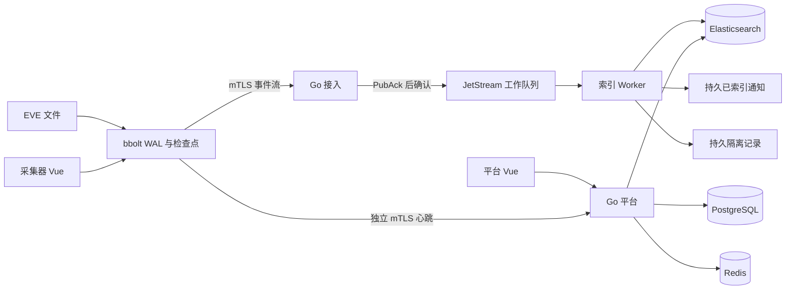

# 星烽 StarBeacon 工程实现与开发

工程记录日期：2026-10-01。仓库已经包含可编译、可运行的 Go 平台、接入进程、索引 Worker、采集器及两个 Vue 管理端。本次工程范围是身份、探针和事件数据链路；[功能覆盖与验收矩阵](功能覆盖与验收矩阵.md)中的完整产品能力仍按领域推进，不因目录建立而视为完成。

## 1. 工程范围

| 工作域 | 当前代码行为 | 后续边界 |
| --- | --- | --- |
| 身份与会话 | 本地账号 bcrypt、8 小时会话、HttpOnly Cookie、CSRF、同源校验、登录限流和登录审计 | 用户管理、细粒度 RBAC、MFA、OIDC、凭据轮换 |
| 平台探针管理 | 实际登记数据、启用／停用、心跳、CPU／内存／磁盘、版本、待传队列、状态详情 | 分组、远程目标配置、证书续签、规则与升级任务 |
| 采集器本地管理 | 独立认证、实际接口及 MAC/IP/MTU、运行健康、采集目标与审计原子保存 | 管理 IP／路由／DNS 变更、回滚确认、Suricata 配置应用 |
| 事件接入 | EVE 文件读取、来源代次与偏移、bbolt 持久队列、mTLS gRPC、路由与摘要核验、持久确认 | 多文件源、硬件采集、PCAP 原包捕获、流量计量 |
| 索引分析 | EVE 标准化、严格 ES 映射、Bulk 分项结果、不可变 ID 重放、异常持久隔离 | 关联检测、产品识别、模型研判、攻击成功判断 |
| 告警检索 | 时间、级别、关键词、源／目的 IP、HTTP 方法、协议、路径前缀；真实详情与原文 | PIT 游标、高级 AST、MAC 筛选、HEX、PCAP 与协议树 |
| 运行观测 | 角色就绪检查、Prometheus 指标、结构化进程日志、平台依赖健康 API | 全局监控页面、告警规则、统一追踪、完整故障演练 |
| 生命周期 | 八类业务策略默认 180 天；ES 默认 180 天 ILM；审计记录保存过期时间 | 租户自定义策略应用、PG 清理作业、保全、PCAP 生命周期 |

LLM 配置／对话／日报周报月报、决策模型、规则 AI 生成、MCP、邮件与即时通信、Syslog、设备 API／认证插件、自动封禁、PCAP 压缩与完整握手导出、文件／沙箱分析、资产网段、大屏等仍属于后续实现范围。当前工程没有对应的“成功”占位接口。

## 2. 目录与运行角色

```text
StarBeacon/
├── cmd/
│   ├── starbeacon/             # 平台 HTTP API 与独立 gRPC 控制流
│   ├── starbeacon-ingest/      # 事件接入、路由与持久接收
│   ├── starbeacon-worker/      # 标准化、索引、隔离和已索引通知
│   ├── starbeacon-agent/       # Go 采集器、本地管理与持久上报
│   └── starbeaconctl/          # 迁移、初始化、权限与开发签发
├── internal/                  # 按职责分包，见 internal/README.md
├── api/
│   ├── proto/                 # gRPC 源契约
│   ├── sensor/v1/             # 固定生成器生成的 Go 源
│   └── openapi/               # 当前平台与采集器 HTTP 契约
├── migrations/                # Goose SQL 与嵌入资源
├── web/
│   ├── platform/              # 平台 Vue 应用
│   ├── collector/             # 采集器独立 Vue 应用
│   └── packages/shared/       # 类型、主题、会话客户端和公共组件
├── deploy/                    # 开发依赖 Compose、NATS 配置与 Go 镜像
├── scripts/                   # 开发初始化、环境加载、样本与集成入口
├── tests/integration/         # 真实 PG/NATS/ES/mTLS 测试
├── .github/workflows/         # Go 与前端 CI
├── prototype/                 # 完整交互设计与合成数据，独立保留
└── docs/                      # 产品、架构、契约及实施文档
```

模块依赖保持单向：入口 → 配置与组装 → 平台／采集／接入／分析 → 契约与存储。当前一个 Go module、五个二进制；前端两个独立应用共用一个 pnpm workspace。模型、取证与设备连接器将在实现时形成受限适配边界，不复制协议解析器、数据库驱动或密码算法。



## 3. 实际工具链与依赖

| 项目 | 本工程固定版本／配置 |
| --- | --- |
| Go | 1.26.8；`go 1.26.0`、`toolchain go1.26.8`、`GOTOOLCHAIN=local` |
| PostgreSQL / Redis / ES / NATS | 18.6 / 8.10.2 / 9.5.4 / 2.15.0，独立开发容器已联调 |
| 前端 | Node 24.19.0、pnpm 12.6.0、Vue 3.5.43、Ant Design Vue 4.2.6 |
| 路由与构建 | Vue Router 5.3.1、Vite 8.3.1、TypeScript 6.0.3、vue-tsc 3.3.11 |
| 迁移／边缘状态／健康 | Goose 3.28.0、bbolt 1.5.0、gopsutil 4.26.8 |
| 编码生成 | protoc 36.2、Go 插件 1.36.12、gRPC 插件 1.6.2 |
| Go 依赖锁 | 根 `go.mod/go.sum`；13 个直接模块，含主模块的实际图 164 项 |
| 开发辅助脚本 | Python 3 标准库；本机验证为 3.14.6，不是后端服务运行依赖 |

本机系统 PATH 中的 Go 仍为 1.25.6。实际构建使用已下载的官方隔离 Go 1.26.8，未覆盖系统版本；通过 `GO=/绝对路径/go` 指定它。完整产品的选型与条件组件见[依赖版本与部署清单](依赖版本与部署清单.md)，没有代码调用的条件 SDK 不进入当前锁文件。

## 4. 本地启动

需要 Go 1.26.8、Node 24.19.0、pnpm 12.6.0、Python 3、Docker 与 Compose plugin。首次从仓库根目录运行：

```sh
make dev-setup GO=/绝对路径/go
pnpm --dir web install --frozen-lockfile
```

`dev-setup` 编译五个入口、生成独立随机凭据、启动开发依赖、迁移数据库、建立非超级用户运行角色、初始化本地租户和管理员、签发开发证书、登记采集器。配置保存在 Git 忽略的 `.local/`，目录权限 0700，凭据及私钥 0600。重跑保留已有凭据、账号和采集器身份；匹配失败时返回错误，不重置管理员密码。

分别在六个终端启动：

```sh
make platform
make ingest
make worker
make collector
make web
make collector-web
```

| 入口 | 本地地址 | 说明 |
| --- | --- | --- |
| 平台页面 | `http://127.0.0.1:5174/` | 平台账号位于 `.local/login.env` |
| 采集器页面 | `http://127.0.0.1:5175/` | 本地账号 `admin`，密码位于 `.local/collector.env` 的 `SB_LOCAL_PASSWORD` |
| 平台 HTTP / gRPC 控制 | `127.0.0.1:28080` / `127.0.0.1:29091` | Cookie 与本地采集器分开 |
| 接入 HTTP / gRPC 事件 | `127.0.0.1:28180` / `127.0.0.1:29090` | 事件批次与控制使用独立连接 |
| Worker / 采集器 HTTP | `127.0.0.1:28181` / `127.0.0.1:28081` | 运维与本地 API |
| PG / Redis / NATS / ES | `25432` / `26379` / `24222` / `29200` | 全部绑定宿主回环；NATS 监控端口 `28222` |

前端 Vite `/api` 保持原始 Origin，分别代理到 28080／28081。当前 Go API 不内置前端静态文件；前端产物位于各应用的 `dist/`。生产需同源 HTTPS 静态入口并代理对应 API，限制运维端点访问。现有完整原型仍在 4173，可以与两个工程应用共存。

Docker Hub 不可达时可用官方镜像的 ECR Public 副本：

```sh
make dev-setup GO=/绝对路径/go \
  COMPOSE_FILES='-f deploy/compose.yaml -f deploy/compose.registry.yaml'
```

Redis／NATS 副本按已核验的 manifest digest 固定，实际运行版本仍需检查。开发使用独立 Compose project 和命名卷，不复用其他项目的数据库。`make deps-stop` 保留卷；重置数据必须明确选择开发卷，不能直接套用到生产。Docker 凭据辅助程序无响应属于本机 Docker 环境问题；可用独立 `DOCKER_CONFIG` 指定无凭据配置和现有 CLI plugin 目录排查，不覆盖系统凭据配置。

### 4.1 EVE 数据入口

开发默认读取 `.local/eve.json`。`make sample` 向它追加一条明确标记的工程验收 EVE，使用保留示例 IP，不向外部网络发送攻击流量。此样本验证上报和索引流程，不证明真实 Suricata 抓包或规则命中。

接入已有 Suricata 时，在采集器环境中配置 `SB_EVE_PATH`，给代理只读文件和轮转目录权限；确认 Suricata 实际版本、EVE 输出和 Ethernet 字段配置。使用 rename/create 轮转，保留旧 inode 到代理读完；检查点后旧文件已被删除时，读取停止并报告异常，不默默跳过缺失来源。copytruncate 即使有前缀检测也不能保证在所有覆盖／快速增长情况下识别，不能作为可靠生产轮转策略。

当前代理每轮最多读取 100 条／约 2 MiB，完整换行后才推进偏移；单条超过 1 MiB 时停止读取并报告异常。它不把超大原文截断为正常告警。处理大包、TCP 重组和检查深度仍由真正的捕获与 Suricata 模块验收，不能把 EVE 大小限制当成大包检测能力。

## 5. 交付、隔离与恢复语义

1. 证书 URI 唯一绑定租户、探针和注册代次，TLS 1.3 验证信任链。PG 每个业务事务用 transaction-local 租户设置和 FORCE RLS，运行账号不能是超级用户、BYPASSRLS 或业务表所有者。
2. 事件 ID 由注册代次、来源代次、原文偏移和行内序号确定。bbolt 同一同步事务保存数据、序号、额度和来源检查点；额度不足时全部回滚，不能只保存部分记录却推进来源。
3. 平台路由固定 UTC 日期分区，重试继续使用原路由。接入每帧核验启用状态、路由、范围、摘要和身份，JetStream PubAck 成功后才返回精确 ACK。
4. 采集器仅回收与当前批次身份、原文摘要及精确序号范围一致的数据。它不根据一个无范围的全局水位删除其他流、旧注册或缺号区间。
5. Alerts／Context 使用 WorkQueue、File Storage、`MaxAge=0` 和 `DiscardNew`。未索引数据不被时间淘汰；满载拒绝新发布，使本地队列与来源产生背压。共享索引消费者在全部有效文档／隔离记录和已索引通知持久化后 DoubleAck，回收接入缓冲。[JetStream 留存语义](https://docs.nats.io/learn/jetstream/retention-policies)
6. ES Bulk 逐项核验；201 为新写入，409 必须核对不可变来源和原文摘要，429／依赖故障重试。400 映射拒绝、无效 EVE、无效 UTF-8 或事件流不匹配进入持久隔离，不伪装成正常告警。

传递保证是至少一次加幂等索引。NATS 2 分钟去重窗口不是跨重启的永久唯一保证；稳定 ES `_id` 和 409 来源核验承担长期重放边界。接入 ACK 表示队列持久接收，Worker DoubleAck 表示索引流程完成，ES refresh 后才可搜索，三者不合并。

工作队列不是供多个独立分析订阅者共享历史的总线：WorkQueue 不允许重叠的独立消费者。后续分析从已索引通知／ES，或经过明确设计的独立持久分发流读取。当前已索引通知为 72 小时运行缓冲，隔离记录为默认 180 天，各流默认上限 256 MiB；通知暂无下游业务消费者。不能将运行缓冲 TTL 当成业务留存，也不能靠提高 TTL 无限积累消息。

本地 WAL 默认 256 MiB，配置 `SB_WAL_BYTES`；该额度是待传记录编码字节，bbolt 文件可以保留更大的已分配页。暂未实现在线压缩及离线 compaction 编排。队列满会停止源读取，Suricata 文件轮转容量和磁盘配额也必须承接背压；任何容量都不足时需要显式报警和缺口处理，当前不会自动清队列换取继续运行。

ES 索引默认每租户／路由 UTC 日期／数据流一个主分片及一个副本，以首次路由日期作 ILM 起点。此实现便于验证身份和重放，不能直接外推到大量 SaaS 租户；租户打包、分片预算、PIT、热点和数据单元调度另需实现与容量测试。当前检索单次范围最多 31 天、页大小最多 100、最多前 10000 条，不是无限历史遍历。

## 6. 留存、凭据和执行边界

PG 为八类业务数据初始化 180 天默认策略，当前告警／协议索引采用全局 180 天 ILM，操作与登录记录保存过期时间，本地审计在写入时有界清理过期记录。PG 定时清理、租户自定义策略同步、精确过期治理与保全尚未实现。PCAP 未接入，不能据此声称全业务数据生命周期已经落地；产品默认仍统一为 180 天，不改成短期 PCAP。

开发证书只用于回环联调：CA 有效期 365 天、服务及探针证书 30 天。续签、撤销、轮换、外部 DNS SAN、失效预警和安全发布仍需实现。运行进程不持有 CA 私钥或迁移 DSN；CLI 是独立运维工具，开发脚本配置中的私钥不得作为生产镜像层或仓库文件。

生产模式要求依赖 TLS、PG `sslmode=verify-full`、ES API Key、HTTPS Origin 和至少 R3 的接入队列。所有 HTTP 当前仍只监听回环，跨主机入口需要受控网关／同源代理与内部可信 CA 配置。生产校验只阻止明显不安全配置，不代表已完成生产 HA、备份恢复、认证强度和权限验收。

当前登录限流使用连接的 `RemoteAddr`，不信任任意转发头。反向代理后会按代理来源聚合计数，完整 SaaS 接入需实现经过允许列表的可信代理链及租户／账号维度配额。NATS 三节点路由、各运行角色受限账号和依赖信任链仍需独立部署验收；当前仅提供回环开发配置，不能把开发 Token 复用到生产。

采集目标保存返回 `not_applied`；OS 网络配置和 Suricata 没有被修改。当前没有真实阻断、升级、规则发布或通知发送接口。后续这些动作必须有持久任务、授权、幂等、执行回执与回滚，不能通过页面按钮直接执行系统命令。

## 7. 构建与验证

```sh
make build test vet GO=/绝对路径/go
make integration GO=/绝对路径/go
pnpm --dir web install --frozen-lockfile
pnpm --dir web build
make generate GO=/绝对路径/go PROTOC=/绝对路径/protoc
```

集成测试仅在开发模式运行，使用随机临时租户、命名空间和测试索引，结束清理自己的测试资源，不读取或删除常驻业务租户。测试流使用独立的小容量额度，创建失败时也清理已建立的临时资源。测试覆盖真实 PG／NATS／ES、CA 签发与 mTLS、EVE/WAL/上传/PubAck/索引、重复投递、Flow ID 精度、MAC、租户隔离、探针停用后拒绝存量连接、消费确认回收以及满队列不淘汰未处理消息；无效 UTF-8 和 ES 映射拒绝均验证了持久隔离和后续回收。Go 单元测试覆盖 CSRF／同源／依赖异常、来源轮转、错误 ACK、额度原子回滚、严格检索和 ES 分项错误；CI 自动运行单元检查和两个前端构建，真实依赖联调另用开发测试入口。

本机 EVE → bbolt 同步保存 → 精确 ACK 回收的单次基准，在 Apple M2、100 条约 14.5 KiB 样本、当前本地磁盘下测得约 **20.9 ms/批、0.69 MB/s**。这一结果不包含网络、NATS、ES、Suricata 或 PCAP，不是镜像带宽或端到端吞吐承诺；热点、编码分配和 fsync 仍需要在目标服务器真实样本中测量。

采集器观察时间到 ES 写入确认的直方图 `starbeacon_event_index_commit_age_seconds` 排除 ES 刷新等待，并依赖时钟同步；负时间差单独计数。接入／索引计数包含重投次数，不作为唯一告警量。全流程 P95/P99、1–200+ 探针、大流量、断电、网络分区、180 天数据规模、TLS 盲区和设备阻断效果均须单独验收，当前不提供未经测量的速度数字。

五个 Go 入口已分别通过 Linux amd64／arm64、`CGO_ENABLED=0` 交叉编译。Go 镜像通过 `deploy/Dockerfile` 构建，默认平台角色，可用 `STARBEACON_ROLE` 选择其他入口；构建阶段固定官方 Go 镜像 digest，运行阶段为非 root scratch，包含标准 CA 与二进制。本机已完成平台镜像构建及容器版本命令验证。证书和配置由部署注入；容器中的回环监听需要同网络命名空间的受控入口，不能仅映射端口就视为可公开访问的生产部署。采集器 EVE、状态盘和宿主指标可见性需要独立设计，不能把普通平台镜像作为有捕获权限的采集器安装包。

## 8. 实现顺序与验收门槛

| 顺序 | 领域 | 进入下一阶段的条件 |
| --- | --- | --- |
| 1 | 工程数据链路、身份、探针与基础检索 | 当前代码与真实依赖联调可复现；恢复、指标和限制有明确语义 |
| 2 | Suricata 运行管理、规则验证／同步／回滚、证书与采集配置应用 | 真实引擎、来源轮转、检查深度、控制优先级和回滚通过测试 |
| 3 | PCAP 全量捕获、180 天对象归档、可配置压缩、会话与握手导出 | 原包完整性、断档、随机定位、存储生命周期及目标带宽验收 |
| 4 | 资产与网段、应用识别、检索 AST、审计／通知／Syslog、大屏 | 真实投影、游标、权限、渠道回执、事务 outbox 和错误可恢复 |
| 5 | 模型配置、研判、对话、报告、规则 AI 生成、MCP | 源数据授权、结构化输出、证据约束、评测、预算和只读工具边界 |
| 6 | 决策授权、采集器连接器、自动封禁、升级、文件／沙箱分析 | 影子／审批／自动策略、置信度校准、真实生效与撤销、隔离和灰度验收 |
| 7 | 集团／SaaS 资源治理与生产 HA | 配额、租户生命周期、分片预算、备份恢复、故障域与容量演练 |

以上顺序是当前工程依赖关系；完整范围不缩减。每个领域以真实 API、持久状态、页面与异常路径共同交付，禁止用合成页面数据或成功提示替代执行。
