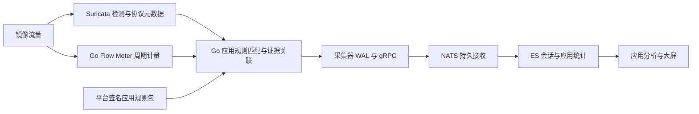
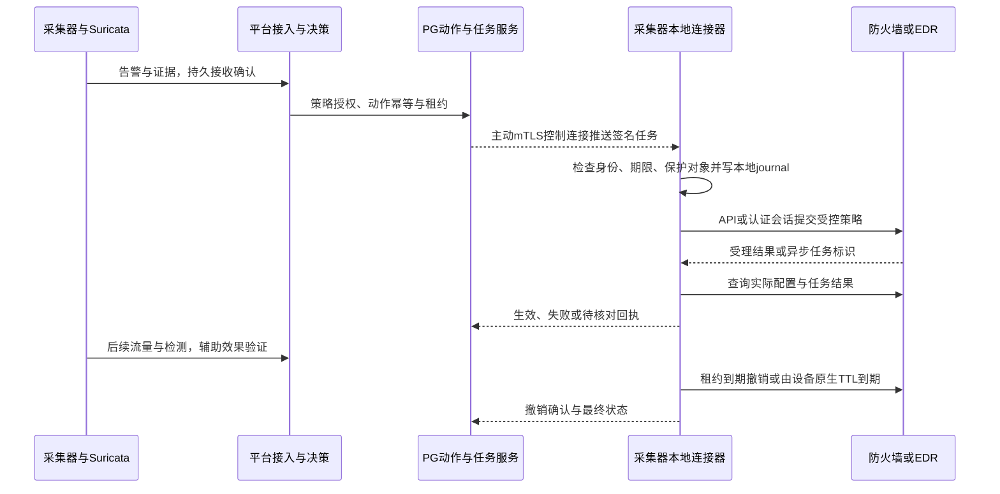

# 星烽 StarBeacon 应用识别与响应性能设计

本文定义应用流量分析、大屏、采集器执行联动及各阶段速度。基准日：2026-09-28。指标属于需要在指定硬件、规则和设备上验收的设计目标，不是实测结果。默认执行链路固定为：**平台研判与授权 → 下发采集器任务 → 采集器访问设备 → 读回与流量验证 → 到期撤销**。

## 1. 应用识别的范围

平台可以展示“哪些资产正在使用网盘、视频、即时通信、办公、代码托管、远程管理等应用”，按应用产品、类别、资产、网段、方向和时间统计流量、速率、会话与风险。百度网盘、爱奇艺等是具体应用产品，不应与 TCP、TLS、HTTP 等协议放在同一个枚举里。

| 层级 | 示例 | 平台字段 |
| --- | --- | --- |
| 传输协议 | TCP、UDP | `network.transport` |
| 应用协议 | HTTP、TLS、QUIC、DNS | `network.protocol` |
| 产品与服务 | 百度网盘、爱奇艺、某企业自建应用 | `application.product_id`、`service_id` |
| 应用类别 | 云存储、在线视频、办公协作、远程管理 | `application.category_id` |
| 识别状态 | 已确认、规则推断、冲突、混合、未知 | `application.status` |
| 证据 | 主机名、HTTP 属性、DNS 关联、协议特征、授权终端进程信息 | `application.evidence_refs` |

“已确认”只表示达到对应应用识别策略的证据标准，不代表网络资产受到攻击。普通视频和网盘活动不自动成为恶意告警；业务允许、带宽异常、策略违规、威胁命中是分开的状态。用户身份只有在接入可信身份／终端映射后显示，否则定位到资产，不通过 IP 猜测具体人员。

### 1.1 已核实的技术边界

Suricata 8.0.7 可提供协议、DNS、HTTP、TLS 等元数据，规则可匹配相应可见 buffer，但它不是已经维护好所有互联网产品的应用目录。其固定版本 QUIC 源码支持解析部分 Initial 信息，并不意味着可读取加密 HTTP/3 的 URL 与正文。[EVE 格式](https://docs.suricata.io/en/suricata-8.0.7/output/eve/eve-json-format.html)、[QUIC 实现](https://github.com/OISF/suricata/blob/suricata-8.0.7/rust/src/quic/quic.rs)

nDPI 6.0 有 IQIYI 协议标识、域名映射及特定 UDP 特征，但这些不能解释为所有现代爱奇艺流量都可识别。固定版本未核实到独立的百度网盘协议标识；识别百度通用域名不能直接贴成百度网盘。内置产品规则必须根据合法取得的官方服务信息和授权样本持续维护，不能声称继承一个开源列表就覆盖所有 App。[nDPI 6.0](https://github.com/ntop/nDPI/releases/tag/6.0)、[IQIYI 解析器](https://github.com/ntop/nDPI/blob/6.0/src/lib/protocols/iqiyi.c)、[域名匹配库](https://github.com/ntop/nDPI/blob/6.0/src/lib/ndpi_content_match.c.inc)

HTTPS 下通常只能使用当时可见的握手、名称和连接特征；TLS 1.3 证书内容、ECH 内层名称、DoH/DoQ 查询、隧道内应用等不能一律被旁路探针读取。共享 CDN IP、通用浏览器 JA4、公共证书或 DNS 查询单独不足以确认具体产品。初期不默认部署 TLS 解密或保存客户私钥；需要明文特征时接授权代理／终端日志，并注明来源和可见性。

## 2. 默认实现与可选增强



默认采用 Go Flow Meter、Suricata 元数据、Go 应用规则引擎，避免给每个包调用 LLM。Flow Meter 只做有界 L2/L3/L4 解码、流跟踪和计量；完整协议重组与安全检测仍交给 Suricata。应用规则先在采集器匹配，平台保留规则版本与证据并做跨数据源补充，平台离线期间仍可形成可补传的流量统计。

Go 计量采用 `github.com/gopacket/gopacket v1.7.2` 的 Linux AF_PACKET / TPACKET_V3 路径与复用的层解析器，最低 Go 声明为 1.25.0，符合项目 1.26.0。零复制返回的数据只在有效生命周期内使用，需保留的少量字段复制；不把 mmap 临时片段交给异步 goroutine 长期持有。该方案的吞吐仍需实测。[版本与模块](https://github.com/gopacket/gopacket/blob/v1.7.2/go.mod)、[AF_PACKET 源码](https://github.com/gopacket/gopacket/blob/v1.7.2/afpacket/afpacket.go)

Suricata 与计量器使用不同 fanout group 获取各自完整流量；同一 group 内 HASH/LB 是分流，不是复制，错误共组会导致双方只拿到部分包。双抓包增加内核分发、内存带宽和 CPU 开销；双方需独立 drop 指标，采用 RSS／NUMA／对称流哈希设置时按 NIC 与驱动验收。高吞吐场景可研究经过验证的共享捕获接口或硬件分流，不直接把未实现的零拷贝架构作为吞吐保证。[Linux packet mmap](https://docs.kernel.org/networking/packet_mmap.html)、[Suricata 捕获建议](https://docs.suricata.io/en/suricata-8.0.7/performance/packet-capture.html)

nDPI **6.0** 作为独立受限原生进程的可选增强，用本机受限接口向 Go 输出分类，避免将复杂 C 解析器嵌入平台 API。其 TLS／QUIC 等组件采用具体双许可条件，盈利产品不能仅凭核心 LGPL 就默认启用全部解析器，改成 sidecar 也不会改变这一点。本方案不把该商业授权作为基础应用大屏的前置要求。[许可声明](https://github.com/ntop/nDPI/blob/6.0/README.license.md)、[官方说明](https://www.ntop.org/announcing-ndpi-dual-license-change/)

## 3. 应用目录与识别规则

应用中心页面包含应用目录、识别规则、规则包、样本与覆盖率、未知流量、例外。产品目录字段包括稳定 ID、中文名称、别名、类别、服务子类、责任人、维护来源、版本、适用区域、受支持客户端／传输和最后验证时间。名称调整不会改 ID，产品与应用类别的映射有版本。

| 规则特征 | 使用方法 | 证据边界 |
| --- | --- | --- |
| 精确域名／后缀 | 域名按 label 边界匹配，小写与 IDNA 规范化 | 不允许 `example.com.attacker.test` 命中 `example.com`；泛域名可能只识别厂商 |
| HTTP Host／可见路径／UA | 多字段组合，区分原始与规范化值 | UA 可伪造；加密或缺少响应时不可填造 |
| 可见 SNI／ALPN | 产品域名与协议族组合 | ECH／无 SNI／共享服务可能只能识别上层类别 |
| DNS 关联 | 按客户、资产、网络域、回答 TTL 与时间窗建立候选关系 | 不能用整个公司最近查过的域名给所有连接归因 |
| IP/CIDR | 对经过验证的专有地址段辅助识别，带来源和失效时间 | 共享 CDN／云地址只作弱证据，过期映射失效 |
| 字节／协议特征 | 在支持的 buffer 与方向匹配，限定 offset/depth/长度 | 不对密文套用明文签名，不跨边界拼出不存在的内容 |
| 指纹／终端证据 | 指纹作辅助；进程映射需可信终端身份与时序 | 指纹不是应用唯一身份证明，EDR 映射同样需去重与验证 |

规则模型采用受限 JSON AST，包含 id/rev、产品／类别、适用协议、AND/OR/NOT 条件、优先级、排除、证据最低等级、有效期、样本引用与性能预算。纯名称映射优先用哈希／反向域名树，IP 用前缀树；复杂规则按协议和候选产品预分桶，不能每个包串行扫描全部产品表达式。

示例只说明格式，所用 `.example` 域名不属于真实产品，不构成预置识别库：

```json
{
  "schema_version": "application-rule.v1",
  "rule_id": "app_rule_example_drive",
  "revision": 1,
  "product_id": "example_drive",
  "category_id": "cloud_storage",
  "protocols": ["tls", "http"],
  "any": [
    {"field": "tls.sni", "op": "domain_suffix", "value": "files.example"},
    {"field": "http.host", "op": "eq", "value": "files.example"}
  ],
  "exclude": [],
  "evidence_level": "product_hostname",
  "on_match": "classify",
  "enabled": true
}
```

应用规则 `on_match=classify` 只分类，不直接执行阻断。安全威胁规则仍使用 Suricata SID/rev 体系；应用规则可以引用或从受审查模板编译出必要的元数据检测，但不为每个正常应用会话都生成安全告警。两种规则共用签名、样本、灰度与回滚基础设施，保持命名空间与指标独立。

多条规则命中时按照特异性、优先级、排除条件和证据等级裁决；不同产品证据冲突标为 conflict，不能简单取最大模型分数。HTTP/2 连接合并、代理复用、隧道或多产品共享连接不能可靠逐流量拆分时标 mixed 或 infrastructure。识别得分是规则证据强度，未经标定不显示为准确率百分比。

AI 可以根据 PCAP／HTTP Raw 和自然语言生成应用规则候选，与威胁规则使用相同的隔离验证框架；必须同时跑目标产品正样本、同厂商其他产品、共享 CDN、浏览器背景流量及未知样本，不能仅以命中一个域名样本授予产品级确认。

## 4. 活跃流与字节计量

仅有流结束日志无法满足“当前正在占多少带宽”的要求。计量器默认每 **5 秒**输出活跃流窗口，断流／关闭输出最终窗口；采集器按流分片并持久化必要的已输出序列与重放状态。Suricata 的 EVE flush 参数控制输出缓冲，不是活跃流周期导出；缩短 flow timeout 会影响重组与检测，不能借此实现实时仪表盘。[Suricata 配置](https://docs.suricata.io/en/suricata-8.0.7/configuration/suricata-yaml.html)

流身份包含 tenant、sensor_registration、capture_domain、网络命名空间、VLAN／隧道上下文、对称五元组、flow_epoch。重用端口、计量器重启与 flow table 淘汰产生新 epoch。与 Suricata 关联通过 Community ID、五元组、观测域和时间区间，不把 Community ID 当全球唯一的长期会话 ID。QUIC 迁移造成的不同传输流可关联，但没有足够证据时不强行合并计费。

每个窗口保存 `interval_id`、start/end、sequence、双向 packet/byte 增量、累计值、捕获质量与计数来源。窗口 ID 持久化，重传使用相同 ID；累加器不能对重复消息再次加一。累计计数复位不是负流量，出现缺口、溢出、碎片无法关联或表淘汰时记录质量标志。

默认应用分析使用可复现的 **L3 IP 字节**口径，界面显示“IP 流量”；链路层／NIC 线速另列。Suricata flow 字节基于其观测报文长度，不能在未统一口径前直接和计量器 L3 字节相减或叠加；重传、隧道外层、包头与采样策略都影响差异。[Suricata 计数字节源码](https://github.com/OISF/suricata/blob/suricata-8.0.7/src/flow.c)

抓包保留原始帧长度、已捕获长度和截断标志；不能用 `len(captured_data)` 代替实际流量。L3 计数校验协议声明长度与可观察的帧长度，非法超长字段进入异常统计，不放大成不存在的字节。隧道按选定内／外层口径计量且不重复相加。

流量方向默认 client/server 推断并注明置信状态；应用上传／下载只有在内外边界和资产角色明确时才显示。内网对内网不套用外网下载含义。单位明确区分 bit/s、byte/s、GB 与 GiB。

同一网络段被多个探针观察时，平台配置一个计量主观测点或明确的互斥覆盖域，集团总量只汇总不重叠计量域；其他探针用于检测／证据关联。不能将跨观测点相同五元组的字节简单相加，也不能以猜测的全局去重抹掉实际不同会话。主计量点切换记录覆盖版本和缺口，累计值重新建立基线。

## 5. 实时与历史统计一致性

获准保留的明细窗口事实保存在 ES `flow-intervals`；未开启逐流明细时只保留规定的开始／结束／分类变化和聚合记录。分类修订保存在 `flow-classifications`；大屏使用 `app-metrics-5s`、分钟、小时和日汇总。窗口事实不可变，分类结论可追加。迟到识别会把某些未知窗口归入产品，但聚合通过重算同一确定窗口并替换版本完成，不在未知和产品两边重复累计。

实时聚合的 `aggregate_id` 由采集器注册、计量器代次、计量域、时间窗和不含应用的固定维度键组成；一份受限文档保存该维度的完整应用字节分布及总量，revision 单调递增，更新通过 OCC 替换整个分布。窗口创建时同时固定逻辑时间桶、物理目标索引和 routing，更高 revision 始终更新原位置，显式拒绝修订回退；不使用会把更新分散到不同 backing index 的浮动 rollover 写入口。应用变化不能生成两份同时有效的独立计数。采集器可从本地短时窗口状态重算并发送更高 revision，默认修正窗 15 分钟；窗口状态已回收且没有原始明细时，历史归因保持原样并注明限制，不承诺任意时间重算。

初次展示遵循“已知产品＋未知＋混合＋不可归因 = 同一计量域总量”；后续分类校正不得改变原始总字节。已冻结报告保留分类规则、聚合版本和数据水位，重算生成新的内部记录。对密文复用连接无法按具体请求精确拆分的字节只标为连接级归因，不能宣称已经准确计量某个 App 的有效业务正文。

分布采用有界 `nested` 数组，成员为 product_id、category_id、status、双向字节与计数，不把动态产品 ID 展开为 ES 字段名。单文档桶数设上限，尾部准确合并为其他；nested 隐藏文档、更新与索引放大纳入真实索引系数测量。选择组级或抽样明细模式时将可实现的排行、distinct 和回溯能力一起降级，不仅改变存储参数。

页面支持实时、近 24 小时、历史三种查询。实时视图订阅授权的聚合更新，隐藏标签暂停，后端为租户缓存同一时间桶；大量大屏不能各自做全量流记录聚合。原始 5 秒窗口可从 24 小时留存起，分钟汇总 30 天，小时／日汇总 13 个月作为起点，具体配额按客户需求调整。

### 5.1 容量不能按安全告警 EPS 推算

若采集器平均 10,000 个活跃流，每 5 秒上报一次，单台约 **2,000 个窗口/秒**；200 台即约 **400,000 个窗口/秒**，还没有计算协议和告警。这一功能可能成为平台最大的事件源，不能直接套用原方案 10,000 EPS 算例。

默认采集器本地计量完整流量，上传保留计量资产身份的实时维度聚合（accounting_asset_id、方向及关联的资产组／网段快照，文档内保存完整应用分布）及受限流明细：被调查／命中安全事件的流保留详细窗口，普通流按租户窗口配额输出，结束摘要另存；完整逐流 5 秒遥测作为需明确容量配置的模式。计量的全量 byte 总计与“保存每条原始窗口”是不同能力，UI 必须显示明细覆盖模式。

举例每探针平均每 5 秒输出 200 个非空聚合键，200 台为 **8,000 条聚合记录/秒**。每条 500 B、ES 系数 1.3、副本 1、70% 利用率、保留 1 天，额外约 **1.28 TB**；这是聚合维度限制下的算例，不代表任意租户都只有 200 个键。原始逐流方案按 400,000 EPS、500 B、同条件保留 1 天则约 **64.18 TB**，需要独立数据单元和额外队列预算。

默认保留 accounting_asset_id 维度才能提供完整的逐资产排行；租户若选择只传组／网段汇总模式，Top 资产与资产历史只能显示受限明细覆盖，不能声称精确全集排行。每条流定义唯一计量归属资产，边界流取已确认的内侧资产，内网流按固定策略选择计量拥有者；端点双视角或重叠资产组可以单独分析，但不能相加推导全局总量。

基数超预算时对受控维度做准确加总后归入“其他”，明细覆盖下降单独显示；不得丢字节后仍保持总量看似完整。活跃会话数展示当前值、窗口峰值或均值，不把每个 5 秒活跃数相加当作新增会话；新建会话仅在确定创建窗口计一次，独立资产数使用保留的去重维度计算。模型任务不逐 5 秒窗口触发，按经过规则检测的异常主题分析。计量器内存预算按活动流数、每流状态和解析缓存估算；100 万流即使每流仅 256–512 B 也已有约 256–512 MB 结构体量，还需哈希表、分片、元数据、对象与余量，必须测堆和 GC。

## 6. 应用分析与大屏功能

流量分析导航下提供应用总览、应用详情、资产流量、会话、未知流量和流量取证；态势大屏增加应用流量模板。

| 页面／组件 | 展示与操作 |
| --- | --- |
| 应用流量总览 | 当前上下行速率、总字节、活跃／新建会话、应用类别占比、Top 应用、Top 资产、未知比例 |
| 产品详情 | 产品／服务、时间趋势、使用资产、站点、会话、规则证据、识别版本、异常与允许策略 |
| 资产行为时间线 | 按资产展示应用活动时段、流量变化和相关告警；身份来源可追溯 |
| 未知／冲突分析 | 未归因原因、证据不足、待补规则、授权样本采集、规则候选与复核 |
| 应用大屏 | 5 秒计量与默认 5 秒视图刷新；应用／类别／区域分布，带宽与异常趋势，监测覆盖 |
| 响应效能大屏 | 检测／告警可见／决策／命令到达／设备生效 P50/P95/P99、成功／未知／失败、逾期撤销 |

应用大屏与综合态势大屏可独立轮播，提供 1080p/1440p/4K 布局、只读短期投屏身份、暂停刷新和统一筛选。每个卡片显示统计窗口、计量口径、最后数据时间、分类覆盖、明细模式和丢包；地图只是辅助，关键数字可下钻到授权视图。即使没有安全告警，也应能够显示普通业务应用流量。

应用行为规则可定义“某资产组在工作时段使用某类应用”“短时上传超过基线”等监测策略。默认生成业务违规或带宽异常事件，与攻击告警分类分开；若用户授权阻断，调用相同响应服务并检查共享地址影响。识别出视频服务不等于可以封禁其所有 CDN IP；缺少设备原生应用／FQDN 控制时，只对经过授权的精确范围执行，必要时仅通知或审批。

## 7. 采集器执行封禁的架构



默认连接器随采集器安装，是同主机上的受限进程，具有独立 UID、凭据范围和 journal；管理口与抓包口可以分离。平台登记 `device_id`、管理地址、安全域、允许执行的 sensor/connector 实例、动作能力、优先级和凭据引用；不让任何在线探针扫描或任选管理地址。

任务可由告警观测探针本地执行，也可以由同租户、同授权设备范围且网络可达的另一采集器执行。选择依据明确设备绑定、最近验证的可达性、认证状态、版本能力和有效执行租约，不能只用“哪个探针最空闲”。界面显示观测采集器与执行采集器，二者不混为同一身份。

采集器主动建立控制连接，复用既有入口与 mTLS 身份体系；事件上传和设备控制使用独立连接／队列，避免 HTTP/2 连接级流控拖慢紧急任务。若连接器使用独立证书就建立独立认证连接，不能在一条 TLS 连接上声称存在两份不同证书身份。每台连接器的命令有过期、单调代次、稳定 ID、payload hash 与签名。

模型和平台操作员都不直接读取设备密码。官方 API 模式与授权控制台登录缓存模式使用同一执行接口；会话缓存默认留在采集器，写请求超时先读回，未知结果不盲目重试。普通检测采集不因浏览器登录变慢而停顿，浏览器认证与响应 API 有独立资源池。

### 7.1 离线、故障转移和撤销

平台失联后默认不根据新告警自行扩大封禁；本次确定的模式仍是主平台授权下发。已经授权且未过期的动作只有在 policy_version、binding_version、scope_version、保护名单及撤销序号均满足本地有效期要求时才允许继续；缺少撤销序列、缓存过期或范围版本落后时暂停新写。任务需带短期授权租约和最大离线执行窗口，默认失去授权新鲜度即停止新的封禁，不能仅凭旧签名永久继续。过期任务不补执行新封禁。本地维护到期撤销，优先使用设备原生 TTL，接收新租约时按有效租约最大到期时间更新并回读。

平台认为采集器离线，不代表它失去访问设备的能力。旧采集器的本地解封定时器可能与新执行者的续期发生冲突，单靠 PG 锁无法阻止设备上的旧操作。因此接管要求设备条件更新／fencing，或每执行代次有独立规则资源且旧实例只能撤销自己的资源；设备不支持时保持单执行采集器，确认旧执行者被隔离、旧定时器与在途副作用请求被终止或只能作用于旧代次资源，并完成设备对账后才转移，不宣称自动无缝接管。

同一 IP 多租约合并仅在同设备、方向、作用域、规则拥有者和可控执行代次内进行。插件升级、采集器退役、凭据轮换、迁移与租户停用均要保留已有动作的撤销路径；只删除连接器配置会遗留封禁，界面必须阻止或进入明确的移交流程。

## 8. 阻断到底何时生效

受理成功、规则存在、配置生效、现有连接被中断、攻击被遏制分别保存。某些状态防火墙变更规则后，旧会话可能继续通过；需要设备支持的精准状态清理或自然到期，不能默认全设备 flush。外部地址表也可能在设备重启后丢失，必须按仍有效租约核对恢复。[OPNsense 外部地址表](https://docs.opnsense.org/manual/aliases.html#external)、[状态防火墙说明](https://docs.opnsense.org/manual/firewall.html#states)

旁路采集器通过外部 API 阻断后续流量，不能追回已经到达业务的请求。Suricata inline 在转发路径上可丢弃达到匹配条件的包，但应用层规则可能需要后续字节，不能笼统保证所有攻击首包都能拦截。需要即时数据面防护时，应独立验收 inline IPS 或设备本地规则，与中心 AI 的秒级研判响应形成互补。[Suricata IPS](https://docs.suricata.io/en/suricata-8.0.7/ips/index.html)

封禁 IP 与隔离终端不是同等影响动作。设备只支持 IP 规则时，NAT、共享出口、CDN、管理链路、代理与 IPv6 临时地址必须纳入目标验证；不将一条应用归因规则直接转换成厂商全部地址封禁。

## 9. 速度指标与验收目标

### 9.1 时间戳与度量

| 时间点 | 含义 |
| --- | --- |
| `t_packet` | 标注回放中达到规则判定所需的最后相关字节到达采集器；不是一律取连接首包 |
| `t_alert` | 引擎产生可读取 EVE 告警 |
| `t_edge_durable` | Agent WAL 同步完成 |
| `t_ingest_durable` | 平台取得符合持久化契约的队列确认 |
| `t_searchable` | 原始告警及所需列表投影可检索 |
| `t_decided` | 研判与策略授权完成，动作事务已提交 |
| `t_command_received` | 指定采集器持久接受任务 |
| `t_device_accepted` | 设备接受请求，可能仍在异步执行 |
| `t_effective_verified` | 回读证明目标配置在正确作用域生效 |
| `t_traffic_verified` | 有可用网络／终端证据证明后续效果 |

EVE 自身 timestamp 通常表示原始事件时间，不能同时当作检测完成埋点；缺少引擎完成埋点时记录 `eve_observed_at` 并说明检测时延为包含输出／观察等待的上界。没有可用后续流量时 `t_traffic_verified` 为空，不能拿设备配置回读时间冒充效果证明。

同进程分段用单调时钟；跨主机使用经监测的时钟与偏差区间，时间误差超过目标量级时不输出伪精确延迟。每个阶段携带 trace_id、event_id、action_id 和重试次数；补传历史事件与实时事件分开统计。未成功任务也进入成功率／超时统计，不能只计算快且成功的子集掩盖失败。

### 9.2 初始 SLO

下表假设采集器未丢包、固定验证规则、实时流量在约定容量内、平台 RTT ≤100 ms、存储健康、设备 API 已认证且支持在线规则更新。外部设备慢提交、MFA、审批、离线补传、规则等待完整正文等单列，不混入快路径；各租户仍能查看这些慢任务的真实耗时。

| 能力 | 设计起点 | 适用与排除条件 |
| --- | --- | --- |
| 应用分类计算 | 可用特征进入匹配器后 P95 ≤100 ms | 不含等待 TLS/HTTP/DNS 特征出现；未知不强猜 |
| 活跃流计量 | 5 秒窗口；聚合进入大屏 P95 ≤10 秒 | 不是首包后 10 秒必然识别任何 App |
| 告警产生 | `t_alert−t_packet` P95 ≤300 ms | 固定样本、简单规则与目标吞吐；复杂重组规则单独度量 |
| Agent 持久与发送 | `t_edge_durable−t_alert` P95 ≤100 ms；关键告警小批定时发送 | 测试起点可取 25–50 ms 刷新，不能只按条数等满批 |
| 平台持久接收 | `t_ingest_durable−t_edge_durable` P95 ≤300 ms | 依赖网络、fsync 与持久化配置，不用低耐久模式达标 |
| 告警可检索 | 平台接收到可搜索 P95 ≤5 秒 | 包含必要投影；不阻塞低时延响应等待 refresh |
| 确定性授权 | 持久接收到动作提交 P95 ≤300 ms | 上下文已就绪；包括最小证据快照与 PG 授权 |
| 命令送达 | 动作提交到采集器持久接受 P95 ≤300 ms | 主动常驻连接、独立控制队列 |
| 已认证快速设备 | 接受采集器任务到配置生效验证 P95 ≤5 秒 | 仅对通过该能力认证的设备配置；不代表所有防火墙／EDR |
| 确定性自动阻断整体 | `t_effective_verified−t_packet` P95 ≤8 秒 | 上述快路径条件；不包含未知的流量效果证明 |
| 小模型自动阻断 | 整体 P95 ≤15 秒作为资格目标 | 小模型调用预算单列，超时转复核不降阈值 |
| 通用 LLM 自动研判与响应 | 整体 P95 ≤60 秒作为资格目标 | 受模型、token 和工具预算影响；超时不自动封禁 |

这些分段 P95 不能直接相加推导端到端 P95；整体目标必须单独测量。浏览器仅在首次登录或会话续期时使用，热会话走已验证 API；冷认证和 MFA 可达数十秒或需人工，不纳入 8 秒快路径资格。设备需要提交配置、集群同步或异步终端上线时，根据实测设独立档位，不强行套用快速设备目标。

低时延告警输出使用独立且唯一的权威 EVE 告警通道，首轮测试采用 `buffer-size: 0`；上下文输出可单独缓冲并设置有界 flush。若同一告警被配置到两个 EVE 输出，必须指定唯一权威源或明确稳定去重，不能将配置复制计作两个独立告警。EVE 输出缓冲、WAL 批量落盘和发送刷新分别度量，不为吞吐关闭必要的持久化。

告警速度不应受默认大屏 30 秒刷新限制：告警列表可接事件通知并重新读取投影，应用大屏采用 5 秒刷新，综合管理大屏仍可 30 秒。推送消息受外部渠道限速影响，作为 `notification_latency` 单独统计，不能代替告警入库延迟。

## 10. 实现与验收安排

| 工作项 | 必须交付的验证 |
| --- | --- |
| 应用目录与规则 | 百度网盘、爱奇艺等逐产品建立授权正负样本与版本范围，提供已覆盖／部分／未知矩阵，不以命中域名数当覆盖率 |
| 活跃流计量 | 30 分钟以上长连接未关闭时带宽持续更新；结束摘要不重复累计；重启与重传计数正确 |
| 抓包性能 | Suricata 单独与同时开启计量器对照；IMIX、小包高 PPS、长连接、大流表、IPv6／碎片／隧道，记录丢包与 CPU／GC |
| 分类准确性 | 按会话与字节双维度统计精确率、召回、未知和混合比例；不同客户端、网络、加密方式、版本留出评测 |
| 多观测点 | 同会话双探针不重复汇总，计量主点切换能说明缺口 |
| 设备实际阻断 | 新连接与既有状态分别验证；HTTP 200／异步受理／表项存在均不能独自当作流量阻断证明 |
| 速度 | 同一 trace 全链路分段、P50/P95/P99、失败率、条件与样本数；分别测冷认证、热会话、小模型、LLM、恢复补传 |
| 故障 | 上传洪峰不堵控制，旧执行者失联但仍可访问设备、TTL 续期、精确撤销、设备重启与认证过期 |

基础产品规则与活跃计量、应用大屏、采集器本地 API 执行进入首期完整试点；正式自动化的每种设备和模型路径按资格验收。授权 nDPI、更多产品特征和更高速捕获是增强项，不影响基础规则分类功能成立。新增流量基数需计入研发和压测排期，若保持原团队规模，应为计量与应用规则验证另预留约 4–6 周，不能将它当成仅增加一个图表。

详细研究来源见[应用识别与流量分析调研](research/应用识别与流量分析调研.md)与[采集器联动与响应时延调研](research/采集器联动与响应时延调研.md)。
