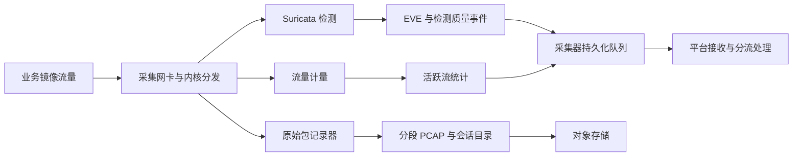

# 星烽 StarBeacon 旁路采集与检测质量设计

设计日期：2026-09-30。检测基线为 Suricata 8.0.7；配置名称、源码行为与产品验收要求分别说明。本文没有进行生产网卡、目标 Linux 内核或实际规则集的吞吐测试，容量与时延须以[应用识别与响应性能设计](应用识别与响应性能设计.md)的负载模型验收。

全量 PCAP、告警证据及其他业务数据默认保留 180 天，并可按数据分类配置。冷热分层只改变存储层级，不提前删除数据；本地环形缓冲的短期驻留不代替对象存储的业务留存承诺。留存、完整握手和会话导出以[PCAP 留存与会话完整性设计](PCAP留存与会话完整性设计.md)为准；协议能力、文件还原和沙箱见[协议覆盖与文件分析设计](协议覆盖与文件分析设计.md)。完整 PCAP 与完整检测是不同指标：保留了密文字节不等于解密成功，保存了长会话也不等于引擎检测了全部正文。

## 1. 旁路部署与观测边界

平台默认接入交换机 SPAN、网络 TAP 或经过验收的流量分发设备。探针监听镜像端口，管理口承担上报、控制及响应联动。镜像采集本身不处于业务转发路径；旁路 Suricata 的规则命中、内部 `drop` 动作或异常策略不能证明业务包已被阻止。真正的自动封禁由平台下发任务，采集器连接器调用防火墙、EDR 等设备，并分别记录受理、策略安装、回读验证与业务效果。

每个采集点登记以下信息：

| 对象 | 配置与证据要求 |
| --- | --- |
| 镜像范围 | 来源端口／VLAN／网络域、双向或单向、过滤条件、镜像设备及配置版本 |
| 链路能力 | 业务双向合计峰值、镜像出口线速、最大帧、封装开销、突发能力；不能用单向业务带宽代替镜像负载 |
| 接口与时钟 | NIC、驱动、固件、队列、MTU、时间戳来源、时钟误差；ERSPAN 等另记内外层和时间来源 |
| 捕获变换 | VLAN 剥离、GRO/LRO、分片重组、去重、截断和采样；原始与派生数据分别标注 |
| 观测完整性 | 双向可见性、原始帧计数、缺口、接口重启、采集开始时间；上游无统计时标未知 |
| 原始证据授权 | 租户、站点、网络域、资产范围、脱敏策略与有效期；管理流量及密钥不混入普通 PCAP 导出 |

SPAN 出口拥塞可以在探针收到报文以前丢包，因此探针 `capture.kernel_drops=0` 不能证明镜像没有丢包。先核对上游镜像统计、NIC 统计，再核对内核和应用统计；无法取得上游分母时只报告“本探针捕获路径已观测丢包”，不报告“全链路零丢包”。同一流量从多个镜像点进入时保留观测点身份，不能无依据合并计数或删除原始重复帧。[Suricata 丢包统计](https://docs.suricata.io/en/suricata-8.0.7/performance/statistics.html)

## 2. 捕获、检测和计量的输入契约

三类消费者必须分别取得其授权范围内的输入；不同进程不得误加入同一个 HASH/LB fanout group。Linux fanout 在组内将一个包交给一个 socket，组内分发不是复制。独立抓包组会增加内核、内存带宽和 CPU 开销；性能测试必须同时开启记录器、检测器、计量器和上传，不能用只运行 Suricata 的结果代表整机。[Linux packet socket](https://man7.org/linux/man-pages/man7/packet.7.html)

原始包记录器保留捕获到的线上分片和帧字节。检测分支可以进行重组、协议归一化与策略化解码；重组结果不覆盖原始证据。尤其要区分：

- Suricata `af-packet.defrag: yes` 在 `cluster_flow` 配置中使用 `PACKET_FANOUT_FLAG_DEFRAG`，使分片在 fanout 前由内核重组。该分支得到的输入不能直接视为未经变换的逐帧镜像。独立记录器不启用此类前置分片合并，并以分片黄金样本确认实际捕获行为。
- AF_PACKET 的 `copy-mode: tap` 是向另一接口复制报文的转发模式，不是单臂监听 SPAN 的同义词。默认旁路探针不配置业务转发接口，也不依靠发送 TCP RST 作为可靠封禁机制。
- 原始记录器、Suricata 和计量器各自记录 drop、截断、积压和重启；一个分支健康不能替另一个分支出具完整性结论。

以上 fanout 与重组行为按固定源码核实；实际目标内核和捕获后端仍须验收。[AF_PACKET 配置处理](https://github.com/OISF/suricata/blob/suricata-8.0.7/src/runmode-af-packet.c#L363)、[Linux fanout 语义](https://man7.org/linux/man-pages/man7/packet.7.html)

## 3. 捕获与重组配置

### 3.1 发布配置与可复现性

每台探针的有效配置清单包含 `capture_profile_id/revision`、引擎版本与构建摘要、配置全文摘要、规则包摘要、启用解析器、NIC/驱动/内核、捕获后端、ring/block 参数、线程与 CPU/NUMA 亲和性、BPF、最大捕获长度、协议限额和 bypass 策略。使用目标二进制检查配置，保存渲染后生效值及样本结果；仅引用源模板默认值不能证明发布镜像采用了相同设置。

| 配置领域 | 固定版本事实 | 平台实施要求 |
| --- | --- | --- |
| 捕获线程 | `workers` 依赖捕获后端把同一双向流交给同一工作线程 | 验证对称 RSS／fanout；错误线程、乱序和单大流热点分别测试 |
| 分组与缓冲 | AF_PACKET 有 `cluster-id`、`cluster-type`、`ring-size`、`block-size`、`block-timeout`、`tpacket-v3` | 默认选择经过验收的被动 V3 配置；按帧大小、突发、内存与时延预算定值 |
| 捕获长度 | `pcap.snaplen` 属于 PCAP 后端；AF_PACKET 的尺寸计算路径不同 | 不把 `pcap.snaplen` 写到 AF_PACKET 配置中假称已生效；逐后端验证实际 `captured_length/original_length` |
| 包尺寸 | `default-packet-size` 参与 AF_PACKET 的 snaplen 及 ring 尺寸计算 | 按 MTU、链路头、封装和重组输入验收，不仅作为内存预分配参数处理 |
| 校验和 | `stream.checksum-validation` 与捕获后端的校验和信息共同影响处理 | AF_PACKET 核对 `checksum-checks: kernel` 与上层配置；不以全局关闭校验和掩盖镜像或 offload 问题 |
| 中途会话 | `stream.midstream` 模板默认关闭 | 旁路恢复配置允许开启；已观察握手与中途接管分开标记，不能补造握手 |
| 单向会话 | `stream.async-oneside` 默认关闭 | 仅为确认存在的单向采集点启用专项配置与测试；不能恢复未镜像的响应内容 |
| 重组深度 | 模板 `stream.reassembly.depth` 为 1 MiB；部分协议可覆盖深度 | 发布配置必须明确深度，不盲目继承；达到限额记不完整，不将“未命中”视为安全 |
| 内存限制 | 有 `flow.memcap`、`stream.memcap`、`stream.reassembly.memcap`、`defrag.memcap` | 按并发流、重组滞留和整机资源分配；禁止所有限制统一置 0 作为解决漏检的方案 |
| 绕过策略 | `stream.bypass` 可在深度达到后停止后续处理；TLS 也有独立 bypass 选项 | 默认不启用流级或内核级自动 bypass；显式例外须有范围、有效期与质量标记 |

模板配置入口见[Suricata 8.0.7 配置模板](https://github.com/OISF/suricata/blob/suricata-8.0.7/suricata.yaml.in)。配置需要覆盖限额、日志行为和实际输入，不能把“零丢包”与“全正文检测”合并为一个健康指标。

AF_PACKET 源码中，V2 和 V3 尺寸计算均读取 `default_packet_size`；未设时再按对应路径选择接口最大包尺寸等值。V3 的实际捕获长度还受块容量、内核及 BPF 等影响，不能据此推断该值是所有后端的统一硬上限。接收代码发现 `tp_len > tp_snaplen` 时设置 `AFP_TRUNC_PKT`，交给引擎的只有 `tp_snaplen` 字节。V3 在启用内核分片重组而块尺寸不足时也有专门警告，生产验收不得忽略。[尺寸计算](https://github.com/OISF/suricata/blob/suricata-8.0.7/src/source-af-packet.c#L1667)、[接收截断处理](https://github.com/OISF/suricata/blob/suricata-8.0.7/src/source-af-packet.c#L978)、[分片块尺寸检查](https://github.com/OISF/suricata/blob/suricata-8.0.7/src/runmode-af-packet.c#L761)

### 3.2 NIC、丢包与乱序

GRO/LRO 合并小包会改变引擎看到的包尺寸与 TCP 状态，默认捕获接口关闭这类合并。校验和 offload 按捕获后端核对；AF_PACKET 可利用内核标记，不照搬 PCAP 后端的配置。RSS 必须保证双向流在解析时保持正确关联；对称 RSS 能力未知时采用经测试的队列配置，不能直接把队列开到 CPU 数量。调整队列、ring、线程或 NUMA 亲和性均产生配置版本并重新跑双向与分片样本。[Suricata 捕获与 offload 要求](https://docs.suricata.io/en/suricata-8.0.7/performance/packet-capture.html)

`af-packet.use-emergency-flush` 可能通过放弃一批未处理包来恢复过载；配置开启时必须暴露覆盖损失。提高 ring 只吸收有限突发，不能解决长期输入大于处理能力；过大缓冲还可能提高最坏时延。扩容时按网络域或对称流分片，不按单包任意负载均衡拆散 TCP 上下文。

## 4. 加密可见性与明文来源

| 流量情形 | 旁路通常可观察内容 | 不能据此承诺的内容 |
| --- | --- | --- |
| TLS 1.2 常规完整握手 | 部分 ClientHello/ServerHello、证书、版本、套件、可见名称及流量特征 | HTTPS 路径、请求体、文件内容；会话恢复时证书也可能不重复发送 |
| TLS 1.3 无 ECH | 可见 ClientHello 中的名称／候选 ALPN、ServerHello、版本与流量特征 | ServerHello 之后的握手包括证书已加密；客户端提供的 ALPN 不等于已选择的应用协议 |
| TLS 1.3 ECH | 外层 ClientHello、可见扩展与流量特征 | 内层真实名称、内层扩展与应用正文；仅看外层名称不能确认真实业务域名 |
| QUIC | 已支持版本的头部与可解析 Initial 中的部分 TLS 握手 | Initial 可解析不代表 0-RTT、Handshake、1-RTT 或 HTTP/3 内容可读 |
| STARTTLS、加密邮件、加密数据库、VPN | 加密前后状态、外层连接与可见握手 | 隧道或加密升级之后的明文应用内容 |
| DoH／DoT／DoQ | 外层协议或端点特征 | 所有 DNS 查询名称；开启某个明文解析器不解除传输加密 |

TLS 1.3 加密 ServerHello 后的握手；QUIC Initial 密钥可由公开连接信息导出，其他加密层使用 TLS 协商的秘密；ECH 区分外层与内层 ClientHello，并允许 GREASE。因此出现 ECH 扩展不能直接证明真实 ECH 被接受，更不能反推内层名称。[RFC 8446](https://www.rfc-editor.org/rfc/rfc8446.html)、[RFC 9001](https://www.rfc-editor.org/rfc/rfc9001.html)、[RFC 9849](https://www.rfc-editor.org/rfc/rfc9849.html)

Suricata `app-layer.protocols.tls.encryption-handling` 的 `track-only`、`full`、`bypass` 分别控制加密开始后继续跟踪、继续检测或尽量停止处理；`full` **不是 TLS 解密开关**。平台默认保留可见 TLS 元数据和质量信息，不因为主要流量加密就无记录地全部 bypass。指纹、证书、IP 和流量形态只是研判证据，不等于确认应用内容或入侵结果。[固定配置定义](https://github.com/OISF/suricata/blob/suricata-8.0.7/suricata.yaml.in#L954)

可选明文来源按以下顺序接入：

1. 已授权的 TLS 终止节点提供明文镜像或事务日志，保留原始连接、代理连接、请求 ID 和采集点。代理后的源 IP、端口、时间与原连接不同，须通过可信关联字段连接，不把未验证的 X-Forwarded-For 当真实身份。
2. 已授权终端／服务输出结构化安全事件或有限的应用层审计；说明其来源是端点日志，不伪装为旁路探针解码结果。
3. 案件内使用合法取得的每会话 TLS secrets 与固定 TShark 版本进行隔离离线取证。记录支持的协议版本、密钥范围、来源、有效期和失败原因；缺少包或相应秘密仍可能解密失败。

证书私钥不能普遍解密 TLS：传统 RSA 密钥交换还要求匹配服务器、非恢复会话及相应握手；ECDHE 和 TLS 1.3 不适用这种私钥解密方式。离线 TShark 能使用 key log 不等于 Suricata 实时检测链路支持相同密钥输入，不能把离线功能列作在线解密能力。[Wireshark TLS 解密条件](https://wiki.wireshark.org/TLS)

原始密文、派生明文、密钥引用使用独立权限和生命周期。平台只存授权的密钥引用，短期解密作业按需取密钥；日志、普通 PCAP 导出、MCP 响应默认不包含 secrets，也不自动向 PCAPNG 注入 Decryption Secrets Block。派生结果保留原始对象版本、包范围、工具配置和可验证摘要。

## 5. 大包、长流与规则覆盖

“大包”至少包含大 Ethernet 帧、IP 分片后重组报文、长 TCP 字节流、大 HTTP 请求／响应体、压缩后扩大的对象五种不同问题。不能通过提高一个 `snaplen` 或一个 `depth` 同时解决。

| 失效或受限环节 | 可能影响 | 必需的处理与显示 |
| --- | --- | --- |
| 超过镜像链路／NIC 最大帧 | 包在探针前或网卡层丢失 | 核对 MTU 与封装后帧长、NIC 长度错误；不足标采集盲区 |
| 抓包截断 | 帧头可见而尾部不存在 | 保存 `captured_length` 与 `original_length`，解码与导出显示截断 |
| 分片丢失、重叠或过期 | 重组失败或引擎与目标处理不同 | 记录分片限额、超时、重叠事件与目标 OS 策略；原始片段保持可取证 |
| TCP 丢包、乱序、重传、不同重叠数据 | 缺口、解析失败、重组分歧 | 监控 gap、overlap、wrong-thread；不把 ACK 推断的字节当作已捕获字节 |
| TCP 重组深度／内存达到上限 | 后续字节不再接受同等内容检测 | 对实际受影响会话标明限制；仅有探针级计数时按时间窗报告风险，不能虚构精确流归属 |
| HTTP 正文限额与检测窗口 | 正文部分不可见或暂缓检测 | 区分总正文限制、最小检测大小与滑动窗口；按服务配置并测试跨窗口内容 |
| 解压层数、时间、比例或内存限制 | 解码停止，正文不完整 | 输出明确 `decompression_limit`／`unsupported_encoding`，不能以“未发现恶意”结束 |
| HTTP/2、WebSocket、SMTP 等协议配额 | 超大事务／过多事务／载荷被限制 | 维护每种解析器配额，不用 HTTP/1 配置代表所有协议 |
| 加密、未知协议、解析器未启用 | 只有外层或部分元数据 | 区分 `encrypted`、`unsupported_protocol`、`parser_disabled`、`parse_error` |
| pass、bypass、抑制或告警队列溢出 | 无告警、少告警或停止后续检查 | 分别记录策略原因与资源失败；不得统一归类为无威胁 |

HTTP/1 的正文限制由 `app-layer.protocols.http.libhtp` 下的默认／服务配置管理，模板请求和响应上限均为 100 KiB；还存在最小检测大小和窗口。零值、协议覆盖值及解压参数按具体配置项解释，不能给所有参数统一定义“0 等于无限”。HTTP/2 的并发流、头表及重组配额，WebSocket 载荷上限，SMTP 内容跟踪上限各自独立。[HTTP 检测 buffer 与限制](https://docs.suricata.io/en/suricata-8.0.7/rules/http-keywords.html)、[协议配置](https://docs.suricata.io/en/suricata-8.0.7/configuration/suricata-yaml.html#application-layer-parsers)

规则管理必须声明目标 buffer 和依赖条件。包级长度／载荷规则、TCP 重组规则、应用层归一化 buffer、文件内容规则不是同一种匹配语义。发布前使用合法合成样本覆盖分段、窗口、编码与协议变体，报告命中与限制原因；不得仅测试把字符串放在单个小包中的正例。规则生成 AI 不得自动扩大 pass 范围、关闭校验和、无限提高深度，或以关闭限额作为发布前提。

旁路 IDS 中 `exception-policy: auto` 相当于忽略主异常策略；它不提供业务 fail-close。`ignore` 也不代表失败的内存分配或应用解析能恢复成功。质量面板必须依赖原生资源／解析计数，而不能只看 `exception_policy.*`：未启用异常策略时相关统计可能不输出。[异常策略行为与统计](https://docs.suricata.io/en/suricata-8.0.7/configuration/exception-policies.html)

PCAP 与检测限制应分开核对。固定模板中 `pcap-log.use-stream-depth: no`、`honor-pass-rules: no`，源码初始化也为关闭，只有相应开关开启才按该条件跳过记录。因此不宣称 Suricata 默认必然因深度、pass 或加密而不存包；同时，日志无法恢复捕获入口已丢弃或硬件 bypass 后未收到的报文。生产以生效配置和黄金 PCAP 验证。[PCAP 输出条件](https://github.com/OISF/suricata/blob/suricata-8.0.7/src/log-pcap.c#L636)、[初始化默认值](https://github.com/OISF/suricata/blob/suricata-8.0.7/src/log-pcap.c#L1393)

## 6. 检测质量模型与监控

### 6.1 质量对象

`capture_quality` 描述镜像与原始包获取；`inspection_quality` 描述引擎实际可检查内容；`delivery_quality` 描述事件从 EVE 到平台的投递。三个对象独立，不以一个布尔 `complete` 代替。

| 字段 | 语义 |
| --- | --- |
| `scope` | `packet`、`flow`、`transaction`、`sensor_interval`；说明证据能定位的粒度 |
| `status` | `complete_observed`、`partial`、`unknown`、`not_applicable`；完整指已定义的观测范围 |
| `reasons[]` | 丢包、截断、单向、中途接管、深度／内存／解析限制、加密、显式策略等版本化原因 |
| `observed_range` | 实际起止时间、方向、已观察字节区间；未知总长度保持未知 |
| `source` | 原生事件、原生计数、记录器检查或平台推断；推断与直接证据分开 |
| `profile_revision` | 捕获、解析、规则、限额与计数口径版本 |
| `sensor_interval_ref` | 关联探针运行区间质量；区间丢包只能标“可能受影响”，不直接断言每条流都丢包 |

告警详情、会话、文件、研判输入、案件和报告都携带相关质量字段。仅知道“引擎未命中”的受限流不能自动判误报或无入侵；自动处置需要足够的正向证据和独立策略约束。解密不可用不禁止基于已知恶意 IP、可见证据或端点确认的处置，但必须在结论里说明证据来源和盲区。

### 6.2 原生指标与平台指标

| 层级 | 原生或采集指标 | 平台行为 |
| --- | --- | --- |
| 上游／NIC | 镜像出口丢包、NIC `rx_missed_errors`／`rx_no_buffer`／长度错误等驱动实际字段 | 按驱动映射并保留原名；无计数不是零 |
| 捕获 | `capture.kernel_packets`、`capture.kernel_drops`、`capture.errors`、AF_PACKET 截断事件 | 按捕获后端解释分母；避免跨后端套用同一丢包率公式 |
| 分片 | `defrag.max_trackers_reached`、`defrag.max_frags_reached`、`defrag.wrk.tracker_timeout` | 显示重组资源与超时；内核前置重组路径另采内核统计 |
| 流表 | `flow.memcap`、`flow.memuse`、`flow.emerg_mode_entered`、活跃流 | 检测资源耗尽、提前淘汰与单流热点 |
| TCP | `tcp.ssn_memcap_drop`、`tcp.segment_memcap_drop`、`tcp.stream_depth_reached`、`tcp.reassembly_gap` | 正常负载出现资源丢弃即进入覆盖降级状态 |
| TCP 质量 | `tcp.invalid_checksum`、`tcp.pkt_on_wrong_thread`、`tcp.ack_unseen_data`、`tcp.overlap_diff_data`、`tcp.midstream_pickups` | 定位观测缺口、队列关联、端点差异与中途接管 |
| 解析／策略 | 实际发布版本输出的 app-layer error、decoder/stream event、`exception_policy.*`、bypass 统计 | 能力注册表记录是否启用与可用；不为缺失字段伪造零值 |
| 告警 | `detect.alert`、`detect.alert_queue_overflow`、`detect.alerts_suppressed` | 队列溢出是覆盖损失；显式抑制单独统计，保留策略版本 |
| 证据写入 | 原始包记录器输入／写出包数、截断数、磁盘写延迟、失败对象、待上传最老时间 | 与检测质量独立告警；磁盘满不能悄悄改变留存策略 |
| 事件交付 | EVE 文件增长／读取偏移、WAL 积压字节、最老事件年龄、ACK 重试、ES 待写、推送待投递 | 区分检测已产生但平台未见、平台已见但推送失败 |

计数器名称参考固定版本源码；实际 JSON 的点号展开、零值省略和 enabled 条件由版本映射层处理。`AFP_TRUNC_PKT` 的事件映射源名称为 `decoder.afpacket.trunc_pkt`，最终统计前缀还受 `stats.decoder-events-prefix` 影响，不能只硬编码一个展示路径。[捕获计数器](https://github.com/OISF/suricata/blob/suricata-8.0.7/src/source-af-packet.c#L2636)、[TCP 计数器](https://github.com/OISF/suricata/blob/suricata-8.0.7/src/stream-tcp.c#L6128)、[解码与分片计数器](https://github.com/OISF/suricata/blob/suricata-8.0.7/src/decode.c#L635)、[截断事件映射](https://github.com/OISF/suricata/blob/suricata-8.0.7/src/decode-events.c#L31)、[告警溢出与抑制](https://github.com/OISF/suricata/blob/suricata-8.0.7/src/detect-engine.c#L3544)

统计采用默认 5 秒的产品采样窗口；这是待验收配置，不代表引擎默认值。收到资源丢弃、队列溢出、证据写入失败的事件或统计增量后，立即产生可持久化的探针质量事件，去重后通知运维；质量发现时间包含统计采样和上报等待，不能承诺原生错误发生即被平台得知。持久计数器按 `engine_run_id` 处理重启复位。高基数会话 ID 不作为 Prometheus label，按流细节进入授权事件或取证目录。探针没有上报质量数据时显示“质量未知”，不能保持绿色。

## 7. 从捕获到通知的可测时延

至少记录 `packet_captured_at`、`evidence_ready_at`、`eve_observed_at`、`wal_durable_at`、`ingest_accepted_at`、`indexed_at`、`search_visible_at`、`decision_completed_at`、`notification_enqueued_at`、`provider_accepted_at`。捕获时间为报文时间；规则需要的最后一份证据何时齐备与首包时间不同。无法从 EVE 得到精确引擎判定墙钟时，使用带来源标记的采集器观察时间，不把事件内报文 timestamp 伪装为执行完成时间。

HTTP 正文窗口、TCP ACK 驱动的被动重组、乱序等待、事务完成、协议超时、统计窗口均可影响最早可判定时间。实时告警不等待完整 PCAP 上传、连接关闭、沙箱结果或 LLM 总结；这些异步结果以可追溯版本补充已有调查记录。通知服务的“接口接受”与人员收到／阅读不同，分别建模。

报告同时给出首个相关包至通知、证据齐备至通知、平台接收至可搜索的 P50/P95/P99 和最老未完成年龄。分阶段百分位不能直接相加当作端到端 P99；跨主机时间必须附时钟误差，时钟异常时保留同主机单调时钟区间。重放、补传和实时数据分组，禁止以大量快速重放样本稀释实时尾延迟。

大流量验收同时测 Gbit/s、pps、CPS、并发连接、告警 EPS、PCAP 写入／上传和查询并发；固定小包、普通 MTU、jumbo、长单流、TLS 比例、规则数、命中率及存储保护策略。实际瓶颈可能是小包 pps、规则 CPU、单流串行处理、重组内存或磁盘，不能按 Gbit/s 线性推算。具体时延目标与负载区间由[应用识别与响应性能设计](应用识别与响应性能设计.md)统一管理。

## 8. 验收矩阵

所有样本在授权隔离环境生成或来自合法测试集；发布报告记录样本摘要、期望结果、引擎构建、配置和规则摘要。以下测试验证检测覆盖与降级可见性，不以公开业务网注入异常流量作为验收方式。

| 编号 | 场景 | 验收结果 |
| --- | --- | --- |
| CAP-01 | 正常双向 TCP、跨对象轮转、传感器重启后的中途会话 | 原始字节／握手状态准确；中途接管不声称握手完整 |
| CAP-02 | 单向镜像、双向镜像不同时到达、同流不同 RSS 队列 | 标明范围和质量，错误队列可定位；不能推断未见响应 |
| CAP-03 | MTU、VLAN/QinQ、jumbo、ERSPAN 等合法边界 | 所有支持帧完整保存并解析；超出支持范围明确报错或质量标记 |
| CAP-04 | snaplen／块尺寸不足、NIC 队列和 ring 压力 | 截断与丢包可见；指标分母、原始长度及时间区间正确 |
| CAP-05 | IP 分片乱序、缺片、重叠、超时和内核 defrag | 原包记录器保持片段，检测分支说明变换；不可把合并帧称原帧 |
| CAP-06 | TCP 重传、乱序、不同重叠数据、ACK 未见字节 | 检测与质量结果可复现；导出不填补未捕获载荷 |
| CAP-07 | 重组深度和正文限额边界内、等于、超出 | 规则命中与限制符合声明；超限不报告全面检测通过 |
| CAP-08 | flow／stream／reassembly／defrag 内存压力 | 覆盖降级及时记录；不得因进程仍存活显示运行正常 |
| CAP-09 | HTTP/1、HTTP/2、WebSocket、SMTP 合法大事务及压缩边界 | 分协议限额生效；跨分段和窗口样本结果可解释 |
| CAP-10 | TLS 1.2/1.3、恢复、ECH/GREASE、QUIC 支持／未知版本 | 字段可见性正确；无密钥时不出现伪造 HTTP 内容 |
| CAP-11 | 授权 key log、错误／缺失 secret、缺包、权限撤销 | 离线结果与失败原因准确；密钥不泄露到日志、MCP或普通导出 |
| CAP-12 | pass、bypass、threshold/suppress 与同包多规则命中 | 有意抑制与资源丢失可区分；告警溢出产生质量告警 |
| CAP-13 | EVE 轮转／缓冲、WAL 满、链路中断、平台限流、ES 积压 | 告警投递状态可追踪；允许恢复时稳定 ID 去重，不丢弃原始告警 |
| CAP-14 | 通知渠道超时、限流、重复回执与死信 | 平台已产生告警与渠道受理分别可查；重试有界且幂等 |
| CAP-15 | 实际规则与全部捕获消费者同时运行的持续／突发负载 | 吞吐、覆盖、丢包、尾延迟和追赶耗时一起报告 |
| CAP-16 | PCAP 全量／会话留存到期、限额、保全与导出 | 与留存策略一致，不能因检测深度限制截短原始证据且不告知 |

发布门槛以业务代表性样本的预期检测结果、质量状态和容量余量为依据。“支持某协议”“能导出 PCAP”“平均耗时较低”均不足以替代这些门槛。每次引擎、规则、捕获配置、内核／驱动或硬件变化，重跑受影响的覆盖与性能场景。
