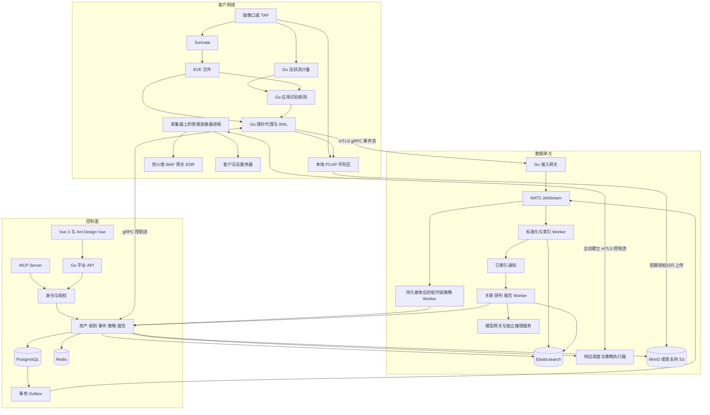
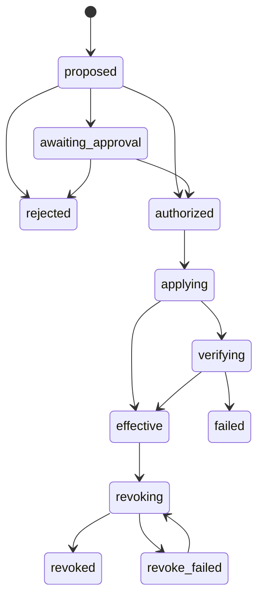

# 星烽 StarBeacon 架构设计

调研基准日：2026-09-28。本文是待实施的工程设计。产品语义见[产品设计](产品设计.md)，字段与接口见[接口与数据契约](接口与数据契约.md)，资源与验收见[实施与容量规划](实施与容量规划.md)。

## 1. 技术选择与边界

采用 Go 模块化业务服务、可独立扩展的数据入口和异步 Worker，不从第一天拆成大量微服务。围绕统一身份、数据模型、证据与策略服务建立边界，后续按瓶颈拆分运行角色。

| 层次 | 主方案 | 原因与约束 |
| --- | --- | --- |
| 前端 | Vue 3 稳定分支、TypeScript、Ant Design Vue、Vue Router、Pinia | 符合用户选型；业务域拆分；服务端分页与权限 |
| Go 基线 | **Go 1.26.0**，按项目要求固定 | `GOTOOLCHAIN=local`；依赖更新不得隐式更换编译器 |
| 网络检测 | Suricata **8.0.7** | 保留原生引擎；Go 负责管理、上报、规则与证据，不重写检测引擎 |
| 传输 | Protobuf、grpc-go、双向流、mTLS | 事件和控制分通道；应用层续传与确认 |
| 数据缓冲 | NATS Server / JetStream **2.15.0** | 持久化、可重放与独立消费者；需要明确持久化配置和幂等 |
| 平台事务 | PostgreSQL **18.6**；pgx、显式参数化 SQL | 业务状态、配置、工作流、outbox；高频原始事件不写 PG |
| 检索分析 | Elasticsearch **9.5.4** 及官方 Go 客户端 | 全部告警、会话、研判与汇总；完整查询投影避免跨库筛选 |
| 缓存与短期协调 | Redis **8.10.2** | 有界缓存、查询配额、短期状态；不作为告警队列与动作权威库 |
| PCAP／制品 | MinIO/S3 兼容对象接口 | PCAP 字节不入 PG/ES；受支持生产实现与桶策略独立配置 |
| 可配置条件 | CEL **v0.32.0**，`cel.dev/cel-go` | 编译后求值；仅允许宿主声明的数据与函数 |
| 模型接入 | Go Provider 接口 + HTTP 模型服务 | Jev、Laya、通用 LLM 分别适配，能力验证后使用 |
| MCP | 官方 `modelcontextprotocol/go-sdk` **v1.8.0** | Streamable HTTP，验证实际客户端兼容矩阵 |
| 应用流量 | Go Flow Meter + Suricata 元数据 + 应用识别规则 | 周期计量活跃流，按产品／类别归因；nDPI 为授权后的可选增强 |
| 客户侧集成 | 采集器上的 Go 连接器；API 或浏览器认证插件 | 主平台下发任务，采集器访问防火墙、WAF、EDR；独立 Runner 为可选部署 |
| 任务调度 | PG 持久任务、租约、outbox、Go Worker | 首期固定流程足够；复杂长流程成熟后才评估 Temporal |
| 运维 | 指标、结构化日志、分布式追踪、备份与恢复作业 | 可接企业已有 Prometheus／OpenTelemetry 体系 |

Go 版本来自[官方发布记录](https://go.dev/doc/devel/release)，Suricata 来自[官方下载页](https://suricata.io/download/)，CEL 版本路径见[官方模块定义](https://github.com/cel-expr/cel-go/blob/v0.32.0/go.mod)。前沿能力用于模型适配、协议和评测，数据库与采集运行时优先采用维护状态明确且通过验证的稳定版本。

首期不同时引入 Kafka、ClickHouse、独立向量库、图数据库、服务网格和完整 SOAR。Redis 与 JetStream 分工明确，关键预算、动作租约及任务状态仍以 PG 为准。所有运行时、客户端与前端构建版本统一见[依赖版本与部署清单](依赖版本与部署清单.md)，此处不使用浮动镜像标签作为交付契约。

## 2. 整体架构



图中的模块是职责边界，不等同于每个模块一个服务。试点由 `platform` 承载 API、控制、MCP 与调度，`worker` 承载索引和分析；生产独立部署 ingest。采集器安装包包含 Suricata、Go Agent、Flow Meter 和受限连接器；连接器默认在采集器主机执行设备任务，不是平台访问客户设备，也不要求客户额外部署一台 Runner。独立 Runner 可用于单独管理区与冗余。模型、浏览器、抓包和设备执行有独立资源及权限边界。

控制面维护租户、身份、配置和数据单元映射；数据单元包含接入、队列、索引、对象存储及 Worker。一个数据单元可服务多个轻量租户，大租户或独立驻留要求使用独立单元。跨单元集团汇总只读取获授权的汇总与事件，不做无界实时跨集群 Join。

## 3. Go 模块与工程结构

建议采用单仓库、单 Go module 起步，按领域分包，关键接口由使用方定义。模型供应商、对象存储和响应设备是外部适配器，领域层不依赖其具体 SDK 类型。

```text
cmd/
  starbeacon/             平台 API、控制流、MCP，可按角色开关
  starbeacon-ingest/      事件接入与持久化确认
  starbeacon-worker/      索引、关联、模型、报告作业
  starbeacon-agent/       探针代理
  starbeacon-flowmeter/   活跃流周期计量与应用识别
  starbeacon-connector/   默认随采集器同机安装，设备认证与任务执行
internal/
  identity/ tenant/      身份、授权、组织和资源范围
  sensor/ detection/     探针与规则生命周期
  ingest/ normalize/     接收、格式校验与字段映射
  alert/ incident/       告警查询与事件业务
  evidence/ asset/ intel/ 证据、资产、情报
  decision/ policy/      模型研判和确定性门控
  response/             动作租约、审批、执行与核对
  integration/ notify/   设备、Syslog、办公通知与投递
  search/ projection/    查询 AST、检索投影与水位
  rulegen/ validation/   AI 规则生成与隔离回放作业
  assistant/ report/    对话与报告
  jobs/ outbox/ audit/   通用事务基础设施
  adapters/             PG、ES、S3、模型和设备连接器
api/proto/               探针契约与版本兼容
api/openapi/             平台 HTTP 契约
web/src/features/        Vue 业务域
deploy/                  合并部署与分布式部署配置
tests/fixtures/          获授权 EVE、PCAP 与接口样本
```

该目录是实施建议，当前仓库尚未生成应用工程。首期对平台业务使用 HTTP/JSON，模型对话使用 SSE；不引入 gRPC-Web 作为浏览器强制依赖。浏览器取消请求后要终止后端工具与模型调用，避免继续计费。

## 4. 探针代理设计

### 4.1 运行组成

探针代理由 EVE Reader、WAL、Uploader、Control Client、Rule Manager、Capture Manager、Health Collector 组成，并管理同机 Flow Meter、应用规则模块和 Connector 的生命周期。Suricata 与各进程分别监督；代理升级不要求中断检测。抓包、设备凭据、浏览器与普通日志上传进程隔离，使用最小必要系统权限。

EVE Reader 正确处理部分行、超长行、轮转、截断、多线程日志和磁盘满。解析原文时保留大整数精度；`flow_id` 进入平台规范模型后为字符串。健康数据至少包含捕获丢包、流重组缺口、日志速率、WAL 最老事件、文件读取位置、队列字节与时钟偏差。

原生 Suricata 多租户 ID 与平台租户 ID 分开。默认一枚探针证书对应一个平台租户；同一采集主机服务多个客户时使用逻辑探针身份和网络域映射，由管理员绑定，不能让 EVE 自报租户获得授权。

### 4.2 注册与证书

一次性注册令牌绑定租户、组织、有效期与最大使用次数。代理生成密钥、提交注册请求并取得独立证书。证书轮换具备重叠窗口；吊销和租户停用能阻止重新连接与继续上报。服务器验证证书身份和探针注册状态，不能只验证 CA 签名。

控制连接由探针主动建立，适合客户防火墙后的部署。控制流与事件流使用独立队列及并发预算，防止大量告警占满连接后规则同步和健康信号无法到达。

### 4.3 本地持久化

代理维护日志代次标识、源字节偏移、记录序号和 WAL sequence。事件 ID 基于源身份确定；同一原始记录在崩溃后重读仍为同一事件。WAL 同步落盘后才推进源检查点。序号、分区令牌和规范化版本在首次写入 WAL 时固定。

平台预先签发分区令牌，绑定租户存储池、分区策略版本和时间桶。代理校时后选用令牌并持久化，重试不得用当前日期重新路由。令牌用于新事件的授权期限与已固化事件的逻辑分区分离：已固化路由的重传在保留／重放窗口内仍指向原分区，重新验证当前探针身份，不能因令牌过期改投另一索引。服务器只接受属于该探针的路由标识，禁止探针直接指定 ES 索引名。

没有有效初始路由或时钟严重异常的新源区间先进入隔离队列；确认该源区间从未被接受后才分配一次性稳定补录分区。已删除原分区的历史恢复属于显式恢复流程，先验证源范围与已有事件，不与普通重试混用。

这一设计将传感器时钟错误与正常时序分区分离。事件发生时间、代理观察时间、平台接收时间均保留；容量不足或时间异常不会被伪装成普通实时数据。

## 5. gRPC 与可靠接收

### 5.1 传输策略

事件按上限约 256 KiB–1 MiB 或最多约 500 条组批作为压测起点；大小和刷新周期由性能测试确定。设置最大解压后字节、最大记录长度、每探针并发与带宽。重连采用指数退避及随机抖动，避免 200 个探针同时恢复造成惊群。

事件流返回应用级 `ingest_accepted`，控制流返回命令收到、执行开始和执行完成。gRPC 自带流控与有限重试不提供跨连接的业务续传。[gRPC 流控](https://grpc.io/docs/guides/flow-control/)；[重试机制](https://grpc.io/docs/guides/retry/)

### 5.2 四个确认阶段

| 阶段 | 意义 | 释放什么 |
| --- | --- | --- |
| `edge_persisted` | 事件进入探针已同步 WAL | 可以推进源文件检查点 |
| `ingest_accepted` | 网关校验后取得符合持久化契约的 JetStream PubAck | 探针可回收已连续确认的 WAL 段 |
| `indexed` | ES Bulk 分项写入成功，或已确认存在相同事件 | 索引消费者可在后续通知持久化后确认消息 |
| `searchable` | ES refresh 后可供检索 | 更新端到端可见延迟指标 |

确认按连续 sequence 推进，存在缺口时返回已接收范围和需要重传的区间，不能用“最大看见序号”跳过缺失数据。网关不缓存每条告警的 PG 收据，避免高频双库写入。

### 5.3 JetStream 持久化与背压

生产采用 File Storage、R3、独立故障域和持久 pull consumer。告警接收的严格档使用 `sync_interval: always` 并按批次测量吞吐；默认同步周期的 PubAck 不能直接称为逐条断电不丢。保证范围是通过实际存储故障测试验证的故障模型，不覆盖所有节点介质同时永久损毁。[JetStream 持久化](https://github.com/nats-io/nats.docs/blob/master/nats-concepts/jetstream/README.md#syncing-data-to-disk)

原始接收流采用有界、可重放保留策略；起始设计为 72 小时，最终由容量、ES 快照频率和恢复目标决定。`Nats-Msg-Id` 仅减少窗口内重复，不作为最终幂等保证。达到字节上限时拒收新消息、向探针背压，不能通过静默删除未消费告警释放空间。接近 MaxAge 前升级告警并启动补救；有限磁盘不具备无限断网无损能力。

告警、可选遥测、规则控制与 AI 作业分别设置资源预算。容量告急时优先暂停可选遥测，保留告警；无法维持告警采集时记录缺口、通知管理员并显示不完整性。SaaS 对每租户使用配额与公平调度，避免单客户耗尽公共队列。

### 5.4 索引与后续分析的一致性

索引 Worker 对每个 Bulk item 分别处理：成功记入本批完成集合；暂时错误重试；确定性格式错误先持久化隔离记录，再结束本轮消费。隔离事件保留原文、源位置、失败原因和重放状态，仍计入“待补入 ES”，不能当作成功接入后消失。

原始告警成功入 ES 后，Worker 将 `alerts.indexed` 通知持久化到下一条流，最后 ACK 原始消息。若 ES 已写入但通知失败，原始消息重投后核验既有文档，再重发通知。因此不会因“写 ES 成功、发分析消息前崩溃”漏掉研判。后续消费者按事件／任务 ID 幂等；按 ID 读取原始事实或等待可搜索水位，不能把尚未 refresh 的搜索空结果判为证据不存在。

ES 409 需要证明事件 ID、源定位与不可变内容摘要一致；否则属于冲突告警，不能无条件忽略。由于消息系统、数据库和响应设备没有共同事务，整条链路描述为“至少一次投递、幂等入库和副作用控制”，不宣称端到端 exactly-once。

### 5.5 低时延响应路径

完整调查沿用已索引事件路径；已通过资格验收的低时延策略可以订阅相同持久接收流，使用与索引器相同版本的标准化库及已版本化上下文，不等待 ES refresh 或大范围关联查询。该路径必须先取得持久接收事实，保存可审计的最小证据快照，再通过相同 PG 授权、动作幂等和 outbox；不绕过原始告警最终写入 ES。上下文缺失／过期、需要新的复杂证据或模型不确定时回到普通研判路径。

低时延与普通分析并行可能两次提出相同动作，业务幂等键绑定租户、事件／聚合主题、策略版本、设备、规范目标与作用周期，由动作服务合并或拒绝重复。控制连接独立于事件上传的 HTTP/2 连接和字节队列，取消固定分钟轮询；不得通过缩短所有业务超时来伪造响应速度。详细时间戳、SLO 与设备生效边界见[应用识别与响应性能设计](应用识别与响应性能设计.md)。

## 6. 数据分工与一致性

| 数据 | 权威存储 | 补充说明 |
| --- | --- | --- |
| 原始告警、标准化告警、协议和流数据 | ES | 全部原始告警在保留期内保留，原文不无限展开索引 |
| 研判事实、模型结果与统计汇总 | ES | 追加历史；当前结论为可重建投影 |
| 租户、用户、角色、资产配置、探针 | PG | 资产被动观察明细可以在 ES，确认后的业务资产在 PG |
| 规则、发布、模型、策略 | PG | 大规则包或模型制品可放 S3，PG 保存版本与摘要 |
| 事件、任务、审批、动作租约、人工反馈 | PG | 引用告警和证据 ID，不复制高频原始内容 |
| PCAP 对象清单 | PG | 对象级元数据，可分区归档；包偏移与高频流索引在 ES/S3 |
| 对话、报告定义与运行记录 | PG | 输入证据快照和报告附件按体积存 ES/S3 |
| PCAP、附件、报告制品、模型制品 | S3 | 生命周期、加密、保全与访问审计 |
| 业务审计 | PG 分区表为权威，异步归档 | ES 可作检索投影，独立不可改写归档承担长期留证 |
| 登录、通知、Syslog 投递与联动记录 | PG 任务和结果；ES 检索投影 | 高频 Syslog 按批次／序列段记录水位，不为每条原始事件建 PG 任务 |
| 查询缓存、短期配额与 UI 进度 | Redis | TTL、租户前缀、授权版本；丢失后可重建，不承载唯一事实 |

PG 的事务内写业务记录与 outbox。投递器将 outbox 发到队列后标记发送，崩溃时允许重发，消费者按 command ID 幂等。ES 不参与 PG 事务；界面区分业务提交成功与检索投影同步状态。

对于“关闭告警”，PG 记录稀疏的人工操作／工作流记录，ES 保留原始事实并更新可重建的当前状态索引。对于模型自动研判，不为每条原始告警制造 PG 事务，仅对实际候选任务和需要人工处理的业务对象建记录。告警全部入 ES 与 PG 业务流程并不冲突。

## 7. Elasticsearch 设计

### 7.1 字段标准与数据集

使用 ECS 核心字段表达时间、源／目的 IP、网络、主机和规则，扩展放在 `starbeacon.*`，同时保留 `suricata.eve.*` 必要字段与原文。`schema_version`、ECS 版本与原始事件格式分开。未来外部交换可增加 OCSF 映射，首期不重复建立两套规范化事实。[ECS](https://www.elastic.co/docs/reference/ecs)；[Elastic Suricata 集成](https://www.elastic.co/docs/reference/integrations/suricata)；[OCSF](https://github.com/ocsf/ocsf-schema)

数据集拆为 `alerts`、`network`、`assessments`、`alert-search`、`alert-groups`、`evidence-index`、`daily-metrics` 和审计检索投影；应用流量另有受限 `flow-intervals`、`flow-classifications` 与各粒度 `app-metrics`。`alerts` 保留不可变事实；`alert-search` 为包含全部可筛选字段及当前研判／工作流状态的完整读模型，不重复保存大段 EVE 和载荷。不另外维护功能重复的 `alert-state` 索引。

### 7.2 分区与去重

告警采用确定性 event ID 和固定逻辑分区，用 Bulk `create` 写入确定的物理索引。索引形如 `sb-alerts-v1-p03-2026.09.28`。低量池按周／月，高量池按日；策略和目标分片数预先发布，单条事件的路由不会随重试和当前写索引变化。

Data stream 和 rollover 的 `_id` 去重范围不跨 backing index，因此它们不作为告警唯一性方案。协议明细和指标可以用 data stream，但用于精确报告／计量的统计必须经过稳定事件键去重。[Data stream](https://www.elastic.co/docs/manage-data/data-store/data-streams)

索引重建、扩池或租户迁移时采用写入栅栏、回填、校验、映射切换、追赶重放和旧映射保留；不能将同一历史事件随意写进两个当前索引。旧分区过期后拒绝自动重建，历史补录走单独审批与稳定的补录分区。

### 7.3 映射与查询

IP 用 `ip`，日期使用明确精度的日期类型，枚举和 ID 用 `keyword`，计数用数值类型。禁止任意 HTTP header、DNS 字段和供应商扩展无限动态创建字段；原始内容可关闭索引或放受控 `flattened` 字段。

告警列表通过受限查询 AST 编译 ES DSL，白名单字段、排序和聚合，强制时间范围与租户／组织权限过滤。深分页采用 PIT + `search_after`，游标绑定用户、权限版本、筛选 hash 和有效期；不为“跳到第十万页”执行无界 `from/size`。PIT 失效返回可恢复提示。

共享索引中的租户过滤由服务端注入，按 ID 获取、聚合、关联、缓存、导出均再次校验。Filtered alias 不构成安全隔离，DLS 的订阅条件另行评估，不默认免费可用。[Alias 过滤边界](https://www.elastic.co/docs/manage-data/data-store/aliases#filter-an-alias)

报表的告警量来自幂等事实索引；唯一资产数若用近似 cardinality 必须标记近似，正式要求精确时用稳定快照下的 composite 分页聚合或已审计去重汇总。原始告警量、去重告警组和安全事件数量不能混为一项。

### 7.4 留存与耐久

起始策略：告警 30 天在线、网络上下文 7 天、日汇总 13 个月；各租户可调，不代表合规最低期限。自动清理前检查保全引用，报告所需摘要单独留存。低频历史告警可延长至 warm 节点或保留 ES 快照；快照恢复查询的等待时间需在产品上说明。

告警保留完整性的硬边界是配置的保留期，不默认无限存储。“全部告警入 ES”表示不因风险低、误报或模型降噪过滤入库；超过业务保留期可以按明确策略删除。

生产至少 1 个副本，translog 使用 request durability，监测分片失败与节点磁盘水位。主分片尺寸以 10–50 GB 为起点并结合文档数、查询和恢复时间压测。[分片指导](https://www.elastic.co/docs/deploy-manage/production-guidance/optimize-performance/size-shards)

### 7.5 完整查询投影与更新顺序

列表、当前状态筛选和相关聚合全部查询同一 `alert-search` 读模型。不能先取原始告警一页，再到 PG 或其他索引过滤“误报／已关闭”；该方式会漏结果并造成总数错误。详情先以读模型授权，再按稳定定位读取原始事实和历史研判。原始告警总量报告仍以 `alerts` 唯一事实为依据。

读模型与原告警绑定相同逻辑时间桶和 event ID，各自保存物理定位，更新不使用当前写入日期。输入分为事实片段、富化片段、人工工作流片段、研判片段，各片段有单独递增的来源版本；PG outbox 的工作流版本不能与模型分析序号混成一个时间戳。应用层读取版本向量，使用 ES `_seq_no` / `_primary_term` 做乐观并发更新；冲突后重新合并，旧版本不覆盖新版本。首次创建须拥有最小事实与租户权限字段，提前到达的状态更新等待事实或由内部定位补齐，不向用户暴露残缺文档。

人工研判覆盖模型“当前展示结论”的规则由投影器确定，模型历史仍追加保留。关联组研判批量映射到成员需要任务、水位与重算；大组不在请求线程同步更新十万条记录。查询返回 `projection_as_of` 与同步状态，状态修改接口返回已提交的业务版本及同步中的明确提示；投影积压不伪装成实时结果。通过事实、研判历史与 PG 稀疏工作流全量重建，双索引版本校验后切换读别名。保留期清理对原始与投影保持一致。

字段分析器、中文分词、Path 检索和查询限制见[运营与集成设计](运营与集成设计.md)。投影会增加磁盘和写入放大，已单列容量，不能以“单 ES”误解成只存一份告警大小。

## 8. 会话关联与 PCAP

Suricata 引擎内会话使用 `tenant + sensor + engine_run_id + flow_id`；跨工具关联使用 `community_id + 观测域 + 时间窗口` 并保留五元组。Community ID 不包含时间，也不能消除 NAT 和复用五元组的歧义。[Community ID](https://github.com/corelight/community-id-spec)

PCAP 提供三档：告警证据包、短期本地环形全量捕获后按需提取、指定网络区全量归档。默认选择告警证据包，但不承诺完整会话；确需告警前窗口时必须启用足够长度的环形捕获并实测。`conditional: alerts` 不能自动兑现任意历史窗口。[Suricata PCAP](https://docs.suricata.io/en/suricata-8.0.7/configuration/suricata-yaml.html#packet-log-pcap-log)

PCAP 不经过事件 gRPC 流发送大块字节。平台经 gRPC 下发上传任务与范围，代理通过短期对象授权上传 S3；网络限制不能直接访问对象存储时提供平台上传代理，保持同样权限和校验。

切片建议从 128–512 MiB 或 30–120 秒测试。对象清单记录租户、探针、接口、起止时间、大小、摘要、对象版本、保留期、状态及捕获缺口；S3 sidecar 保存时间／流到包偏移的映射，ES 保存检索索引。普通整文件压缩与原始偏移不兼容，需选择可寻址块格式或提取时完整解压。

对象只有在 multipart 完成并验证大小与 SHA-256 后才标为可用，ETag 不作为通用完整性哈希。目录提交失败由补偿作业修复；未完成分片、孤立对象与已过期目录定期核对。加密流量不承诺可恢复明文，不在平台中默认集中保管客户 TLS 会话密钥。

PCAP 数据以最短必要期限保存，可按案件延长保全。只有对象版本获得存储侧保留保护，或复制到保全区并验证完整性成功，才将 PG 中的保全标记为生效；仅更新 PG 日期不能阻止 S3 生命周期删除。ES 整索引到期删除前也需先完成被保全证据的迁移与引用更新。签名 URL 短时有效，服务端签发前检查范围；高敏下载通过可撤销代理，避免签发后权限撤回仍能持续访问。桶策略、密钥和对象生命周期与 PG 目录共同验收。

## 9. PostgreSQL、租户与 SaaS

所有租户实体都带不可空 `tenant_id`。主键可全局唯一，唯一约束和关联约束仍带租户；`(tenant_id, incident_id)` 关联到同租户事件，防止错误关联。

启用 RLS 作为纵深隔离：应用连接使用非 owner、非超级用户、无 BYPASSRLS 的角色；必要表使用 FORCE RLS。连接池内采用事务局部租户上下文，确保归还连接后无上下文泄漏。迁移和平台运维使用独立身份与审计，不能把跨租户超级连接交给普通请求。[PostgreSQL RLS](https://www.postgresql.org/docs/18/ddl-rowsecurity.html)

身份上下文包含用户／服务主体、租户、组织范围、资产范围、角色、scope 和授权版本。SaaS 默认软隔离加服务强制过滤，大客户可选独立数据库、ES 池和对象桶／密钥。数据驻留、对象加密和模型出域策略绑定数据单元，不能单靠前端租户切换实现。

资源配额覆盖探针数、接收 EPS／字节、ES 查询并发与时间窗、PCAP 保留和导出、模型 token／费用、报告任务及响应动作频率。计量以幂等接收事件和供应商真实 usage 为基础；拒收、丢失和隔离数据不能按成功分析计费。

租户迁移必须有写入栅栏与可回滚计划；租户删除包含 PG、ES、对象、缓存、模型日志、备份到期和保全冲突处理。法定或合同保全由实际部署要求决定，不在方案中假定一个通用保留期限。

### 9.1 Redis 的部署与失效语义

Redis 存储短时查询结果、资产／情报热点、能力表、token 刷新协调与限流计数。缓存键统一包含租户、授权版本、查询或证据 hash 及 schema 版本；缓存值也记录归属，权限收紧立即更换授权版本。原始载荷、密码、浏览器 Cookie 和永久审计不进入共享明文缓存。

单机试点采用一实例；生产采用主从加 Sentinel，缓存数据实例采用 `allkeys-lfu` 并设 `maxmemory`，无需为可重建缓存强开磁盘持久化。需要共享会话撤销标记、短期幂等令牌的协调数据采用独立实例组、`noeviction`、明确 TTL 与 AOF 策略，不能只用逻辑 DB 隔离两种内存淘汰要求。任务领取、最终费用扣减、动作幂等和租约续期仍落 PG 事务，避免 Redis 故障转移或锁过期造成重复副作用。

Redis 失效时，查询走有界并发回源与本地防击穿，指标和进度允许短暂缺失；鉴权、预算与自动响应需要的条件无法确定时暂停相应写入，告警接入继续依赖 JetStream。跨实例限流是流量保护，不承担唯一账务真相。Cluster 仅在实测容量／吞吐超出单分片时引入，注意多键操作同 slot 和热点键问题。

## 10. 关联分析与证据服务

原始事件索引成功后异步执行资产匹配、IOC 查询、规则语义补充和时间窗口关联。资产地址有有效区间，匹配时考虑 VLAN、VPC、站点和 NAT；不能将不同客户的同一个私网 IP 合并。

首期关联规则采用明确窗口与键，例如同资产同规则族的告警组、短窗口内同源多目标活动，以及不同证据间的事件时间序列。分组 ID 可确定性计算；事件计数不通过可重复消费的无条件加一维护。组投影从唯一事实集合按水位计算，更新用版本检查。迟到事件触发受限重算，超过窗口显示补录影响。

证据服务为每次分析生成不可变 `evidence_snapshot_id`：包含源告警定位、资产与情报版本、会话摘要、捕获完整性、证据引用和授权范围。工具与模型读取该快照；后续证据变化触发新分析，旧结果保持历史。

证据校验分两个层次：引用对象存在且属于授权范围；证据足以支持对应结论。后者不能完全依靠 JSON Schema 自动完成，必须结合确定性规则、离线评测和人工复核。模型返回未知引用或与实际数据矛盾时不发布确定结论。

## 11. AI 与策略执行

### 11.1 提供方和任务路由

`DecisionProvider` 返回有限类别和分数；`GenerativeProvider` 返回结构化内容、解释或对话流。Jev 使用官方独立 API 协议，不假定是 Chat Completions；Laya 以独立认证 HTTP 服务接入；通用 LLM 经能力表匹配所需输出。

Jev 当前可核实为托管 API，固定模型 ID 并记录实际版本，不承诺离线权重。Laya 需锁定代码、checkpoint、tokenizer 与校准版本；中文及安全领域必须实测。通用模型候选为本地 Qwen3.5-9B／Qwen3.8-27B，或托管 DeepSeek Flash 等通过评测的服务；不将通用榜单直接当作安全决策能力。[AI 模型调研与来源](research/AI决策与MCP调研.md)

平台业务与代理用 Go；本地模型基础设施允许官方 Python/C++/GPU 运行时作为独立交付组件。若客户严格要求只运行 Go 自研服务，则通过 Go 接入外部推理服务，不宣称 Laya 或 Qwen 已有本方案实现的纯 Go 推理引擎。

### 11.2 有界工作流

流程节点为证据收集、特征裁剪、确定性规则、小模型、升级模型、校验、保存结果和策略计算。每个节点具有超时、输入版本、重试预算和输出摘要；整个任务限制最大工具调用数、token 与费用。

模型故障不阻断采集和检索。报告与对话使用不同队列，高优先事件研判不被月报抢占。缓存键绑定租户、权限／证据范围、快照 hash、模型版本、模板与校准版本，防止跨租户泄露或把旧上下文的判断复用到新事件。

### 11.3 决策不确定性

把检测有效性、行为性质、攻击结果、候选响应分开。模型提供概率时同时保存分数定义与校准状态；没有标定的 LLM 自报信心只是描述，不用于直接自动封禁。未知类别、缺证据、过时情报、输出截断、供应商错误、分布漂移都允许返回 `abstain`。

人工复核和自有授权样本构成评测／训练闭环。模型供应商输出的训练权利单独记录；例如当前 Jev 服务条款限制蒸馏和相关训练用途，不能默认拿其结果训练 Laya。[TypeSafe 协议](https://typesafe.ai/legal/mca)

### 11.4 策略与执行器

确定性策略输入为身份、资产、证据等级、校准结果、授权范围与设备能力。CEL 表达式在发布时编译并限制成本，运行时不允许任意网络或文件副作用。

响应执行器是单独受限运行角色，凭据来自密钥服务，模型和 MCP 无法访问。动作先进入 PG 事务，生成审批／租约及 outbox；执行器领取动作并回读设备状态，记录生效、失败或未知。无幂等接口的设备通过稳定外部规则 ID 与查询对账避免重复安装规则。



到期解封属于同等重要的持久化任务。审批绑定确切目标、范围、TTL、策略和证据版本；执行前复查授权和保护对象，过期审批或目标变化需要重新审批。

### 11.5 客户侧连接器与插件运行边界

默认由采集器主机安装的 `starbeacon-connector` 主动向平台建立 mTLS gRPC 控制流，主平台下发任务，由采集器调用其可达的防火墙／EDR 管理接口；SaaS 和私有化都沿用这一链路。该进程与抓包／上传使用不同 UID 和受限凭据，独立 Runner 仅用于特定管理区或冗余。每个连接器实例注册绑定租户、站点、默认宿主 sensor_id 及允许访问的设备清单，能力清单包含产品／接口版本、可执行动作、幂等、回读、TTL 和撤销能力。

平台签发包含 `action_id`、租户、连接器、规范化目标、策略版本、有效区间与 fencing token 的任务。Runner 校验签名、身份、期限和递增执行代次，并先写本地持久日志再执行。每个设备写操作串行或按已验收并发执行；跨 Runner 接管需要重新核对设备。设备不支持 fencing 时，平台栅栏不能阻止旧请求稍后到达或旧采集器的离线解封定时器执行。需采用设备条件更新、执行代次独立拥有的规则资源，或保持单执行者且确认旧实例被隔离后才接管；仅 PG 租约与读回不足以保证安全接管。

连接方式分官方 API 与控制台认证插件。插件在明确配置的客户设备地址上完成授权登录，取得 Cookie、CSRF 或短期 token 后优先由 Go HTTP 客户端调用经认证的固定 API。认证状态按租户、实例、认证域、账号、凭据版本、Runner 范围、插件版本与会话代次隔离加密保存，凭据默认只驻留客户 Runner；管理页面不能回显。MFA／验证码进入需要重新认证状态，提供管理员接管，不绕过认证。控制台升级导致 schema 或语义变化时熔断动作，不能仅因 HTTP 200 就判断生效。

浏览器采用固定版本 Chrome for Testing + chromedp，非 root、保留沙箱、独立用户目录／进程与出站白名单，避免租户之间共享上下文；不用无隔离的浏览器默认参数。插件制品有签名、版本、能力声明、设备版本矩阵和回放测试。高权限或未审查原生插件在独立容器／进程运行，不动态加载 Go `.so` 到平台进程；可声明式完成的请求用受限模板实现。浏览器登录不是每条告警启动浏览器，认证续期有锁、过期处理和并发预算。

Runner 离线时停止下发新的封禁，已执行动作优先依靠设备原生 TTL，Runner 持久化解封计划作为补充；既无设备 TTL 又无法保证撤销时禁止无人值守封禁。设备配置生效、流量效果验证、告警收敛三个结果独立记录。详见[运营与集成设计](运营与集成设计.md)和[响应联动与插件调研](research/响应联动与插件调研.md)。

## 12. 报告、对话与 MCP 的共用服务

三者都通过 `QueryService`、`EvidenceService`、`IncidentService` 和 `ResponseProposalService` 访问业务。查询对象被编译为受限 AST，工具可见范围来自认证主体，模型不能扩大权限。

报告任务通过 PG 唯一键 `(tenant, template, period_start, period_end, revision)` 保证调度幂等，Worker 用租约领取并心跳续期。持久任务允许崩溃后重领；已发布制品不覆盖。PG 状态按截止时点的审计／版本记录复原，ES 查询记录数据水位；报告不只是对实时页面截图。

日报默认租户时区次日生成，可配置迟到等待窗；周报、月报复用已冻结的日统计。告警量等可加指标直接汇总，独立资产、攻击活动、跨日告警组等不可加指标必须保存可合并的去重状态或授权明细后重新计算，禁止累加每日 distinct 数。模型输出只填叙述槽位，金额、计数、图表、百分比由代码渲染；格式校验通过不代表文字正确，还需验证证据引用、确定性数字和结论边界。

MCP 当前建议使用官方 Go SDK 的受支持稳定版，验收 `2026-07-28` 与实际客户旧版本。该版传输已取消协议级 session 与独立 GET 长流；不能照抄旧 MCP 架构要求所有请求永久粘到同一进程。长时分析采用平台 job ID，由工具查询状态，避免把任务生命期绑定到一次 HTTP 连接。[MCP 传输规范](https://modelcontextprotocol.io/specification/2026-07-28/basic/transports/streamable-http)；[Go SDK](https://github.com/modelcontextprotocol/go-sdk)

远程 MCP 使用 TLS、OAuth 受保护资源元数据及对应身份授权。每次请求进行 token 签名验证或可信内省，并检查 issuer、audience、有效期和 scope；对 HTTP Origin 按协议和允许列表校验。资源引用读取和下载也需重新鉴权。不能透传调用方 token 给 ES、对象存储或设备。[MCP 授权](https://modelcontextprotocol.io/specification/2026-07-28/basic/authorization)

## 13. 安全与隔离

所有 HTTP 载荷、URL、情报文字、日志和报告附件均视为不可信输入。LLM 上下文中的“执行某命令”“忽略规则”等文字没有授权效力；工具集合、权限、预算和动作边界在 Go 侧执行。

自定义模型 endpoint 和连接器是 SSRF 风险点。由租户管理员在允许的出站策略中配置，校验协议、目标和重定向；私有化允许明确配置的内部推理服务，SaaS 不允许借连通性测试访问平台管理网络和云元数据服务。

生产启用统一登录或 OIDC 接入、角色与资产范围权限、短期服务令牌、密钥加密与轮换、API 限流、日志脱敏和软件制品签名。API key 使用单独查看策略，只能写入和轮换，不原样回显。上传文件和离线 PCAP 在受限作业环境中解析，设置文件大小、CPU、内存和执行时间上限。

审计记录操作者、租户、授权上下文、对象、前后版本、理由、请求与动作 ID、结果和时间；日志不保存密钥。应用账户只能追加审计，长期副本进入独立保全归档；对系统管理员也不声称技术上绝对不可篡改，而是提供分权、校验和独立留证。

## 14. 运维、备份与演进

重点指标为捕获丢包、WAL 最老事件、接收确认延迟、队列最老未消费年龄、ES 索引失败与可见延迟、查询 P95、对象校验失败、模型有效判断率／费用、响应未确认与解封失败。日志与追踪带 trace ID 和租户的受控标识，不把所有高基数事件 ID 当指标标签。

备份覆盖 PG 全量与 WAL、ES 官方快照、对象内容与版本、证书／密钥配置、规则与模型制品。ES 快照放独立故障域；与 PCAP 同一物理集群中的另一个桶不等于灾备。恢复后先核对动作实际状态和未到期租约，禁止把历史 outbox 无差别再次执行到生产设备。

升级包括 N/N-1 探针协议兼容、灰度规则与代理、PG expand/contract 迁移、ES 模板版本演进和回滚窗口。增加字段不改既有 Protobuf 编号，删除字段保留编号。模型升级走独立评测门槛，不随平台更新自动切换 `latest`。

通知、Syslog 与审计使用独立工作池和有界重试，通知目的地故障不会占满告警索引消费者。运维使用 Prometheus 指标、Grafana 展示和可选 OpenTelemetry Collector；版本、最小部署清单与非必需组件见依赖清单。探针指标经受限健康通道上报，避免在互联网暴露每台探针的指标端点。完整指标与日志页面见运营设计。

当接入连接／流量影响交互 API 时拆独立 ingest；当单数据单元不能在目标时间清空积压时扩 Worker 或分数据单元；当规则关联需要复杂跨窗口状态时再评估流处理框架；当长流程数量与补偿复杂度超过现有任务模型时再评估持久工作流引擎。每次引入组件以可测瓶颈和运维收益作为依据。

## 15. 生产选型约束

MinIO 社区仓库已归档，MinIO AIStor Free 的单节点限制不能满足免费分布式 HA 的假设。保留 S3 接口，但生产需选择受支持、可合法交付的 MinIO 产品或兼容存储，并对 multipart、Range、生命周期、加密、保全和 ES snapshot 做实际验收。[MinIO](https://github.com/minio/minio)；[AIStor Free 条款](https://www.min.io/legal/aistor-free-agreement)

Elasticsearch 的部分源码许可与默认二进制发行许可不是一回事；SaaS 内部使用 ES 与向用户提供 ES 服务的边界需要按具体交付方式核实。成本方案不默认包含收费的 DLS、ML、特定历史检索或企业功能；若需使用，记录订阅与部署条件。[Elastic 官方许可说明](https://www.elastic.co/licensing/elastic-license/faq/)

上述条款影响具体采购和产品打包，本文做技术选型识别，不据此对未确定的商业交付方式作法律结论。
