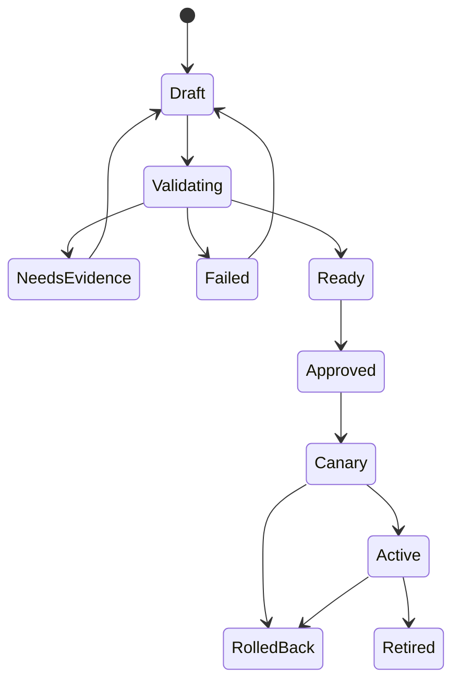
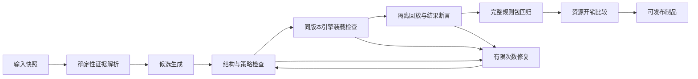

# 星烽 StarBeacon 规则管理设计

本文定义 Suricata 规则从来源、编写、AI 生成、验证到发布与运营的完整闭环。引擎基线为 Suricata 8.0.7，平台服务使用经本机与 CI 锁定同一补丁的 Go 1.26.x。所有默认配额和质量门槛均为产品初始设计值，需在实际客户样本和硬件上验收；本文中的示例规则未执行真实引擎验证。

规则、插件和探针更新的根信任、版本防回退与过期校验复用 go-tuf 维护库；它不取代本规则中心的审批、样本验证、引擎实际加载与回滚。离线规则包同时携带完整信任元数据，不通过关闭过期检查实现离线支持，详见[Go 组件复用调研](research/Go组件复用调研.md)。日志关联、Sigma 子集与情报规则拥有独立类型、字段管线和版本，不伪装成 Suricata 规则；共同生命周期见[安全运营与数据治理设计](安全运营与数据治理设计.md)。

## 1. 功能边界与页面

“检测规则”模块包含规则库、规则源、规则集、AI 生成、样本库、测试任务、发布任务、例外与阈值八个页面。规则详情集中展示描述、适用条件、源文件、修订差异、测试、覆盖探针、命中情况、误报反馈和关联发布。规则作者可以编写与提交，规则发布者决定生产范围；单人部署可兼任，集团可启用职责分离。

| 页面 | 主要功能 | 必须展示的业务信息 |
| --- | --- | --- |
| 规则库 | SID／关键字／协议／风险／分类／标签／来源／状态检索，导入、导出、编辑、克隆、停用 | 本地与来源规则区分；当前修订、验证状态、实际生效探针数 |
| 规则源 | 授权 URL、文件上传、离线包、更新计划、校验和与许可 | 上次成功时间、差异数量、下载失败、版本回退、许可限制 |
| 规则集 | 按网络区／资产组／引擎能力组装规则，变量、依赖、覆盖配置 | 合并冲突、预计规则数、未满足依赖、资源预算 |
| AI 生成 | 自然语言配合 PCAP、HTTP Raw、已有告警或已有规则 | 证据范围、数据出域配置、目标版本、候选规则和验证进度 |
| 样本库 | 正样本、负样本、边界样本、性能样本，标注及授权范围 | 原始／合成属性、来源、标签可信度、脱敏方式、保留时间 |
| 测试任务 | 语法检查、回放、规则包回归、性能比较 | 版本与配置摘要、样本清单、命中差异、未通过门槛 |
| 发布任务 | 影响预览、审批、灰度、分批推进、暂停、回滚 | 期望版本与实际版本、每探针阶段、失败原因和回执时间 |
| 例外与阈值 | 临时禁用、限定范围抑制、告警频率控制 | 责任人、理由、有效期、关联事件与到期处置 |

规则命中、告警展示降噪、事件自动研判和封禁策略分别配置。规则默认生成 `alert`。`drop`、`reject`、`pass`、`bypass` 属于改变数据面或降低检查范围的动作，必须匹配额外能力和授权策略；被动镜像探针不能因为规则文本中出现 `drop` 就实现原链路阻断。[Suricata 规则动作](https://docs.suricata.io/en/suricata-8.0.7/rules/intro.html)

## 2. 规则、来源和版本模型

### 2.1 核心对象

| 对象 | 关键字段 | 存储与约束 |
| --- | --- | --- |
| `rule_sources` | 租户、类型、授权地址、密钥引用、来源许可、更新策略、可信签名者 | PG；下载凭据不可出现在 URL 展示和审计正文 |
| `rule_source_snapshots` | 来源版本、获取时间、摘要、原始对象、许可快照 | PG 索引＋S3 不可变原包 |
| `detection_rules` | `rule_id`、租户、来源、SID、GID、责任人、生命周期 | PG；SID 由平台分配／导入校验，删除后不复用 |
| `rule_revisions` | 修订号、原文、规范化摘要、目标能力、动作、特征说明、依赖、验证状态 | PG；已发布修订不可覆盖，编辑生成下一修订 |
| `rule_sets` | 规则修订列表、网络变量、规则源覆盖、阈值、目标能力档案 | PG；引用确定版本，禁止生产发布引用浮动的最新修订 |
| `rule_samples` | 对象引用、哈希、样本类型、真实／合成、标注、隐私级别、保留策略 | PG＋S3；租户隔离、样本版本不可变 |
| `rule_generation_jobs` | 输入快照、模型与提示模板版本、预算、候选、验证链、费用 | PG；原始敏感材料保持在对象存储 |
| `rule_test_runs` | 引擎构建、制品／配置／样本摘要、阶段结果、资源指标 | PG 摘要＋S3 测试日志及 EVE |
| `rule_releases` | 签名 manifest、目标范围快照、批准策略、阶段、回滚版本 | PG＋S3 制品；发布身份与规则修订身份分开 |
| `sensor_rule_deployments` | 探针、发布任务、期望版本、回执阶段、引擎运行标识、失败原因 | PG；单探针发布串行，断网补偿与过期命令检查 |
| `rule_exceptions` | 规则／范围、类型、理由、责任人、起止时间 | PG；过期必须重新生成目标状态并下发 |

`rule_id` 是平台稳定身份，`sid` 是引擎标识，`rev` 是规则修订，`release_id` 是一份完整发布制品的身份；这些字段不能互相替代。回滚指重新部署一份历史制品，不篡改历史规则修订号。

本地 SID 初期从 1000000–1999999 的本地使用范围分配；分配前登记已有自定义规则，发布包内再次做完整冲突检测。相同 SID 和修订出现不同正文时进入冲突队列，不能按下载顺序覆盖。[SID 范围](https://sidallocation.org/)、[SID 与修订语义](https://docs.suricata.io/en/suricata-8.0.7/rules/meta.html)

### 2.2 来源处理

来源包先下载到隔离区，校验许可、大小、哈希、签名和解包路径，再产生来源快照与变更列表。限制跳转、协议和目的地址，防止来源更新任务变成任意网络访问代理。规则源 URL 由管理员登记，模型不能写入。

平台保存上游原文；启停、变量、阈值和必要的本地派生规则作为覆盖层。展示“上游修订／本地派生修订／最终生效正文”的三方差异。来源更新不直接覆盖已批准规则集。需要 `flowbits`、数据集或辅助配置的规则必须连同依赖一起校验。规则源兼容流程可参考官方 Suricata-Update，但探针端只有 StarBeacon 一个发布写入者。[官方规则管理](https://docs.suricata.io/en/suricata-8.0.7/rule-management/suricata-update.html)

### 2.3 生命周期



编辑已通过测试的内容、变量或依赖会使既有测试资格失效。样本标签纠正、目标引擎配置变化或模型生成逻辑升级不修改历史报告，触发新的验证任务。停用规则属于一次制品发布；数据库里把状态改成“停用”不能直接代表探针已停止检测。

## 3. AI 一键生成交互

用户选择目标规则集，上传 PCAP 或粘贴／上传 HTTP Raw，并输入自然语言检测目标，点击“生成并验证”。系统异步返回候选规则、规则解释、样本命中和验证报告。界面持续显示“解析证据、生成候选、校验规则、回放样本、评估开销”等业务阶段，并允许取消。

输入支持：

- 自然语言＋PCAP：选择具体流、方向和事务，可从告警详情携带样本进入。
- 自然语言＋HTTP Raw：明确请求／响应，保留 CRLF、编码、头部重复、二进制正文和边界信息。
- 仅自然语言：生成草案及建议补充的样本，验证状态为“缺少真实样本”；不能显示为生产验证通过。
- 已有规则＋自然语言：提出修改候选、解释语义差异，并执行旧样本回归。
- 告警＋样本：继承授权范围与证据引用，用户选定“增强检测”或“减少误报”，不能默认为扩大通配条件。

默认输入上限为单次 HTTP Raw 2 MiB、PCAP 100 MiB、10 个文件；大文件按离线测试任务处理，配额由租户套餐配置。模型只接收按需提取的有限特征与片段，初始预算每任务最多 3 个候选、每候选最多 2 次修复，超过预算返回报告与可继续操作，不无限循环。

“生成并验证”不隐含全网发布。具有发布权限的用户可在结果页选择“提交发布”；已预先批准且限定规则动作、目标范围、测试门槛和发布窗口的策略，可以自动进入灰度并按门槛推进。规则生成权限与生产发布权限在 API 和 MCP 层分别执行。

## 4. 证据预处理与字节语义

### 4.1 PCAP

上传后计算 SHA-256、识别格式与链路类型，记录抓包时间范围、snaplen、截断、丢包线索、TCP 握手／重组完整度、双向可见性、应用层识别和加密状态。文件按租户保存到 S3 隔离前缀，解析作业无外网、无抓包接口、无宿主机路径访问，限制 CPU、内存、输出和运行时间。

用户选择流和事务后，系统提取确定的包编号、字节偏移、请求／响应字段以及 Suricata 解析结果。原始包、重组流、标准化缓冲区三者分别保留出处；不能将 UTF-8 替换字符、UI 转义文本或模型重新拼接的内容当原始字节。跨包特征应按协议缓冲区／重组语义设计，避免用单包偏移假装会话偏移。

### 4.2 HTTP Raw

文本粘贴记录输入编码与换行方式；文件上传允许二进制正文。系统展示原始字节视图和解析视图，明确缺少 TCP 握手、响应、时间关系、TLS 与抓包观测条件。`Content-Length` 与真实正文不符、chunked 不完整、头部重复等情况必须保留并提示，不能静默修正。

为测试应用层规则，可以由确定性工具构造带合法 TCP 序列与校验和的合成 PCAP。保存合成器版本、随机种子、构造参数和原始输入引用，标记 `synthetic=true`。合成结果用于协议语义测试，不作为真实攻击发生或真实网络可见性的证据。禁止通过向生产目标发送 HTTP 请求的方式完成普通规则验证。

### 4.3 缓冲区选择

| 输入目标 | 优先考虑 | 必须说明的边界 |
| --- | --- | --- |
| HTTP 方法 | `http.method` | GET／POST 等精确语义与长度 |
| 应用路由 | `http.uri` 或 `http.uri.raw` | 规范化前后区别、路径和查询字符串边界、大小写、编码变体 |
| 请求体标记 | `http.request_body` | 正文上限、压缩／编码、流重组与缺包 |
| 主机名 | `http.host` 或 `http.host.raw` | 主机名规范化、端口和字面值差异 |
| 响应特征 | 响应缓冲区，必要时结合事务状态 | 不能用任意 HTTP 200 推断攻击成功 |
| HTTP/2 | 经验证的通用 HTTP 缓冲区或 HTTP/2 专用条件 | 必须具备 HTTP/2 实样／合成协议样本，不能只回放 HTTP/1 |
| TLS 流量 | 可见握手／指纹／名称特征 | 明文内容不可见时不能声称匹配 HTTP 路径 |

缓冲区能力以目标版本官方定义和实际引擎行为为准。[HTTP 缓冲区](https://docs.suricata.io/en/suricata-8.0.7/rules/http-keywords.html)、[HTTP/2 规则](https://docs.suricata.io/en/suricata-8.0.7/rules/http2-keywords.html)、[TLS 规则](https://docs.suricata.io/en/suricata-8.0.7/rules/tls-keywords.html)

### 4.4 隐私与模型输入

先检查 Cookie、Authorization、会话标识、个人信息和业务数据。模型路由遵守租户的本地／云端配置；敏感原始字节可只在本地模型处理。脱敏导致特征改变时，记录字段级影响，不能把脱敏样本命中结果冒充原始样本命中结果。PCAP 或 HTTP 内容中的指令只是待分析数据，不具备系统提示或工具授权效力。

## 5. 生成器输出契约

模型输出受 JSON Schema 约束，平台解析、分配 SID 和修订、渲染规则并校验。模型不能直接修改规则目录、目标探针、发布批准或密钥。每个候选必须包含：检测目的、适用前提、特征与字节引用、规则文本、覆盖范围、误报场景、未覆盖情况和建议测试集。

```json
{
  "schema_version": "1",
  "target_engine": "suricata",
  "target_engine_version": "8.0.7",
  "detection_goal": "识别指定测试路径的 HTTP GET 请求",
  "action": "alert",
  "evidence_refs": ["sample_01:transaction_1"],
  "feature_refs": [
    {"buffer": "http.method", "value_hex": "474554", "source_ref": "sample_01:request_method"},
    {"buffer": "http.uri", "value_hex": "2f73622d63616e617279", "source_ref": "sample_01:request_uri"}
  ],
  "required_capabilities": ["http"],
  "assumptions": ["探针可观察到完整的明文 HTTP 请求"],
  "limitations": ["该规则不证明入侵成功", "尚未验证加密链路后的可见性"],
  "suggested_tests": ["正样本", "不同路径负样本", "不同方法负样本", "分段请求"],
  "publication": "requires_policy_evaluation"
}
```

Go 服务使用字段级白名单校验引用必须属于当前租户和任务，所有内容长度受限。规则 AST 检查不能代替引擎装载检查。第一期不接收模型输出的 Lua、自定义插件、任意文件路径或外部数据集下载指令；后续扩展通过独立能力白名单纳入。

Jev、Laya 等决策模型可用于候选风险分类、路由或已验证的窄任务；是否具备可靠的规则文本生成能力必须单独评测。完整规则生成选择能稳定输出结构化结果的通用模型或本地模型，模型供应商、模型修订和提示模板均锁定到任务快照。

## 6. 验证流水线与质量门槛



### 6.1 静态检查

检查动作、协议、方向、变量、SID／rev、依赖闭包、字节转义、buffer 与相对偏移的关系、正则复杂度、过宽条件和配置前提。检测对几乎所有 HTTP 请求都成立的特征、仅凭 User-Agent／通用路径判断恶意、固定复制随机 token、错误地把明文用于 TLS 密文匹配等问题。每个发现区分“禁止发布”与“需评审”，解释原因和影响。

候选不能偷偷引入 `pass` 或 `bypass` 降低检测面，不能用扩大正文上限或关闭校验来掩盖测试失败。确需改变目标配置时生成单独配置变更，并重新计算全部规则的兼容性与资源预算。

### 6.2 同版本引擎检查

测试镜像绑定 8.0.7 引擎、构建选项、架构、解析器与规则相关配置。探针上报 `--build-info`、特性清单及配置摘要，平台按能力档案分组验证；版本号相同但构建特性不同，不能自动视为等价。

测试服务以参数数组启动固定可执行文件。以下仅为离线作业的命令形态，平台不将模型文本插入 Shell：

```sh
suricata -T -c /job/config/suricata.yaml -S /job/rules/candidate.rules --init-errors-fatal --strict-rule-keywords=all -l /job/output/syntax
suricata -r /job/samples/input.pcap -c /job/config/suricata.yaml -S /job/rules/candidate.rules --init-errors-fatal -l /job/output/replay
```

`-T` 只做装载检查；第二步才实际回放。完整规则包必须再做一轮装载与回放，不能用候选规则的单独成功代替整包成功。默认保留校验和检查；遇到网卡 offload 等导致的样本校验和问题，报告原始问题与可选诊断结果，不能静默全局关闭校验后宣称生产兼容。[官方命令行定义](https://docs.suricata.io/en/suricata-8.0.7/command-line-options.html)

### 6.3 样本与断言

测试以“预期事务／流上的目标 SID 命中”和“不应命中的合法事务”为粒度；不能只断言整个 PCAP 出现过一条告警。校验方向、SID、rev、应用协议、事务引用、重复告警范围及因阈值导致的输出变化。独立样本使用独立进程或确认清空会话状态；分片构成同一会话的样本应按固定顺序组合，记录组合关系。

| 样本集 | 目的 | 首期门槛建议 |
| --- | --- | --- |
| 直接正样本 | 证实声明要检测的行为 | 所有必需断言通过；未命中必须解释为失败或前提不满足 |
| 邻近负样本 | 防止只匹配通用字串 | 方法、路径、合法参数、相似域名、正常正文等关键负样本零误触发 |
| 协议边界样本 | 识别分段、编码和方向假设 | 对每个声称覆盖的变体建立测试；不覆盖的变体明确列出 |
| 真实正常流量 | 评估客户业务误报 | 每个代表性业务类别有独立样本；不足时不能授予自动发布资格 |
| 历史回归集 | 防止覆盖范围退化或规则依赖破坏 | 必需已验收用例全部通过，例外经批准并保留差异 |
| 性能基准集 | 评估最坏和常见路径 | 同硬件／配置／数据下比较候选前后，不以模型自评分代替 |

合成样本与真实样本分别统计，训练／提示中见过的样本与独立评测集分开。报告同时给出 TP、FN、FP、TN、样本数量与来源，不用小样本的“100% 准确”作产品承诺。例如 10,000 个独立负样本中零误报，仍不等于真实误报率为零；按二项分布近似，95% 上界约为 3/10000。大量同一会话复制不能算独立样本。

### 6.4 性能门槛

每个规则修订记录 `required_inspection_profile`、目标协议/方向、所需正文与重组范围、文件完整度要求、适用加密状态和测试配置摘要。检查深度来自目标探针的实际渲染配置，不只读取规则文件；测试配置与生产配置不一致时不得沿用发布资格。超出已验证正文/流深度的行为属于未覆盖，不能因为有全量 PCAP 就标记在线规则已经检查。

边界回放覆盖跨包特征、IP 分片、TCP 乱序/重传/缺口、Jumbo 与截断、长连接深度边界、正文限额前后、压缩正文及解压超限、解析失败、内存压力、`pass/bypass` 和每包告警队列溢出。样本断言同时核对原包是否保存、解析是否完成、实际检查范围、目标告警是否产生和 EVE 是否持久送达。规则无命中与无法完成检查必须分开；采集和检测质量的具体配置见[旁路采集与检测质量设计](旁路采集与检测质量设计.md)。

AI 不能通过对 TLS 密文生成明文正文条件、给残缺文件计算“完整文件 hash”或取消所有资源上限来满足断言。确需扩大检查深度或文件提取范围时，提交带容量影响的能力档案变更，连同完整规则包重新压测。模板声明覆盖的协议以[协议能力与文件分析](协议覆盖与文件分析设计.md)登记的实际能力为准。

规则匹配优先使用有区分度的协议字段与内容，必要时给出 `fast_pattern` 理由；正则条件前尽量设置可有效预过滤的内容。选择必须通过实际回放和 profiling 验证。[Fast Pattern](https://docs.suricata.io/en/suricata-8.0.7/rules/fast-pattern-explained.html)、[载荷与正则](https://docs.suricata.io/en/suricata-8.0.7/rules/payload-keywords.html)

初始门槛建议：代表性基准下完整规则包 CPU 成本增加不超过 5%，峰值 RSS 增加不超过 10%，重载峰值内存仍保留 25% 余量；超过门槛进入人工性能评审，不自动发布。目标带宽下的在线丢包、流重组失败、EVE 延迟和 WAL 增长需要单独压测，不把离线单线程吞吐当在线多核网卡吞吐。

使用专用 profiling 构建定位昂贵规则，再以生产构建复核吞吐；profiling 本身有成本，不能将两个不同构建的耗时直接相减。保存检查数、匹配数、平均／最大 tick、CPU、RSS、耗时、输入字节与包数，至少重复三次并报告波动。[规则 profiling](https://docs.suricata.io/en/suricata-8.0.7/performance/rule-profiling.html)、[配置与性能影响](https://docs.suricata.io/en/suricata-8.0.7/configuration/suricata-yaml.html#rule-and-packet-profiling-settings)

### 6.5 失败、修复与超时

语法修复只向模型提供必要诊断、相关规则片段与受限上下文；失败可能来自缺少样本、版本能力、环境配置或错误检测假设，不能全部归因于语法。修复修改任何检测条件后重新跑所有相关测试。超时、OOM、解析崩溃、无断言输出均为失败；不能把“进程没有返回告警”当负样本通过。

默认每租户同时运行 2 个生成任务、2 个回放任务；调度器独立限制总 CPU／RAM 和大文件任务。测试 Worker 与线上 ingest／ES 写入 Worker 分池，避免一键生成影响实时告警。PCAP 文件按对象引用传递，不能塞入 MQ 消息。测试日志和结果设置生命周期，引用受保留策略约束。

## 7. 规则包签名、发布和回滚

### 7.1 制品内容

规则包包含 manifest、规则正文、变量、分类／引用配置、阈值配置、必要数据集、每文件 SHA-256、目标引擎能力、测试报告摘要、来源许可和依赖列表。manifest 记录 `tenant_id`、规则集、发布序号、`release_id`、父制品、签名者、有效条件与允许目标范围。整体签名由受控发布服务完成；模型服务和测试 Worker 不持有签名私钥。

制品签名不等于质量通过；探针同时校验签名、目标身份、兼容性和发布授权。平台支持密钥轮换、吊销与已知良好制品的受控回滚。普通旧命令不能降级探针；回滚必须是新的、有更高部署序号的授权命令，引用历史制品。

### 7.2 探针执行阶段

```text
queued → downloaded → verified → preflight_passed → reload_started
       → reload_completed → active_confirmed → health_observing → completed
```

任一阶段都可失败；超时后进入待对账，不能直接归为成功。阶段回执持久化在代理日志，使用任务 ID 与部署序号幂等处理，断线后继续上报。平台显示下载成功、引擎重载完成、健康观察完成三个不同事实。

1. 代理在独立暂存目录下载规则包并验签、验哈希，禁止路径穿越和任意脚本。
2. 以本机同版本引擎和准确配置做 preflight，核对可用内存、磁盘、依赖和 expected rule count。
3. 通过单写入者锁与持久部署日志切换规则包引用，保留上一份已知良好制品。
4. 调用本地 Unix socket 的受限命令触发重载，记录引擎进程标识和启动时间。平台不暴露任意 socket 命令。
5. 阻塞式完成回执或非阻塞式状态轮询之后，核对重载时间、失败规则列表、加载数量、代理持有的制品摘要与引擎健康。
6. 条件满足后上报 `active_confirmed`，继续观察内存、CPU、丢包、异常解析、告警速率与 EVE 延迟。

preflight 是另一个装载进程，会与正在运行的引擎同时消耗资源；热重载又存在新旧检测引擎重叠。两种峰值分别预算，禁止并发进行 preflight 和重载。资源不足时暂停发布或转入经过批准的维护窗口，不能以跳过本机校验来满足进度。

官方重载会创建并切换检测引擎，期间占用额外内存；非规则配置不能假定由该命令生效。[重载行为](https://docs.suricata.io/en/suricata-8.0.7/rule-management/rule-reload.html) 官方 socket 提供重载时间和加载统计，但不直接返回内存中整包哈希。平台的版本确认来自受控文件、单写入者、完成回执和对账证据；若存在旁路改写或无法完成对账，状态为“版本待核实”。[控制接口](https://docs.suricata.io/en/suricata-8.0.7/unix-socket.html)

### 7.3 灰度策略

建议默认批次为代表性探针 1 台、10%、30%、剩余，少量探针按实际整数规划。每批观察至少 30 分钟；业务周期较长的规则还需覆盖业务高峰。选择覆盖不同能力档案和网络区域的代表探针，不能只选流量最少的一台。离线探针不计入成功，发布任务分别展示成功、失败、待上线和不兼容。

暂停条件包括：装载失败、新增引擎错误、丢包较基线显著增长、异常告警激增、内存余量不足、持续 EVE 延迟。明确灾难阈值可触发自动回滚；样本不足或误报争议则暂停等待研判。灰度批次、自动推进条件、自动回滚条件和最长有效期均在发布前批准，批准后不能由模型自行放宽。

### 7.4 回滚语义

回滚重新选择已知良好制品、再次执行 preflight 与重载，再回读确认；不能仅恢复软链接。失败时保留证据、禁止继续扩大批次并向管理员推送。没有确认回滚生效的探针仍显示异常状态，不展示“已恢复”。

规则回滚不自动撤销已由防火墙／EDR 实施的动作。平台根据关联 `rule_id/rev/release_id` 列出受影响响应租约，交给响应策略复核和按权限撤销。删除错误规则也不删除历史告警、测试记录、审批和操作日志。

### 7.5 告警的规则版本归属

平台自有规则及许可允许的来源规则在制品组装阶段加入非功能性发布元数据，记录原文到发布正文的映射。探针启用相应 EVE 输出并在测试中断言发布标识能进入告警；该配置不可仅依靠默认值。元数据能力由官方规则和 EVE 格式定义。[规则元数据](https://docs.suricata.io/en/suricata-8.0.7/rules/meta.html)、[EVE 格式](https://docs.suricata.io/en/suricata-8.0.7/output/eve/eve-json-format.html)

关联优先使用事件携带的发布标识及 SID／rev，再结合引擎运行身份和不可变制品清单。迟到 EVE、重载交界处告警、不能改写的来源规则或缺失标识时保存 `rule_release_resolution` 和证据等级。只有证据支持才能标为精确归属；无法唯一确定时显示“发布版本待核实”，不使用上传时最新版本补填。

## 8. 例外、阈值与命中运营

规则例外按租户、组织、网络区、资产组、源／目的范围、规则和有效期配置。展示实际编译结果与覆盖数量；`EXTERNAL_NET = !$HOME_NET` 等配置必须验证内部横向场景是否被排除，不能默认“外部来源”包含所有需要检查的来源。

临时例外到期后由任务服务生成新的规则目标版本，下发并确认生效；即使平台时钟已过期，离线探针上的旧抑制也可能仍然存在，因此界面要显示到期但待同步。高影响例外需要责任人和复核周期。流量排除、检测禁用、告警抑制和通知静默四种行为分别命名并记录。

Suricata 告警阈值与动作执行有不同语义。对 `drop/reject` 使用阈值不代表阻断只发生在第 N 次命中；平台响应计数应基于独立事件与策略，不能复用告警频控表达式假装响应阈值。[官方阈值行为](https://docs.suricata.io/en/suricata-8.0.7/rules/thresholding.html)

规则运营指标包括按有效运行时长归一化的命中率、涉及资产、确认误报／有效检测、待确认比例、检测延迟、规则成本、发布失败率和例外覆盖。展示样本量，避免把未经分析的未标注告警计算为“正确”。若某规则长时间不命中，先检查流量覆盖与配置，不自动判为无效。

## 9. API、权限与审计

| 接口 | 行为 |
| --- | --- |
| `POST /api/v1/rule-generation-jobs` | 输入证据引用、自然语言、目标能力和预算；返回异步作业 ID |
| `GET /api/v1/rule-generation-jobs/{id}` | 阶段、候选、缺失证据、消耗与错误 |
| `POST /api/v1/rule-generation-jobs/{id}/cancel` | 停止未执行阶段并终止受控测试进程 |
| `POST /api/v1/rules/{id}/revisions` | 基于既有修订创建候选，携带版本条件防止并发覆盖 |
| `POST /api/v1/rule-test-runs` | 固定规则／样本／引擎档案，返回测试任务 |
| `POST /api/v1/rule-releases/preview` | 目标、冲突、许可、依赖、测试资格和资源影响预览 |
| `POST /api/v1/rule-releases` | 创建不可变制品及待发布任务 |
| `POST /api/v1/rule-releases/{id}/approve` | 授权者批准固定制品与范围，或由已批准策略完成 |
| `POST /api/v1/rule-releases/{id}/advance` | 按既定策略推进下一批 |
| `POST /api/v1/rule-releases/{id}/pause` | 停止发出后续命令，已运行命令进入对账 |
| `POST /api/v1/rule-releases/{id}/rollback` | 创建新的回滚部署命令 |
| `GET /api/v1/rule-releases/{id}/deployments` | 每探针阶段、实际版本、失败原因和健康观察 |

变更接口要求幂等键；读取与修改分别校验租户、组织、资产范围和细分权限。`rules:generate`、`rules:edit`、`rules:test`、`rules:publish`、`rules:rollback`、`rules:source_admin`、`samples:raw_read` 分别授予。外部 Agent 的 MCP 可暴露只读规则查询、生成草案和测试；发布／回滚工具另设 scope，并始终经过同一发布服务。

审计记录操作主体、用户／Agent 身份、原版本与新版本摘要、理由、目标范围、授权策略、关联证据、请求 ID、模型与提示版本、测试结果和探针回执。不保存密钥明文；敏感样本访问和导出单独审计。原始样本可按保留策略清理，但保留不可逆摘要、授权与测试结果引用状态，不将“证据已清理”显示为“证据仍可下载”。

## 10. 示例与验收

自然语言示例：“根据这份 HTTP 请求生成一条检测规则：只识别 GET 请求访问 `/sb-canary`，仅告警，部署到测试网络区。”候选可呈现为下述语义示例；SID 仅为演示，真实值由平台分配：

```text
alert http any any -> $HOME_NET any (msg:"StarBeacon 测试路径访问"; flow:established,to_server; http.method; content:"GET"; bsize:3; http.uri; content:"/sb-canary"; bsize:10; sid:1000001; rev:1;)
```

该规则必须通过引擎装载、目标正样本、不同方法／路径负样本、分段请求测试；是否允许查询字符串、HTTP/2、规范化变体是明确的检测范围，不由模型默默扩展。样本引用、生成模型和候选版本均保留。界面不得将该示例标为已验证或已发布。

| 验收项 | 可验证结果 |
| --- | --- |
| PCAP 与 HTTP Raw 一键生成 | 返回候选、证据引用、规则解释、实际测试结果；缺失证据能明确阻止错误的验证状态 |
| 原始字节与编码 | NUL、CRLF、无效 UTF-8、百分号编码和正文截断不会被 UI 或生成器静默改写 |
| 引擎差异 | 不支持关键字／未开启协议／不同正文上限的探针被识别为不兼容或要求分别验证 |
| SID 与修订 | 并发生成不重复分配，来源碰撞阻止发布，已发布正文不可覆盖 |
| 样本覆盖 | 命中断言绑定预期流／事务，合成与真实结果分别统计，超时不能作为负样本通过 |
| 发布 ACK | 仅下载成功、非阻塞命令接受、加载失败、断网均不会显示为生产生效 |
| 灰度与回滚 | 错误规则停止扩散，回滚再次确认，离线探针上线后拒绝过期部署序号 |
| 实际规则版本 | EVE 版本元数据／映射证据符合设计；热重载和迟到日志不会贴错当前版本 |
| 权限与租户 | 生成者不能绕过发布策略；样本、缓存、对象签名下载和作业调度不跨租户 |
| 成本与性能 | 模型预算有效，解析进程受限，大 PCAP 作业不会耗尽实时采集资源 |
| 自动响应关联 | 规则撤回能查到关联动作，历史告警保留，解封由响应租约正确处理 |

本模块首期完整包含规则 CRUD、来源管理、版本、验证、AI PCAP／HTTP Raw 生成、签名发布、灰度与回滚。后续迭代扩大协议模板、模型评测集和高级依赖分析；这些扩展不能作为缺少基本发布验证闭环的理由。
