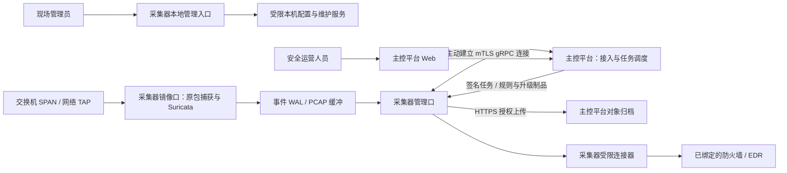

# 星烽 StarBeacon 采集器管理与部署设计

## 部署形态与责任

StarBeacon 采用**采集器与主控平台两种部署形态**。采集器位于客户站点，连接 SPAN／TAP 镜像与管理网络，负责本机捕获、检测、持久缓冲、证据上传及已授权的设备联动；主控平台负责集中检索、资产、研判、响应编排、规则发布、报告、租户和审计。主平台内部可分为多个数据单元，仍属于同一种平台部署形态。

采集器提供独立本地 Web 管理入口，用于现场初始化、网络配置、平台接入与故障恢复。主平台的探针管理提供关联入口、实际配置快照与任务状态；平台登录不自动取得设备本地管理权限。当前 Vue 原型在同一个本机开发服务中演示两个入口，**没有实现两个生产部署包、设备服务或真实认证**。

镜像口与管理口独立规划，镜像口不设置业务 IP、默认路由或 DHCP，不转发业务流量。主平台通过采集器主动建立的控制通道下发任务，默认不需要从平台网络直接访问设备 Web 端口。现场人员或经过授权的运维网络访问本地管理页；SaaS 场景下的客户私网地址不能成为平台服务器的任意代理目标。旁路规则命中不等于业务阻断，联动仍需独立执行权限、设备回读、效果观察与到期撤销。

## 管理入口与页面

本地导航保持五个工作区，同一对象的配置、状态和操作通过页签与弹窗连接，避免把每项参数做成独立菜单。

| 工作区 | 主要内容 | 操作与证据 |
| --- | --- | --- |
| 运行状态 | CPU、内存、磁盘、镜像流量、丢包、服务、WAL／PCAP 上传水位、证书、时钟 | 服务维护；查看任务和实际快照 |
| 网络与采集 | 网卡名称、用途、MAC、IPv4／IPv6、链路、速率、MTU、驱动、队列、卸载；管理地址与采集参数 | 管理网络配置、镜像网卡多选、网卡详情、配置检查与变更申请 |
| 平台接入 | 平台主机、gRPC 端口、TLS 服务名、CA／证书引用、设备身份、制品地址、心跳、批次、重试 | 一次性注册密钥、证书查看、轮换申请；不显示私钥 |
| 规则与升级 | 目标／实际规则包、规则数、同步方式、版本核对、系统组件、发布来源、任务 | 规则同步配置、同步申请、Agent／引擎／系统镜像升级、规则版本回滚 |
| 系统维护 | 主机名、时区、NTP、缓冲配额、水位、服务、本地操作日志 | 时间与存储配置、服务维护、脱敏诊断包申请 |

每个工作区提供有数据、无数据、详情、操作、加载与加载失败六种原型状态；本地登录、多因素认证和会话过期单独呈现。首次未接入、接口读取失败、权限不足和无筛选结果不能互相替代。设备断开时不把流量或链路速率补为 0；本地检测、平台连接与数据确认分别显示。

主平台通过探针详情“采集与版本”关联本地管理原型。当前只为 `SENSORS-0001` 总部核心探针提供配置样机，不能把这套网卡与版本当成其它设备的真实配置。生产关联需登记受信管理地址、检验访问者与设备身份并独立鉴权；浏览器不能直接执行平台代持的本地凭据。

## 管理网络配置

基础配置包含管理网卡、IPv4 静态地址／DHCP、地址前缀、IPv4 网关、可选 IPv6 地址／前缀及网关、DNS、MTU、回滚确认窗口。表格同时显示管理接口与镜像接口，不把 MAC 作为设备永久身份。主机名、显示时区及 NTP 属于系统维护；内部事件时间继续使用统一时间表示，原始时间误差单独记录。

生产网络能力以设备上报的 `capability_revision` 为准：物理、VLAN、Bond、虚拟接口、IPv6、静态路由和网卡驱动设置各自有支持状态及可编辑范围。当前原型样机展示物理网卡和回环，提供基本管理地址配置；**不实现 VLAN／Bond 创建、静态路由编辑或任意系统网络命令**。后续接口页只能在有受支持配置适配器时启用这些字段，不允许把缺失能力呈现为已经支持。

变更流程：

1. 获取实际配置与修订号，保存草稿；检查接口存在、用途冲突、地址格式、MTU、DNS 和回滚窗口。
2. 在受支持的网络配置后端检查地址冲突、路由、网关、权限、IPv6 能力及新地址可达条件；前端格式检查不代替这些步骤。
3. 返回旧值／目标值、影响接口、可能断开当前会话、检测中断范围和自动恢复计划。平台与本地同一资源只能有一个在途配置任务。
4. 设备持久保存旧配置和变更 journal 后应用；默认确认窗口 90 秒，可配置为 60–300 秒。恢复计划先持久化，不能依赖浏览器页面存活。
5. 管理员在新地址重新认证并确认可达，或由受信设备与平台检查完成约定确认。到期未确认、重启或服务崩溃按 journal 恢复旧配置；恢复失败显示“结果未知／需现场处理”。
6. 回读实际地址、路由、连接和采集健康，再记录生效状态。浏览器跳转、请求返回 202 或平台在线均不单独证明全部配置已生效。

原型创建申请后保留旧配置，只展示回滚计划，**不运行真实网络变更、计时恢复或新地址探测**。DHCP 模式的静态地址字段禁用，申请摘要写为“由 DHCP 获取”；实际租约地址需要设备回读。

## 网卡与采集参数

网卡表格展示用途、链路、MAC、IPv4／IPv6、标称与协商速率、MTU、观测流量；详情显示驱动、RX 队列、GRO／LRO 与回读来源。当前镜像口 `eth0`、管理口 `eth1` 与主平台同一探针快照对应。多镜像口汇总保留接口来源，跨接口重复包不通过盲目累加冒充新业务流量。

| 参数 | 原型取值／单位 | 生产约束 |
| --- | --- | --- |
| 采集网卡 | 多选，本机示例 `eth0` | 管理口、回环不可选；链路断开需要修复；VLAN／Bond 按能力验收 |
| 捕获模式 | AF_PACKET，旁路 | 不显示直通阻断效果；后端能力、内核与驱动共同验证 |
| HOME_NET | IPv4／IPv6 CIDR 列表 | 对应站点观测域；变量与规则一起编译测试 |
| BPF | 默认空，最多 1024 字符 | 由捕获后端编译；影响握手、PCAP 与规则覆盖必须说明 |
| 捕获长度 | 默认 262144 字节 | 覆盖 MTU／封装；实际 NIC、分发与切片是否截断分别计量 |
| 混杂模式 | 默认开启 | 按驱动实际回读，不能凭前端开关证明已配置 |
| 每接口线程 | 示例 8，输入 1–32 | 原型范围不构成生产硬件上限；按核数、RSS 和 NUMA 验收 |
| cluster-id | 示例从 99 顺序分配 | 本机各 AF_PACKET 实例与接口唯一，设备校验系统现存占用 |
| 流／HTTP／文件深度 | 示例 8／4／32 MiB | 分别映射引擎配置，变化可能需重启；达上限产生明确检测缺口 |

网卡卸载、RSS、队列、IRQ 和 NUMA 不通过统一模板强制修改全部硬件。Suricata 的性能配置依赖具体 NIC、RSS 方式及 CPU／NUMA，应用前需保留驱动实际能力与负载验收结果。[Suricata 8.0.7 性能配置](https://docs.suricata.io/en/suricata-8.0.7/performance/high-performance-config.html)

原包长度、TCP 重组深度、HTTP 检查深度和文件提取深度独立。TLS 密文、ECH、镜像缺包与超深正文等边界继续遵循[旁路采集与检测质量设计](旁路采集与检测质量设计.md)，不通过配置“无限长度”推定所有威胁均可检测。

## 平台接入与密钥

设备注册密钥与运行认证分别管理：注册密钥为短期、单次、仅写的引导凭据；运行使用本机私钥对应的设备证书与双向 TLS。注册密钥绑定租户、站点、网络域、角色、有效期和允许的设备范围，不能由设备自行声明租户后直接上报。原型不提供长期裸 API Key 替代 mTLS 的选项。

设备生成私钥并保存到受限凭据存储，向平台提交 CSR 与一次性注册凭据，平台验证绑定与使用次数后签发证书。注册成功、控制连接建立、首个心跳和首个持久批次 ACK 分别记录。离线注册可通过经签名且绑定设备公钥的注册包完成；无授权签名包不能跳过认证。

本地配置包含平台主机与 gRPC 端口、TLS 服务名、CA 引用、本机证书引用、制品 HTTPS 地址、心跳周期、批次及有界退避。TLS 服务名与 CA 必须校验；地址不携带密码，PCAP 上传使用受限授权，不向探针分发对象存储管理员 AK／SK。格式检查只验证输入结构，真实诊断逐项返回 DNS、路由、TCP、TLS、设备认证、gRPC 与制品访问状态，失败停留在对应阶段。

证书轮换保留新旧过渡、撤销状态与最后成功连接；新连接验证前不清理旧证书。注册凭据、私钥、Cookie 和明文密钥不写日志或任务摘要，不进入诊断包、浏览器存储和截图。重注册、租户迁移或退役必须先处理待上传 WAL、证据归属与活动封禁撤销职责，不能通过修改主机地址完成迁移。

## 规则同步、升级与回滚

规则同步支持平台推送、定时拉取、手动申请与授权签名离线包。配置页提供版本核对周期及验证通过后自动重载的选择；自动重载仍要求授权包、签名、引擎测试、资源检查与回读。断网保持当前规则，恢复后按发布代次对账，不重放已经过期或被撤销的任务。

规则任务记录平台目标包、已下载包、已验证包、引擎实际生效包、规则数、失败规则与实际回读时间。流程为“授权与兼容检查 → 制品下载 → 签名／hash → 隔离配置测试 → 原子安装 → 重载 → 实际版本回读”。失败保留原规则；回滚生成新的发布代次，目标为此前验收的不可变包，不能把当前包再次同步叫作回滚。

Suricata 规则重载只刷新规则相关配置，不代表任意采集参数或系统配置可热更新；重载会暂时需要旧／新检测引擎的额外内存。引擎测试、重载完成与实际包回读各自留证，不能把下载成功显示为检测已生效。[Suricata 8.0.7 规则重载](https://docs.suricata.io/en/suricata-8.0.7/rule-management/rule-reload.html)

系统升级分别选择 Agent、Suricata 引擎或受支持的采集器系统镜像。Agent／引擎包沿用签名与版本兼容检查；系统镜像增加启动环境、恢复分区、重启窗口、驱动和硬件兼容验收，不能当成普通规则包。升级前检查磁盘、待上传数据、journal、活动撤销职责、配置格式及回滚数据兼容性；数据目录与二进制目录分开。升级后的启动、自检、数据续传、规则加载与健康回读完成后才提交实际版本。当前原型样机没有登记系统回滚制品，系统回滚入口禁用并说明缺少已验证前版本；规则回滚使用单独的已登记示例规则包。

平台与本地创建的任务使用统一任务身份、锁与修订检查。任务来源、授权人、目标、制品版本、阶段、失败码、重试、撤销和回读均可追踪。原型本地申请状态为“等待执行回执”，实际版本保持原快照；历史完成记录明确标记为合成示例。离线制品只展示示例文件名，不实际读取、上传或安装文件。

## 时间、存储、服务与审计

运行状态展示本机时钟来源、偏差与最后校准时间；时间跳变保留时钟不确定性和单调计时，不改写已捕获数据。NTP 配置不能只依赖 DNS 可解析判断同步成功。

WAL 配额、PCAP 缓冲、磁盘高水位和业务留存分别配置。WAL 在平台持久接收确认后才回收，断网积压达到保护阈值时分级限流并记录缺口。PCAP 切片使用既有 Zstandard 独立块与对象归档布局；本地空间回收不缩短平台全量 PCAP 默认 180 天。告警、PCAP、操作与登录日志等已启用业务数据默认 180 天，分类或租户可自定义，保全优先。[数据留存与生命周期设计](数据留存与生命周期设计.md)

服务维护包含重启、进入／退出维护模式；停止新工作不能停止已有动作的到期撤销。原型样机没有设备写权限，执行器明确显示“未授权”。诊断包默认只采集脱敏配置、版本、指标与错误摘要，排除凭据和通信载荷；扩展取证需要单独授权。任务生成不表示诊断文件已可下载。

本地操作日志记录操作者、设备身份、时间、动作、对象、修订、任务 ID、申请结果与执行结果；登录日志记录认证结果和失败原因码。敏感字段只记录发生变化及凭据版本。平台离线时本地日志持久缓冲，恢复后通过认证通道上传，保留本地事件 ID 防重。主平台应能关联设备本地任务及平台发布任务。

## 实施边界与接口

后端保持 Go 1.26.x 工程基线，前端沿用 Vue 3、Ant Design Vue 和已有公共组件；本次没有引入额外前端依赖或改变数据库版本。生产构建分为平台 UI 与采集器 UI，分别由对应服务提供静态资源与同源 API；当前原型的路径分离不能替代真正的部署、鉴权或权限隔离。

采集器本地 Web 服务采用低权限账号。涉及网卡、服务与升级的动作通过受限本机执行接口，校验操作类型、参数、设备身份和任务签名；不接收任意 shell，不让 LLM 直接控制主机。网络配置后端按交付 Linux 镜像探测，使用受支持的系统配置服务或受维护适配器，并约定唯一配置所有者；不能同时让多个后端覆盖同一接口。发行镜像、驱动和网络后端未验收前，不把其软件包作为通用必选依赖。

| 规划的本地 API | 内容与约束 |
| --- | --- |
| `GET /local-api/v1/status` | 本机状态、采集与数据确认水位、缺测及时间来源 |
| `GET /local-api/v1/interfaces` | 能力、网卡和逻辑接口快照；权限与脱敏 |
| `GET /local-api/v1/configurations` | active／desired 配置、revision、来源与适用范围 |
| `POST /local-api/v1/configuration-checks` | 格式、设备能力、网络／引擎验证及影响预览 |
| `POST /local-api/v1/configuration-jobs` | 固定检查快照、expected_revision、申请人、幂等键和授权 |
| `POST /local-api/v1/network-jobs/{id}/confirm` | 从新管理连接确认；必须验证任务、身份及确认期限 |
| `POST /local-api/v1/enrollment-jobs` | 一次性密钥，仅写；单次消费、平台绑定和 CSR |
| `POST /local-api/v1/certificate-jobs` | 受限轮换，不返回私钥 |
| `POST /local-api/v1/update-jobs` | 固定签名制品、组件、代次、窗口与回滚目标 |
| `GET /local-api/v1/jobs/{id}` | 阶段、失败、回读与恢复状态；不返回敏感参数 |
| `GET /local-api/v1/audits` | 本地审计与上传确认水位 |

以上为待实现契约，不是当前可调用接口。写操作要求本地身份、CSRF／Origin 保护、同源访问、幂等与资源修订；设备证书只用于设备与平台通信，不作为浏览器管理员身份。生产默认限制管理监听与允许访问的管理网段，远程访问需明确配置；首次初始化通过现场控制台或回环受限流程，不提供通用默认密码。

## 验收

| 场景 | 必须观察到的结果 |
| --- | --- |
| 选择管理口为镜像口／选择回环 | 检查拒绝，实际配置不变 |
| 网卡断链、非法地址、MTU 与采集长度冲突 | 显示对应原因，不能提交为已生效 |
| 修改配置后未确认、设备重启或浏览器关闭 | 设备恢复旧配置或报告明确未知状态；不依赖页面计时 |
| TLS 服务名、CA、注册密钥或证书无效 | 停在认证失败阶段；不能绕过校验上报 |
| 断网、积压与磁盘高水位 | 保留已持久数据及确认水位，记录缺口与影响 |
| 规则签名失败／引擎测试失败／内存不足 | 不切换 active 规则包，任务有失败原因 |
| 升级后启动失败 | 恢复前版本，保留 WAL、PCAP 与撤销职责并报告结果 |
| 平台与本地并发编辑 | expected_revision／任务锁拒绝冲突，不后写覆盖 |
| 注册与诊断日志检查 | 没有密钥、Cookie、私钥或未授权业务载荷 |
| 原型申请 | 仅创建本地待执行任务；实际配置不变，刷新恢复合成样例 |

原型检查只覆盖页面、输入边界和示例状态机；真实网络变更、驱动能力、吞吐、注册、规则测试、升级恢复、断网续传和权限隔离仍需采集器与主平台工程实施后验收。
